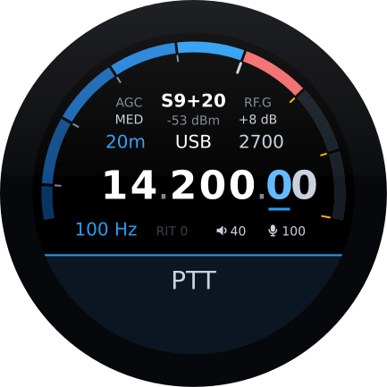
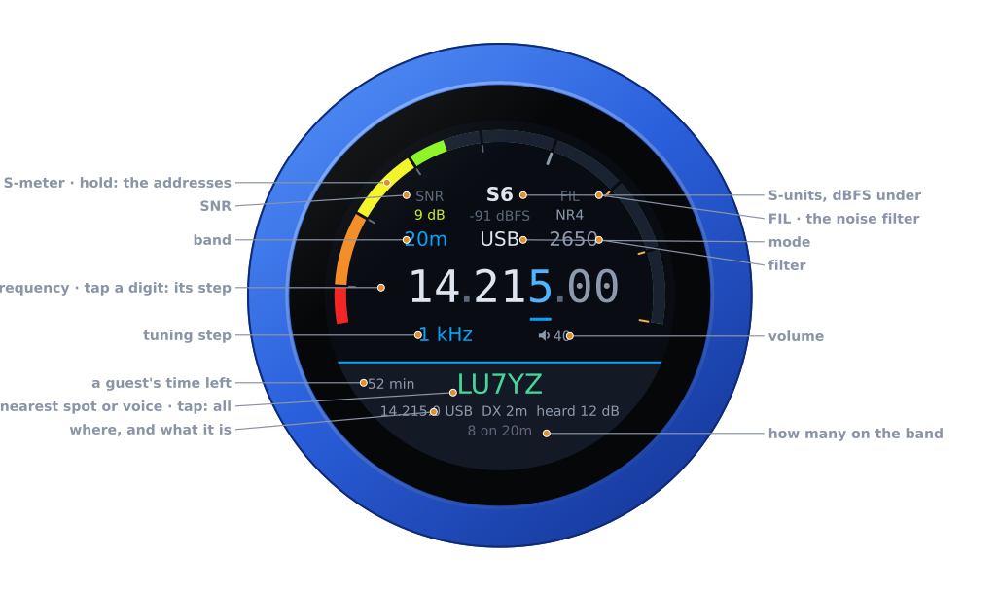
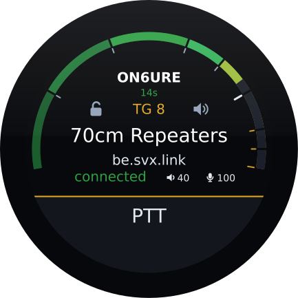

# VFO-Knob

A hardware VFO knob and control head for [AetherSDR](https://github.com/aethersdr/AetherSDR),
FlexRadio and the Icom IC-705, built on the Waveshare ESP32-S3-Knob-Touch-LCD-1.8. Tune,
change step, key the transmitter, watch the S-meter — over a USB-C cable or
over WiFi. And, with firmware of their own, a talkgroup knob for SvxLink
reflectors and a dial for UberSDR web receivers.

<p align="center">
  
  &nbsp;
  
</p>

*Receiving, and transmitting, to scale in the 66 mm body. The readouts follow
the bars. The meter blocks are notched in the background colour, so the
separators appear where the bar has reached and vanish where it has not.
Everything outside the body is annotation: the knob draws the S-meter scale as
bare ticks, so its values are marked around the rim.*

It speaks **TCI v2.0** over a WebSocket, which is AetherSDR's own control
protocol — so the knob is not polling, it is told. Tune at the desktop and the
knob follows; turn the knob and the desktop moves.

With an **IC-705** it talks to the radio itself, over WiFi, in Icom's network
protocol — the one RS-BA1 and wfview use — with receive and transmit audio,
so knob and radio are a complete station with no computer in between. Its face
wears Icom's colours, so which radio a knob is for shows at a glance. The same
firmware runs the IC-7610, with MAIN or SUB and its antennas on a swipe. See
[the Icom guide](docs/icom.md).

With a **FlexRadio** it is one of the radio's MultiFlex stations, over the
radio's own API: a station of its own, with Opus audio both ways, or the dial
and PTT for a SmartSDR, AetherSDR or Maestro station already on the radio. In
the Maestro's colours. See [FlexRadio](#flexradio-multiflex).

With the **svxconnect** firmware there is no radio at all: the knob is an
[SvxLink](https://www.svxlink.org/) reflector client over WiFi, in the style of
[SVXConnect](https://svxconnect.app/) and in its colours. The dial picks the
talkgroup, the S-meter shows who is talking, and the built-in microphone and
the jack are the station. See [SvxLink reflectors](#svxlink-reflectors).

With the **ubersdr** firmware the knob is a dial for an
[UberSDR](https://ubersdr.org/) web receiver, over the receiver's own
protocol: through its tunnel or on the LAN, with its audio on the jack, the
spots and voices on the band along the bottom, its noise filters and SNR
beside the S-meter, and its SSTV pictures on the glass. It only receives. See
[UberSDR](#ubersdr).

---

## What it does

| | |
|---|---|
| **Tune** | Per-digit step selection: tap a digit to set the decade. Acceleration on top, so a flick crosses a band and a slow turn lands on 10 Hz. |
| **PTT** | Toggle — tap to key, tap anywhere along the bottom to unkey. It keys as the finger lifts from a tap, so a swipe that starts on the bottom of the face never keys; on the air, a touch there unkeys at once. Nothing vibrates while you transmit: the motor sits beside the microphone and would be heard on the air, so the red screen alone says you are keyed, and you feel the unkey once the radio is back on receive. A four-rung teardown ends in dropping the socket. The transmit time-out is the radio's own. |
| **Meters** | S-meter in receive; SWR, auto-ranging forward power (to 2.5 kW) and mic level in transmit, each holding its peak for a second before it falls, so SSB reads as speech rather than flicker. The mic level uses AetherSDR's own scale: amber from −10 dB, red from 0. SWR above 2.5 turns its reading red. |
| **Audio** | RX audio out of the 3.5 mm jack, TX audio from the onboard mic, both with adjustable level. The built-in microphone is very good — clear, natural speech on the air, ideal for amateur radio — so the knob needs no headset or hand mic. |
| **Headset** | A Bluetooth headset through the board's second chip, with the [companion firmware](docs/headset.md) on it: the knob's audio in the headset, its microphone the one you transmit with — the knob's own is then off — and its call button the PTT. The slab shows the headset, its microphone struck through in red while muted, and a press does not key while it is; optionally the boom arm is the PTT, down to talk. On the UberSDR firmware, only for listening. |
| **Mode / filter / RIT** | Tap to open and turn to choose. Filter and RIT take effect as you turn, and a tap anywhere closes them; band and mode take a tap on their panel, and a tap anywhere else leaves them as they were. |
| **AGC / gain** | Either side of the S-meter's reading, edited like the filter: the AGC on the left, and on the right the front end's gain — P.AMP on the IC-705, RF.G on the FlexRadio, greyed out on AetherSDR until its TCI can carry it. |
| **Memories** | On the IC-705, **V/M**, last on the swipe down: MEMORY, and the frequency readout becomes the channel — its name, number, frequency, shift and tone — and the knob steps through the programmed channels of one group (tap the group, where the band was, to choose another). VFO again for the VFO, simplex. |
| **Radios** | Up to four per firmware on the configuration page — an IC-705 and an IC-7610, two FlexRadios, AetherSDR on two computers — and, on the FlexRadio firmware, the SmartLink account's. Swipe up, turn to one, tap on it: the knob restarts into it (SWITCHING TO …), with or without a link to the one it leaves; under the name, **LAN** or **SmartLink** says how it is reached. Not over the USB cable, which reaches one computer or one radio. |
| **Gain, power, tuner** | On the Icom firmware, swipe from the left for RF GAIN, and tap it for POWER, in watts; both apply as the knob turns (with a web SDR chosen, BALANCE comes first). Swipe from the right to put the IC-7610's antenna tuner in the line or out of it — only that: no tune cycle, nothing transmitted. |
| **Web SDR** | On the Icom, Xiegu and FlexRadio firmwares, a KiwiSDR, a Web-888 or an UberSDR as a second receiver beside the radio (and beside an UberSDR, a KiwiSDR): swipe down, turn to **LOCAL** or a receiver, and tap. It follows the radio's frequency, mode and passband. The radio is in the left ear and the SDR in the right, brought to the same loudness, and **BALANCE** — first on the swipe from the left — fades from one to the other. See [Web SDRs](#web-sdrs). |
| **Network** | Hold a finger on the S-meter until the knob clicks: the card comes up with the firmware and its version (`UberSDR 1.14.0`, or `… dev` for a build that is not a release) and the knob's addresses; tap the card to put it away. With the card up, hold the S-meter again, until the knob buzzes, for the [firmware picker](#first-run). |
| **Branding** | RF.Guru boot splash in the palette of [rfguru.app](https://rfguru.app/), over the site's own backdrop. |

## Two transports

The knob is USB-powered, so it is always plugged into something — and whatever
runs AetherSDR is a computer with a USB port.

- **USB-C (preferred).** The knob enumerates as a **USB network adapter**
  (CDC-NCM), hands your machine an address and talks TCI over the cable. No
  configuration at all, and immune to what a machined metal case does to
  2.4 GHz.
- **WiFi.** Configure an SSID on the configuration page and power the knob from
  any charger.

The cable wins whenever a computer is on the other end of it — the knob then
waits for AetherSDR there rather than switching networks. With no computer on
its side of the cable — a charger, or the plug the wrong way round — it goes to
WiFi straight away. When the cable is chosen, WiFi is shut down — that frees
about 40 kB of internal RAM, which this board genuinely needs.

## First run

Knobs ship with the **setup firmware**, `vfo-knob-setup`: it puts the knob on
your WiFi from a phone and installs the firmware for your radio. No computer
needed. Step by step, with the knob's own screens: [the setup guide](docs/setup.md)
(one guide per firmware in [docs/](docs/README.md)).

1. The knob comes up as an open WiFi network, **VFOKnob**. Join it with a
   phone, and the phone opens the knob's sign-in page by itself (if it does
   not, browse to `http://192.168.4.1`).
2. Choose your network, enter its password — **Show** shows it as you type —
   and tap **Connect**. The page says whether the knob got on, and if not,
   why — a wrong password, a network out of reach — so you can try again.
3. The knob then lists the firmwares on its dial, with their versions: turn to
   yours and tap the panel to install it. It downloads the image, checks its
   signature and restarts into it, and the WiFi settings go with it.
4. Tell the knob where its radio is, on its configuration page: hold a finger
   on the S-meter, at the top of the face, until the knob clicks, and browse
   to the address on the card that comes up — user `admin`, password `admin`.
   Change the password; the page nags until you do, since it can key a
   transmitter.

The list comes from the update server each time, so a knob set up long after
it was made still shows every firmware there is then. A knob that already knows
a network joins it and goes straight to the list; the list's last entry,
**WIFI**, brings the hotspot back to set up another.

**Back to the list, from any firmware:** hold a finger on the S-meter until the
knob clicks and the address card comes up, and let go. Then hold the S-meter
(or the card) again, for three seconds, until the knob buzzes. The dial asks
**FIRMWARE?** — turn the knob for yes; a tap, or ten seconds of nothing, says
no. The knob restarts, installs the setup firmware over WiFi and shows the list
again, keeping the WiFi settings. With something wrong — **NO LINK**, say, on a
knob with another radio's firmware — the warning panel shows the addresses in
the card's place: hold that until the knob buzzes. It needs WiFi: on the cable
the knob says so and carries on as it was.

## AetherSDR over the cable

The AetherSDR firmware also runs over the USB-C cable, from the computer
running AetherSDR (step by step: [the AetherSDR guide](docs/aethersdr.md)):

1. Plug the knob into the computer running AetherSDR. Windows 10 (version 1903
   or later), Windows 11, macOS and Linux all bring it up as a network adapter
   by themselves — there is nothing to install. **The USB-C socket only works
   one way round:** the other way it reaches the board's second chip, the knob
   finds no computer, and it says **FLIP USB-C**. Turn the plug over.
2. In AetherSDR, enable the TCI server — the `TCI` panel in the button bar —
   and set it to start automatically in Settings, so the knob finds it every
   time. That is the only setup on the computer.
3. Open **`http://10.55.42.1`** — user `admin`, password `admin`.
4. Change the password. The page will nag until you do; it can key a
   transmitter.
5. If you want WiFi, set an SSID and the AetherSDR host. The host is only used
   on WiFi: over the cable the knob always talks to the computer it is plugged
   into.

## If the page does not open

Give the knob about ten seconds after plugging in: for the first six it is a
serial port, which keeps it flashable, and only then a network adapter.

1. **FLIP USB-C on the knob**, or the computer finds a *USB Serial* (CH340)
   port instead — `USB\VID_1A86…` in Windows' Device Manager: the plug is the
   wrong way round. Turn it over. With WiFi set up the knob only says so for a
   few seconds after the splash before carrying on over WiFi, so watch it
   start, or look for that CH340 port.
2. **Windows.** The knob is under *Network adapters* in Device Manager —
   Windows 10 names it after its driver, *UsbNcm Host Device* — with
   *Hardware Ids* (Properties → Details) starting `USB\VID_303A&PID_4000`.
   Windows 10 before version 1903 has no driver for it: update Windows, or set
   WiFi up once over the cable from a computer where it works and run the knob
   from a charger. Firmware 1.3.2 and older is the exception to "nothing to
   install": update it. Until then, on Windows 10 it shows as an unknown device
   (Code 28) and needs its driver chosen by hand — right-click → *Update driver* →
   *Browse my computer for drivers* → *Let me pick from a list of available
   drivers on my computer* → *Network adapters* → **Microsoft**,
   **UsbNcm Host Device** — and on an up-to-date Windows 11 it fails with
   Code 10, which no driver choice fixes.
3. **Check the address.** The computer's side of the link should be
   `10.55.42.2` (`ipconfig` on Windows). A `169.254.x.x` address means it got
   no lease: renew it, or set `10.55.42.2`, mask `255.255.255.0`, no gateway
   and no DNS by hand. `ping 10.55.42.1` should then answer.
4. **Open the page** with the scheme typed out, `http://10.55.42.1/`. If ping
   answers but the browser does not, a VPN or a proxy is taking the request —
   disconnect it, or add `10.55.42.*` to the proxy exceptions.

**WiFi instead of the cable.** With no computer on its side of the cable the
knob goes to WiFi by itself, a few seconds after powering up — so a charger is
all it needs, once an SSID and the AetherSDR host have been set over the cable
from a computer where it works. Plugged into a computer it stays on the cable
even if that computer could not set the adapter up; keep a finger on the screen
from plugging it in until the dial appears to skip USB networking for that
boot.

## If the knob says NO LINK

The page opens but the knob stays on **NO LINK**: either AetherSDR's TCI server
is not running — see *First run* — or the computer's firewall is turning the
knob away. The knob connects *to* AetherSDR, so the computer has to let it in.

Over the cable the link has no internet access, which is correct: nothing lies
behind the knob. With no gateway on it, Windows lists it as *Unidentified
network* and treats it as *Public*, so if AetherSDR's firewall prompt was
answered for private networks only, the knob cannot reach AetherSDR's TCI port
over the cable. Allow it once, from an administrator PowerShell — 50001 is
AetherSDR's default; use the port set on the configuration page:

```powershell
New-NetFirewallRule -DisplayName "VFO-Knob TCI (USB)" -Direction Inbound `
  -Protocol TCP -LocalPort 50001 -RemoteAddress 10.55.42.1 -Action Allow -Profile Any
```

A *Block* rule always beats an *Allow*, and that prompt may have left one for
AetherSDR on public networks. If the rule above changes nothing, open
*Windows Defender Firewall with Advanced Security* (`wf.msc`), find
AetherSDR's *Public* TCP rule under *Inbound Rules*, switch it from Block to
Allow, and on its *Scope* tab set *Remote IP address* to `10.55.42.1`. Left
unscoped, that opens AetherSDR's TCI port — which can key the transmitter —
to everyone on every public network the computer joins.

A Linux firewall that drops inbound connections by default (ufw, or
firewalld's *public* zone) stops the knob the same way — on the cable, and on
WiFi from wherever your network puts it. Let both in once, e.g.
`sudo ufw allow proto tcp from 10.55.42.1 to any port 50001` for the cable and
`sudo ufw allow proto tcp from 192.168.1.0/24 to any port 50001` with your own
LAN's range for WiFi.

## FlexRadio (MultiFlex)

The multiflex firmware (`vfo-knob-multiflex`) talks to a FLEX-6000 or
FLEX-8000 itself, over the radio's own API on the LAN — no SmartSDR, no
AetherSDR, no computer. Step by step: [the FlexRadio guide](docs/multiflex.md). The knob is one of the radio's MultiFlex stations,
beside SmartSDR, AetherSDR or a Maestro, in the Maestro's colours.

<p align="center">
  
</p>

At boot the knob looks at who is already on the radio and, if anyone is, asks
on the dial what to be:

- **STATION OWN** — a station of its own. Its own slice, which the radio gives
  back where it was after a restart; its own audio both ways, as Opus over
  WiFi, so the speaker and the built-in microphone are the station; and its
  own transmit settings, which leave the other stations' alone.
- **DIAL FOR** *station* — the dial and PTT for a station already there, like
  a FlexControl on its computer. The knob works that station's active slice,
  and follows when its operator clicks another; PTT keys that station's
  transmitter, with that station's microphone. The knob plays no audio.

The last choice is offered first, and taken after 30 s without an answer. With
nobody else on the radio the knob does not ask.

| | |
|---|---|
| **The dial** | Tunes the slice. Mode, filter, AGC, RIT and RF.G — the panadapter's RF gain, which the radio's API carries — are edited as on the other radios. |
| **Swipe from the right** | **TUNE**, a carrier at the tune power, for an external tuner or to check SWR — PTT stops it, and it stops by itself after 30 s. **ATU**, one cycle of the radio's tuner. **MEM**, the tuner's memories, lit when on; a tap switches them and the menu stays. The menu opens on MEM: TUNE and ATU are a turn away. |
| **PTT** | Refused with the reason when the radio will not transmit here: out of band, or another station on the air. |

The radio is given by its IP address on the configuration page, and MultiFlex
must be enabled on it. Finding the radio by its discovery broadcast is still to
come.

### SmartLink

A radio away from home is reached through FlexRadio's own service, as SmartSDR
and AetherSDR reach it. Log in under **SmartLink** on the configuration page
with the account's email address and password: the password goes to
FlexRadio's login service and is not kept — the knob keeps the login it is
given, until you log out there. The account's radios are listed, and with
**Offer these radios on the knob** they come after the configured ones on the
swipe up, marked **SmartLink** under the name; **LAN** marks the direct ones.
The same radio can be in the list both ways.

Chosen, the knob restarts into it: SmartLink's server introduces the knob to
the radio, which it then reaches over TLS. The radio's certificate is its own,
self-signed; the knob pins it the first time, as AetherSDR does, and refuses a
different one until you log in again. After that it is the same station as on
the LAN, Opus audio and PTT included. A radio reachable only by hole punching
— neither a forwarded port nor UPnP — is listed but not yet connected to.

## Web SDRs

On the Icom, Xiegu and FlexRadio firmwares the knob can listen to a web SDR
beside the radio — a [KiwiSDR](http://kiwisdr.com/), a Web-888, or an
[UberSDR](https://ubersdr.org/) through its Kiwi input; all three speak
KiwiSDR's protocol. Up to four are kept, added on the configuration page with
their address (`host:port` — **8073** on most KiwiSDRs), a password where the
receiver has one, and its time-limit password, which lifts the listening limit
some receivers put on each address. The address is the receiver's own plain
`http://` one: not an `https://` link through a proxy or a tunnel.

| | |
|---|---|
| **Swipe down** | **RX**: turn through **LOCAL** and the receivers by name, tap to listen. The IC-7610 then goes on to MAIN/SUB and the antenna for the radio's side, whichever was chosen: with an SDR the radio still plays in the left ear. The IC-705 goes on to V/M. |
| **Listening** | The SDR follows the radio: frequency, mode and passband, retuned as the dial turns. The radio is in the left ear and the SDR in the right, both levelled to the same loudness. |
| **Its S-meter** | A thin blue line just outside the radio's S-meter, on the same scale, and its reading in blue under the radio's, where the dBm is otherwise: **S9+20** against the radio's **S7**. Dots while it connects; a word, in amber, when it cannot — *busy*, *no apps*, *password?*, *day limit*, *no answer*. |
| **Balance** | First on the swipe from the left while an SDR is chosen; a tap on it goes on to RF GAIN and POWER. From **RADIO**, the radio alone, through **L \| R** to **SDR**, the SDR alone. |
| **Transmitting** | The SDR goes quiet: it would play the over back a second late, and from a speaker the microphone would hear it. |

**Test**, beside each receiver on the configuration page, logs in and says
what the receiver calls itself, how many of its channels are in use, and
whether the password is right. It also says when a receiver's owner lets no
apps listen: a KiwiSDR can keep its channels for browsers, and a client
without a waterfall — the knob is one — is cut off after ten seconds. The
knob tries such a receiver once and then leaves it alone until it is chosen
again. It waits two minutes when the channels for apps are all in use, and
half an hour when the day's listening limit has been reached.

The choice is on the radio page too, and in its API: `sdr=local` or `sdr=0`
to `3`, by the receiver's place in the list, and `balance=-100` to `100`.

## UberSDR

The ubersdr firmware (`vfo-knob-ubersdr`) makes the knob a dial for an
[UberSDR](https://ubersdr.org/): it talks to the receiver over its own
protocol, as the receiver's web page does, with Opus audio. It reaches it
through UberSDR's tunnel (`https://<name>.tunnel.ubersdr.org`, over TLS) or on
your own network, and plays it on the jack. Receive only, in UberSDR's own
dark theme. Step by step: [the UberSDR guide](docs/ubersdr.md).

<p align="center">
  
</p>

| | |
|---|---|
| **SNR, FIL** | Either side of the S-meter: the signal's height above the noise in its passband, and the receiver's noise filter — OFF, NR2, RN2 or NR4, whichever it runs — chosen as the knob turns. |
| **Spots and voices** | Along the bottom, where PTT is on a radio: the one nearest the dial on the band -- the DX cluster's spots and every voice the receiver's detector hears now, named or not (in CW, the CW skimmer's), green while it is heard. A tap puts them all on the dial; tap one and the receiver goes there in its mode. |
| **SSTV** | Swipe from the right: the receiver's SSTV gallery, newest first, one picture a detent; any tap goes back to the dial. |
| **A KiwiSDR beside it** | Swipe down for LOCAL or a KiwiSDR (or a Web-888), which follows the UberSDR: the UberSDR left, the KiwiSDR right, BALANCE from the left. |
| **Its limits** | Without the receiver's password the knob listens as a guest: when the receiver ends a session, the dial asks before starting another, as UberSDR's own page does. |

## SvxLink reflectors

The svxconnect firmware (`vfo-knob-svxconnect`) turns the knob into a node on
an SvxLink reflector: protocol 3.0, the reflector's own TLS with a client
certificate, Opus audio both ways at 16 kHz. It is a port of
[SVXConnect-CLI](https://github.com/Guru-RF/SVXConnect-CLI)'s reflector client,
and shares its protocol code, talkgroup manager and codec settings. Step by
step: [the SvxLink guide](docs/svxconnect.md).

<p align="center">
  
</p>

The face is the radio face, read differently:

| | |
|---|---|
| **The dial** | Steps through the switchable talkgroups, one a detent. The talkgroup's name, from the reflector's portal, is where the frequency is — looping when it is long — with the reflector under it; `TG n` is where band and mode are. |
| **Lock** | Left of the talkgroup: no busier talkgroup takes you away, no quiet spell drops you to monitoring, and the others are not heard. The dial still switches, and the talkgroup it turns to is locked in its turn. |
| **Mute** | Right of it: the speaker off, the talkgroup still selected, who is talking still shown. |
| **Meter** | The received audio in dBFS, and in transmit the microphone. Above it, who is talking — with where they are, when the reflector publishes it — or who spoke last and how long ago. |
| **PTT** | Tap to key, tap to unkey, as on the radios. The reflector's own announcement of your callsign confirms the key; on a busy talkgroup it refuses you the floor and the knob says so with the refusal click. |
| **Link** | Where the step is: **connected**, **connecting** or **disconnected**. |

Talkgroups follow SVXConnect's rules: *switchable* ones are on the dial,
*monitored* ones are followed when there is traffic, a `+` after a number
raises its priority (`9990, 8++, 1745+`), the knob stays on a talkgroup for a
while after an over, and drops back to monitoring after a quiet spell. With
no lists set it steps through every talkgroup the reflector's portal names.

### First run

1. Set the WiFi on the configuration page, and the reflector: its name, not its
   host — `be.svx.link` is found through its SRV record.
2. Under **Station**, give your callsign and an email address; the location and
   position are for the reflector's map.
3. Press **Request certificate**. The knob makes its RSA key (a few seconds),
   sends the reflector a certificate request and keeps asking every 30 s until
   the sysop has signed it, then logs in by itself. The certificate renews by
   itself; the key never changes, because the reflector knows the callsign by
   it.

### On an enhanced reflector

Where the reflector has a portal, the knob reads its `talkgroups.json` for the
names (kept in flash, refreshed daily) and follows its live feed for where each
talker is. The feed is a second connection to the same host; the knob pauses
it while it logs in, and it can be switched off on the configuration page.

## A Bluetooth headset

The board carries an ESP32 beside the ESP32-S3, with the classic Bluetooth the
S3 lacks, and a UART between the two. The companion firmware (`companion/`)
makes it a headset's audio gateway, as a phone is: hands-free profile,
wideband speech where the headset has it, the audio passed to and from the
knob at its own rate. It goes on the second chip once, over the USB-C plugged
the other way round; pair the headset on the configuration page, and the knob
calls it whenever it is switched on. Step by step:
[the headset guide](docs/headset.md).

While a headset is connected its call button is the PTT, the glass only
unkeys, and the knob unkeys by itself if the headset goes out of reach on the
air.

## Configuration page

Served on port 80 over whichever interface is up. Status, AetherSDR endpoint,
WiFi credentials, audio levels, access credentials, and firmware updates.

Opened over WiFi, the host field offers a green **my IP** — the address of the
computer you are browsing from, one tap to fill in when that is where
AetherSDR runs. Over the cable it is not offered: there the knob finds
AetherSDR by itself, and the cable's `10.55.42.2` would mean nothing on WiFi,
the only place the host setting is used.

The radio section is a list: up to four radios, each with a name for the
dial, and one **In use** — chosen here for the next start, or with a swipe up
on the knob, which restarts into it at once. (The reflector firmware keeps
its single reflector.) On the FlexRadio firmware a **SmartLink** section
below it logs in to FlexRadio's service and lists the account's radios, each
with **Use now** — see [SmartLink](#smartlink).

With the radio connected, the page opens on its **controls** instead, in the
knob's own colours: the frequency, typed or stepped, band, mode, filter, AGC,
the preamp or RF gain, power, the tuner, MAIN/SUB and the antenna, RIT, the
[web SDR](#web-sdrs) and its balance, and the knob's volume and mic gain —
everything the knob can set on the radio, and
nothing that transmits. **Config** leads to the settings above, the radio
staying connected.

The same, for other programs — a logbook reading the frequency and mode, or
anything setting them with a URL:

```
GET /api/radio                        the state, as JSON
GET /api/radio/set?freq=14074000      Hz, or MHz with a point (14.074)
    ...&mode=usb&filter=2&agc=mid&rfgain=80&power=50&tuner=on&rit=-120
    ...&sdr=0&balance=-30             a web SDR beside the radio, "local" for none
GET /api/radios                       the radios the knob knows, and the one in use
POST /api/radios/switch  to=1         another in use: the knob restarts into it
```

A POST with the same fields as a form does the same. Both need the page's
login (`http://user:password@<knob>/api/radio`), and no setting is taken while
the radio is on the air.

> **It is HTTP Basic over plain HTTP.** A lock on the door, not a safe — treat
> the knob as something that belongs on a network you trust.

## Updates

Images are **RSA-3072 signed** and the signature is checked before an update is
accepted. Nothing is burned into eFuse and Secure Boot is not enabled, so the
board always stays ordinarily flashable — this protects the update path, not
the hardware.

- **On WiFi** the knob checks by itself — at boot, and every 24 h by default —
  and asks on the dial: **UPDATE x.y.z**, *tap here to install*. A tap on the
  question installs it and restarts into it; anything else — ten seconds, a
  turn of the knob, a tap elsewhere — and the question goes away and the dial
  carries on. It never asks while transmitting, and never installs unasked. A
  yes given mid-session restarts the knob first and installs at boot, where
  there is room for it. Set the interval to 0 on the configuration page to
  stop checking.
- **Over USB** the knob has no route to the internet — it is the DHCP *server*
  on that link. The configuration page does the checking and the downloading
  instead, then pushes the image over. Same image, same signature check.

If an update fails to boot, the bootloader rolls back to the previous slot. The
confirmation is tied to the same "this boot looks healthy" timer that clears the
boot-loop guard.

There is one firmware per radio, `vfo-knob-<radio>` — `vfo-knob-aethersdr`,
`vfo-knob-icom`, `vfo-knob-multiflex`, `vfo-knob-svxconnect` and `vfo-knob-ubersdr` — and each has its own update
channel, `firmware/<radio>/`,
so a knob is only ever offered its own releases. It also refuses to install
another radio's firmware as an update; switching radios is a deliberate choice
under **Firmware** on the configuration page, or on the dial through the
[setup firmware](#first-run), `vfo-knob-setup`.

Publishing a release: `tools/release.sh 1.2.3 --push` (another radio's:
`RADIO=<radio> tools/release.sh …`). Each release also rewrites
`firmware/index.json`, the list the setup firmware shows, from the channels'
manifests.

## Building

Needs ESP-IDF 5.5.x.

```sh
idf.py -B build_usbnet \
       -D SDKCONFIG_DEFAULTS="sdkconfig.defaults;sdkconfig.usbnet" \
       build flash
```

Leave off `sdkconfig.usbnet` for a WiFi-only build that keeps the serial
console. **No credentials are compiled in** — a unit ships with empty storage
and is configured over the cable.

The IC-705 firmware is WiFi only (the radio is reached over WiFi, and the USB
link has no route to it):

```sh
idf.py -B build_icom -D VFO_RADIO=icom \
       -D SDKCONFIG_DEFAULTS="sdkconfig.defaults;sdkconfig.icom" \
       build flash
```

So are the multiflex, svxconnect, ubersdr and setup firmwares:

```sh
idf.py -B build_multiflex -D VFO_RADIO=multiflex \
       -D SDKCONFIG_DEFAULTS="sdkconfig.defaults;sdkconfig.multiflex" \
       build flash
idf.py -B build_svxconnect -D VFO_RADIO=svxconnect \
       -D SDKCONFIG_DEFAULTS="sdkconfig.defaults;sdkconfig.svxconnect" \
       build flash
idf.py -B build_ubersdr -D VFO_RADIO=ubersdr \
       -D SDKCONFIG_DEFAULTS="sdkconfig.defaults;sdkconfig.ubersdr" \
       build flash
idf.py -B build_setup -D VFO_RADIO=setup \
       -D SDKCONFIG_DEFAULTS="sdkconfig.defaults;sdkconfig.setup" \
       build flash
```

Host-side tests (no hardware, no ESP-IDF):

```sh
cmake -S test/host -B build_host && cmake --build build_host && (cd build_host && ctest)
```

`tools/mock_aether.py` is a fault-injecting TCI server for exercising the error
paths without a radio.

The companion firmware for the second chip is its own project (target
`esp32`), flashed over the USB-C the other way round:

```sh
cd companion && idf.py -B build build && idf.py -B build -p /dev/ttyUSB0 flash
```

To try the face's touch with nothing keyed, `-D VFO_PTT_DRY_RUN=1` builds an
image whose PTT taps are only logged, never sent to the radio; its slab reads
**PTT TEST**. Never for a release.

## Recovering a knob

Once TinyUSB owns the USB pads there is no serial port, and this board makes
that awkward: GPIO0 doubles as the audio mux behind a single button inside the
case, and **the other Type-C plug orientation reaches the board's second chip,
not the ESP32-S3.** So the firmware leaves its own way back in.

- Every boot holds the ROM serial port open for **6 seconds** before starting
  USB networking. `idf.py flash` catches it.
- The PHY mux is put back to serial on *every* startup — it lives in the RTC
  domain and survives a reset, so without that a crash would come back with no
  serial port at all.
- `echo reboot | nc <knob-ip> 3333` restarts it remotely and opens that window.
- Holding a finger on the screen through boot skips USB networking entirely.

Port 3333 is also a log stream — the USB build has no console, so it is the only
way to watch a boot.

### A new knob

`tools/install-setup.sh` puts the setup firmware — what every knob ships with —
on a knob over its USB-C cable: a new board with Waveshare's demo on it, or any
knob to be made new again. It erases the whole flash and writes the latest
release's setup firmware (checked against its manifest), with the bootloader
and partition table from `build_setup/`. With the plug the wrong way round it
finds the second chip's CH340 instead and says to turn the plug over; a knob
running the USB-networked AetherSDR firmware is asked to restart and caught in
those 6 seconds.

## Safety

The knob keys a transmitter. Two things are worth knowing:

- **Toggle PTT** means the radio stays keyed when you let go. That is why the
  very loud red screen exists (there is no haptic reminder: on the air the
  motor would be heard through the microphone), and why the radio's transmit
  time-out should be set: in AetherSDR, *Radio Setup → TX →
  Timeout*. The radio enforces it itself, so it holds even if the knob, the
  link or the computer does not. The knob no longer keeps a second one.
- **A client that loses power while keyed cannot unkey itself.** No firmware on
  this device can fix that; the server has to notice. Filed upstream as
  [aethersdr#5985](https://github.com/aethersdr/AetherSDR/issues/5985). On a
  FlexRadio the knob as a station of its own is safe from this: the radio stops
  a station's transmission when it leaves. As the dial for another station it
  is not — that station is still there — so try it before relying on it: key
  from the knob, pull its power, and see what the radio does. The radio's
  transmit time-out is the backstop.

## Hardware

Waveshare ESP32-S3-Knob-Touch-LCD-1.8: ESP32-S3 with 16 MB flash and 8 MB PSRAM,
360×360 round SH8601 display, CST816 touch, DRV2605L haptics, PCM5100A DAC and a
PDM microphone, and beside the S3 an ESP32-U4WDH (classic Bluetooth, 4 MB flash)
behind its own CH340 on the other orientation of the USB-C, joined to the S3 by
a UART (S3 GPIO38/48 to its IO18/23). Every GPIO number lives in `components/board/board_pins.h`.

## Licence

[Apache-2.0](LICENSE). You may use, modify, sell and ship this firmware,
including on hardware you sell, with no obligation to publish your changes. It
carries an explicit patent grant. Keep the `LICENSE` and `NOTICE` files with
any redistribution, and state what you changed.

The display initialisation table in `components/panel/sh8601_init_cmds.c` comes
from Waveshare's demo for this board. Waveshare confirmed on enquiry that their
ESP32 demo code is Apache-2.0, so it carries the same terms as the rest and
redistributes cleanly. Full list in
[THIRD_PARTY_LICENSES](THIRD_PARTY_LICENSES).
