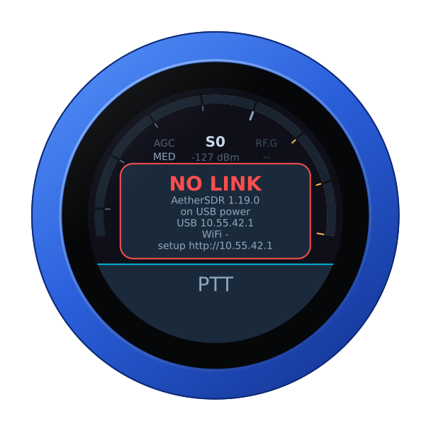
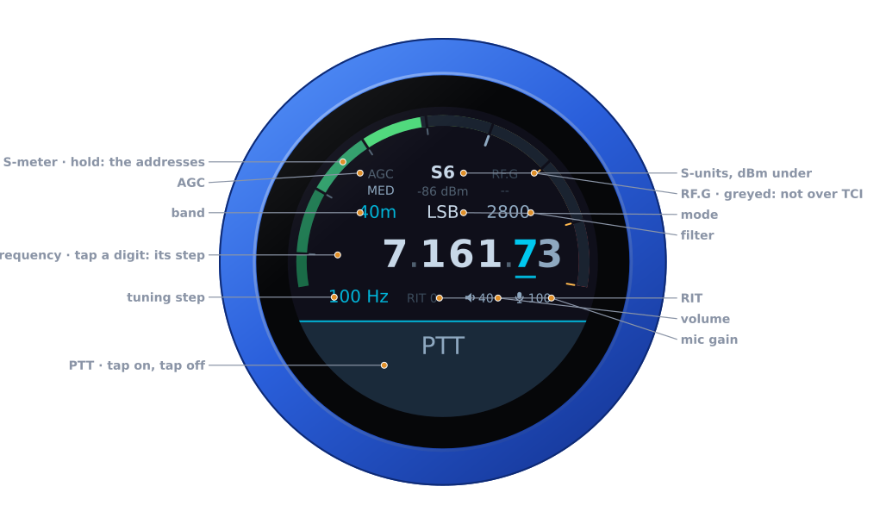
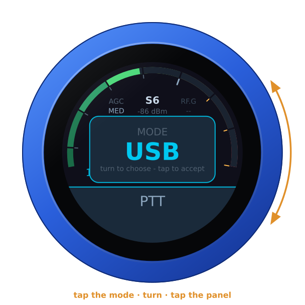
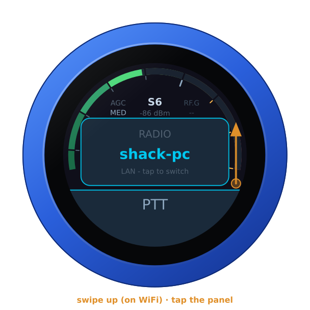
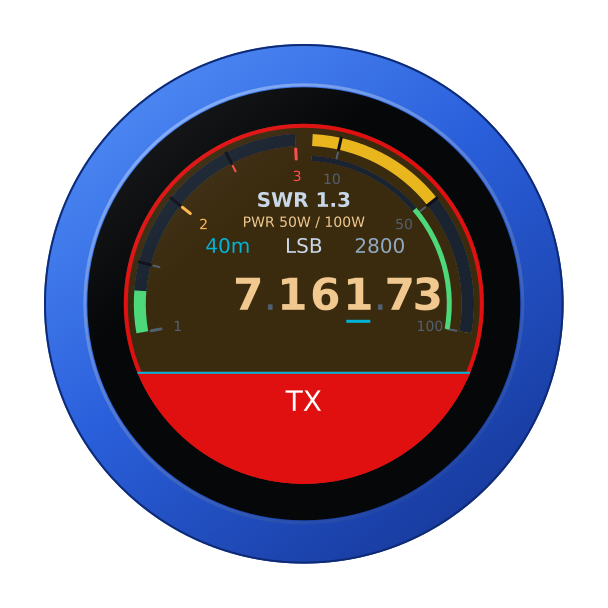

# The AetherSDR firmware

`vfo-knob-aethersdr` is a dial for [AetherSDR](https://github.com/aethersdr/AetherSDR),
talking to it over **TCI**, AetherSDR's own control protocol — so the knob is
not polling, it is told. Tune at the desktop and the knob follows; turn the
knob and the desktop moves. Audio comes from AetherSDR to the knob's jack, and
the knob's microphone goes back. Its face wears AetherSDR's dark theme.

The pictures are the knob's own screens, drawn from the firmware's texts and
layout (`tools/mkdocs.py`); the orange marks are what your hand does.

## Two ways to connect

- **The USB-C cable (preferred).** Plugged into the computer running
  AetherSDR, the knob is a USB network adapter: it hands the computer an
  address and talks TCI over the cable. Windows 10 (1903 or later), Windows 11,
  macOS and Linux need nothing installed.
- **WiFi.** Set an SSID and the AetherSDR computer on the configuration page,
  and power the knob from any charger.

**The USB-C socket only works one way round.** The other way it reaches the
board's second chip, the knob finds no computer, and says so. Turn the plug
over.

## First run

1. In AetherSDR, enable the **TCI server** — the `TCI` panel in the button bar
   — and set it to start by itself in Settings, so the knob finds it every time.
2. Over the cable, open **`http://10.55.42.1`** — user `admin`, password
   `admin` — and change the password: the page nags until you do, since it can
   key a transmitter.
3. For WiFi, set the SSID and the AetherSDR computer. That host is only for
   WiFi: over the cable the knob always talks to the computer it is plugged into.
   Up to four computers can be listed, each with a name for the dial.

Until AetherSDR answers, the knob says so, with its addresses — over the cable,
the computer's firewall is the usual reason: see the README's
[If the knob says NO LINK](../README.md#if-the-knob-says-no-link).

## The face

| Part | Tap | |
|---|---|---|
| **S-meter** | hold: the address card | S-units, peak held a second; dBm under the reading |
| **AGC** | the AGC editor | OFF, SLOW, MED, FAST |
| **RF.G** | — | greyed: AetherSDR's TCI does not carry the RF gain |
| **Band** | the band editor | the band's own frequency, on a tap on the panel |
| **Mode** | the mode editor | USB, LSB, CW, CW-R, AM, SAM, FM, NFM, DIGU, DIGL, RTTY |
| **Filter** | the filter editor | its width, on the side of the carrier the mode uses |
| **Frequency** | a digit: the tuning step | the underlined digit is the step |
| **Step, RIT** | RIT: its editor | RIT in amber when set |
| **Volume, mic gain** | their editors | the knob's own levels |
| **PTT** | key, and key off | see [Transmitting](#transmitting) |

Turn the knob to tune: a slow turn moves a step at a time, a flick crosses a
band. Band and mode change on a tap *on the panel*; filter, AGC, RIT, volume
and mic gain apply as you turn, and any tap closes them.

## Another computer

On WiFi, with more than one computer listed, swipe up: turn to one, tap the
panel, and the knob restarts into it. Over the cable there is no choosing — the
cable reaches one computer.

## Transmitting

**PTT** is a toggle: tap to key, tap again to unkey. It keys as the finger
lifts from a tap — a swipe that starts on it never keys — and on the air a
touch unkeys at once. The face turns to transmit: SWR across the left half,
forward power across the right, the microphone on the thin inner ring, the mic
level on AetherSDR's own scale.

The transmit time-out is the radio's own: set it in AetherSDR, *Radio Setup →
TX → Timeout*. The radio enforces it itself, so it holds even if the knob, the
link or the computer does not.

## Another firmware

Hold the S-meter for the address card, then hold it again for three seconds
until the knob buzzes, and turn: see [the setup guide](setup.md#back-to-the-setup-firmware-from-any-radios).
It needs WiFi: over the cable the knob says so and carries on.
