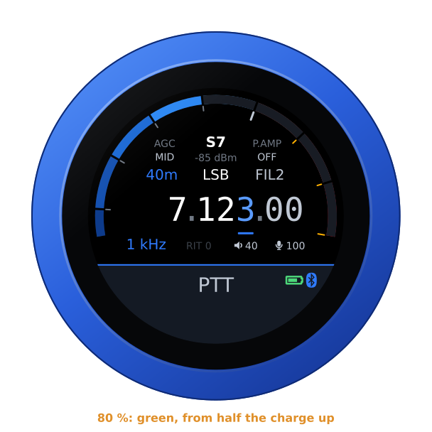
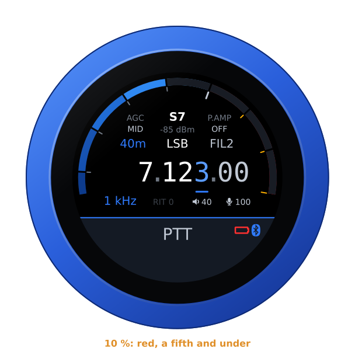
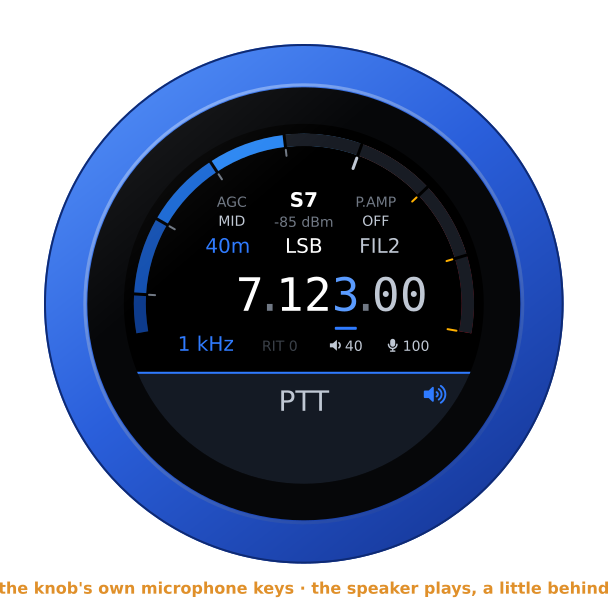
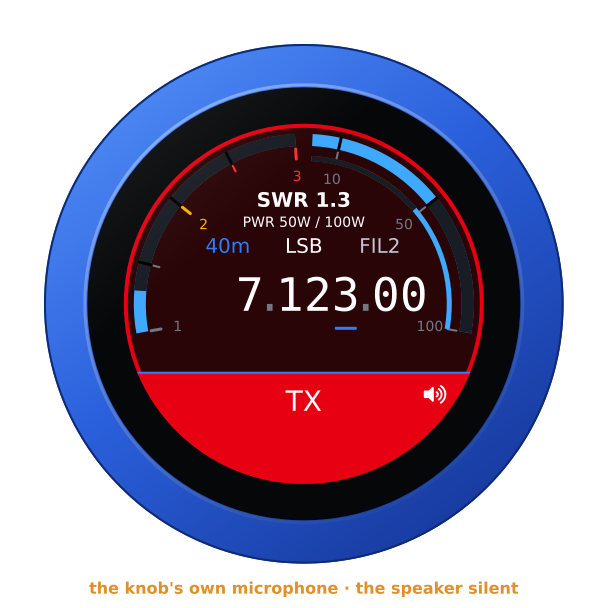

# A Bluetooth headset or speaker

The knob has a second chip beside its ESP32-S3: an ESP32 with classic
Bluetooth, which the S3 has not. With the companion firmware on it, the knob
is a Bluetooth headset's audio gateway — what a phone is to it — or a
Bluetooth speaker's music source. While a headset is connected:

- the knob's audio plays in it, as well as on the jack — mono, as the
  hands-free profile carries it: 16 kHz with a wideband headset, 8 kHz with
  an older one;
- its microphone is the one you transmit with, and the knob's own is off;
- its call button is a PTT: a press transmits, the next one stops. The slab
  keys as it always does, too;
- its logo shows at the right end of the PTT slab, which keeps its caption;
  the logo turns red while the headset has its microphone muted, and then
  neither the button nor the slab keys;
- its battery shows beside the logo, green, yellow or red, if the headset
  reports it ([Its battery](#its-battery)).

While a speaker is connected:

- the knob's audio plays in it as well as on the jack, a fifth of a second or
  so behind — the same in both of its channels;
- its volume is the knob's **VOLUME**, if it takes its volume from what plays
  to it, as most do: it turns itself to the knob's, and its own volume buttons
  or knob turn the knob's. One that does not keeps its own, and the knob
  turns down what it sends;
- you transmit with the knob's own microphone, as with nothing connected,
  and the speaker falls silent while you do;
- its buttons key nothing;
- a speaker shows at the right end of the slab, where a headset's logo is —
  never red — and its battery beside it, if it reports it. See
  [A Bluetooth speaker](#a-bluetooth-speaker).

The UberSDR firmware only receives: there the headset is for listening, and
its logo shows beside the spots, never in red, since nothing keys. So it is
with the IC-R8600 receiver on the Icom firmware: the slab says **RECEIVER**,
with the logo at its end, and nothing keys.

The Telephone firmware opens the headset's audio for its calls only, as a
mobile phone does. The audio opens when a call rings in, so the ring plays in
the headset as well as on the jack, or when you dial. It closes when the call
is over. While a headset is connected, the call itself is only in the headset:
the jack stays silent. The headset's button answers a call that rings, and
hangs up one that is up; the knob's slab then declines a call ringing in.

The knob keeps two mic gains: one for its own microphone, one for a headset's.
A headset's microphone comes levelled, while the knob's own is quiet, so one
setting never suited both. The face's mic readout, and its editor, are for the
microphone in use; the editor's title says **HEADSET MIC** while a headset is
connected. A headset coming or going swaps them; a speaker leaves the knob's
own. The configuration page has both, under **Audio**. A call ringing in is
the knob's to ring, with its buzz and its face. There the headset's button
answers a call ringing in and hangs up one that is up, its mute only mutes,
and the slab stays the call's, with the headset's logo at its end: see
[the Telephone guide](phone.md#a-bluetooth-headset).

The pictures are the knob's own screens, drawn from the firmware's texts and
layout (`tools/mkdocs.py`).

## The second chip

The second chip comes with the companion firmware on it, and the knob keeps
it up to date by itself: it finds a newer release with its own update check,
or on its SD card, and hands it to the chip. It is the one update the knob
installs without asking: it never transmits, and the chip checks it and
falls back by itself.

The update goes only while the knob is idle and no headset or speaker is
connected — after two quiet minutes, never during an over or a call — and
takes about half a minute. The chip does not call the headset or speaker
meanwhile, but one switched on connects at once all the same, and the update
waits for the next quiet moment. The chip checks the firmware's signature,
keeps the one before until the new one has started and talked to the knob, and
goes back to it by itself if the new one does not settle. One that crashed,
hung or would not start is not sent again; one that went back for a power cut,
or for a knob that never answered it, may go again, three times at most.

The knob fetches the firmware while it starts, before the radio connects, or
later, after two quiet minutes; an over or a call stops that download too,
and it goes again at the next quiet moment. On the USB cable, where the knob
has no way out, the configuration page fetches it and hands it over when it
is opened, as it does the knob's own updates. **Check automatically every …
hours** at 0 stops the knob looking for it on the network too; a copy on the
SD card still goes.

The configuration page shows the second chip's version under **Bluetooth
headset or speaker** — a release, or a development build, which the knob
leaves alone — and an update's progress. A second chip whose firmware came
before speakers knows headsets only, and the page says so until its update.

### For developers

The companion firmware is `companion/` in the repository (ESP-IDF 5.5, target
`esp32`). The second chip's serial port is the knob's own USB-C, **plugged
in the other way round**: one way the cable reaches the ESP32-S3, the other
way the second chip's serial port (a CH340).

Once per knob, a cable writes what the knob's updates never do: a bootloader
that can go back to the firmware before, the partition table, an empty
otadata, and a first firmware. `tools/install-setup.sh` does it for a new
knob, after the ESP32-S3; on a knob in use, keeping its headset's pairing:

```sh
tools/install-setup.sh --second-chip                                # the latest release
tools/install-setup.sh --second-chip --chip-build companion/build   # a build of this tree's
```

After that, a development build goes on without a cable — the knob sends it
at a quiet moment —

```sh
cd companion && idf.py -B build build
curl -u admin:<password> -H "Expect:" --data-binary @build/vfo-knob-companion.bin \
     'http://<knob>/api/bt/update?force=1'
```

or by cable, only the firmware and an empty otadata, so that it is the one
that starts:

```sh
idf.py -B build -p /dev/ttyUSB0 app-flash
esptool.py -p /dev/ttyUSB0 erase_region 0xe000 0x2000
```

Never `idf.py flash`: that writes the bootloader and the partition table
again, which only the bench writes. Every build is signed with the knob's
key (`ota_signing_key.pem`): the chip takes an update only signed like the
firmware it runs. The knob's automatic updates leave a development build
alone. A test release is built the way `tools/release.sh` builds a release,
with an overlay — `-D COMPANION_DEFAULTS=<file>`, the file holding
`CONFIG_VFO_COMPANION_RELEASE=y`, `CONFIG_APP_PROJECT_VER_FROM_CONFIG=y` and
a version below any release, `CONFIG_APP_PROJECT_VER="v0.9.1"` say. A
release is published only after a knob has kept it and then taken an update
from it (`RADIO=companion tools/release.sh`).

Waveshare's own firmware, saved before the first of these with `esptool.py
-p /dev/ttyUSB0 read_flash 0 0x400000 waveshare-esp32.bin`, goes back with
`esptool.py -p /dev/ttyUSB0 write_flash 0 waveshare-esp32.bin`.

## Pairing

Open the knob's configuration page: hold a finger on the S-meter until the
knob clicks, then browse to the address on the card. **Bluetooth headset or
speaker** is there once the second chip runs the companion firmware.

1. Put the headset in pairing mode — on most, hold the call button with the
   headset off until its light flashes. A speaker has its own way, often a
   Bluetooth button held down.
2. **Find headsets and speakers**: the knob looks for ten seconds, headsets
   (🎧) and speakers (🔊) first in the list.
3. **Connect** beside yours.

The knob remembers it, and calls it whenever it is switched on, as a phone
does: switch the headset on and it is there in a few seconds. **Disconnect**
lets it go until it calls again or you connect it; **Forget it** unpairs it,
and forgets what the knob made of it.

## On the knob

On every firmware a connected headset shows only its logo at the right end
of the slab, and its battery beside it where it reports one
([below](#its-battery)); the slab keeps its caption — **PTT**, **TX**, **----** —
as without a headset (the Telephone's slab is the call's:
[its guide](phone.md#a-bluetooth-headset)). The logo is in the face's own
colour; red while the headset has its microphone muted (not on a receiver,
where nothing keys); and white on the air, when the slab is red. A speaker
shows a speaker there instead ([below](#a-bluetooth-speaker)).

| A headset connected | Its microphone muted |
|---|---|
|  |  |

The headset hears what the jack plays, the knob's volume applied, and its
own volume buttons on top. Its mute is read from the microphone gain it
reports — 0 while muted, as the Jabras do; a headset that does not report it
never turns the logo red.

### Its battery

A headset or speaker that reports its battery has it shown left of its logo,
as soon as it has said its charge: green from half the charge up, yellow
under half, red at a fifth and below — and its bar full, three quarters,
half, a quarter or empty, to the nearest quarter. On the air, on the red
slab, it is white, as the logo is. On every firmware, receivers included, and
for a speaker as for a headset. The configuration page says the charge after
the device's name: *battery 80 %*. The knob's own battery, while it runs on
it, looks the same but sits at the top of the arc, over the S-meter.

| Charged | Under half | Low |
|---|---|---|
|  |  |  |

Most headsets and speakers made to work with phones report it the way an
iPhone asks for it — when they connect, and again each time it changes by a
tenth: they say what they are with Apple's `AT+XAPL`, which the second chip
answers as an iPhone does, and their charge, in steps of 10 %, with
`AT+IPHONEACCEV`. The Jabra Evolve2 headsets ask so, and so does the JLab
speaker, over the hands-free link it opens beside its music, which carries no
call. A device that reports nothing never shows a battery. The hands-free
profile has a battery report of its own (1.7's HF indicators, `AT+BIEV`); the
Bluetooth stack on the second chip offers it to no headset, so a device that
reports its battery only that way shows none — one that sends it all the
same has it taken.

Nothing shows until the device has said its charge after it connected, and
the battery goes with the device — or with the hands-free link its charge
comes over: a speaker that closes that link and plays on shows no battery,
rather than a charge that no longer changes. A second chip whose firmware
came before this reports no battery; its update brings it.

## Transmitting

The headset's call button keys, and the next press unkeys; a tap on the slab
does the same, as without a headset. While the headset has its microphone
muted, neither keys — an over would be a dead carrier — and the knob clicks
three times and says **HEADSET MUTED**. Unkeying is never refused.


If the headset goes out of reach, or its battery runs flat, while you
transmit, the knob unkeys: nobody could unkey from the headset any more.

## The boom arm as the PTT

On a headset that mutes its microphone when the boom goes up — the Jabras do
— the boom can be the PTT: tick **The boom arm is the PTT** under Bluetooth
headset or speaker on the configuration page. Lowering the boom transmits;
raising it stops.


Never by itself: when the headset connects, or the knob starts, with the boom
down, the slab says **RAISE BOOM** in red, under its caption, and nothing
transmits until the boom has been up once. The call button works as above all
the while. The option is the knob's, whichever firmware it runs.

## A Bluetooth speaker

A Bluetooth speaker plays the knob's audio as the jack does — through A2DP,
the profile a phone plays music with — and is only an ear: you transmit with
the knob's own microphone, as with nothing connected, and the speaker's
buttons key nothing — its volume buttons turn the knob's **VOLUME**, if it
takes it (below). It gets the knob's one channel in both of its
own. A speaker shows at the right end of the slab, where a headset's logo is,
so that you see which microphone keys: in the face's own colour, white on the
air, and never red — there is no headset microphone to be muted. Its battery
shows beside it as a headset's does ([Its battery](#its-battery)). While you
transmit the speaker falls silent, as it sits beside the knob's microphone;
the moment of audio it had already taken in still plays out.

| A speaker connected | On the air with a speaker |
|---|---|
|  |  |

The knob tells a speaker from a headset by itself. A scan reads each device's
class and the services it lists: one that plays music but takes no calls, or
that calls itself a loudspeaker, a portable or car audio set, or a hi-fi, is
a speaker; anything else is a headset — headphones that take calls too, since
their microphone is at your head. Some speakers call themselves headsets all
the same. Such a speaker hangs up every call's audio the knob opens on it,
and is found out by that the first time it connects, in about ten seconds of
it; the knob then calls it again as a speaker. A headset that has once kept
a call's audio open is never taken for a speaker that way, whatever drops
come later — a phone of its own taking it, say. It remembers what each device
is.

**Use as**, under the device's name on the configuration page, shows what the
knob made of it and why, and switches it: a headset used as a speaker, or a
speaker as a headset. The device connected is called again as the one
chosen, and the choice is kept; nothing automatic overrides it.

A speaker plays a fifth to a third of a second behind the jack: its own
buffer, a short one of the second chip's, and the stream's beat. The page
shows how far, beside its audio. With a speaker on the jack too, the room
hears both, the Bluetooth one a little later.

**Its volume.** Most speakers take their volume from what plays to them, as
from a phone: Bluetooth's remote control profile carries it (AVRCP's
absolute volume). The knob sets such a speaker to its **VOLUME** — the face's
readout and its editor, or the page's **Volume** — and sends it the audio at
a quarter of full level, the speaker's own amplifier turning it down from
there. A speaker with no volume buttons, then, is set from the knob, and one
with buttons or a knob of its own turns the knob's **VOLUME** with them: the
face and the page follow, and it is saved as a turn of the dial is. The dial
turning goes to the speaker a few times a second, its last position always. A
**VOLUME** of 0 is silence on any speaker. The jack keeps the knob's
**VOLUME**, as it always has.

Any speaker is sent a quarter of the level, 12 dB less: a quarter of full
level where its own volume is the knob's **VOLUME**, a quarter of the jack's
where it keeps its own. It is a loudspeaker, and what suits earphones at a low
**VOLUME** fills a room from one. The headset is sent the jack's level.

When such a speaker connects, its audio waits until it has turned to the
knob's **VOLUME** — under a second for most, up to five for one slow to bring
up its remote control, or without one — so that it never plays at its own
level first; then its sound rises to the **VOLUME** over about a second. Where
it says it plays louder than asked — a step of its own, or the dial just
turned down — the knob turns down what it sends by as much, at once. A turn of
its own buttons right after a turn of the dial is taken for the dial's own,
and leaves the knob's **VOLUME** as it is; when the two cross, the dial's wins.

A speaker that does not take its volume that way keeps its own, set by its
own controls, and the knob turns down what it sends to it as it does the
jack: the two together set how loud it plays — so set it with its own
controls, and fine-tune with the knob's. So does one that answers the knob's
first **VOLUME** louder than asked, or leaves three in a row unanswered: it is
not taken at its word, and the next **VOLUME** the dial turns to tries again.
The page says which a speaker is, under its audio: **Volume**, *the knob's
VOLUME*, *its own*, or *its own — it did not take the knob's VOLUME*. The
second chip sets no speaker's volume but at the knob's word, so with a knob
whose firmware came before this, a speaker keeps its own — where its own
controls left it, or the last knob firmware that set it: one without buttons
can then only be turned down further, from the knob.

- **The Telephone** plays a call on the jack and the speaker together, the
  speaker's audio open for calls only. The slab answers a call ringing in at
  once, the speaker under **ANSWER**; you talk into the knob's own microphone,
  muted at the start of each call, and the knob holds it back while the other
  end talks, as without a speaker — longer by the speaker's lag:
  [its guide](phone.md#a-bluetooth-headset).
- **The receivers** play in it — on the UberSDR firmware with the speaker
  beside the spot, on the IC-R8600 with it at the end of **RECEIVER** — and
  nothing keys.

A second chip whose firmware came before speakers knows headsets only; a
knob whose firmware came before them is never given a speaker — to it every
device is a headset, as before. A second chip whose firmware came before
speakers' volume leaves every speaker's own volume to it, and the knob turns
down what it sends; its update brings the rest.

## From a computer

```
GET  /api/bt                        the headset or speaker, its state, what a scan
                                    found; the second chip's firmware, and its update
POST /api/bt   do=scan              look for headsets and speakers, ten seconds
               do=connect&bda=…     pair if need be, and connect
               do=disconnect
               do=forget&bda=…
               do=kind&bda=…&kind=speaker
                                    use it as a speaker (kind=headset: as a headset)
               do=boom&on=1         the boom arm as the PTT (on=0: not)
POST /api/bt/update                 a signed second-chip firmware, as the body:
                                    the knob sends it at a quiet moment
               ?force=1             a development build, or an older one, too
```

`/api/bt/update` needs a second chip that can go back to its firmware before,
which a cable sets up once ([For developers](#for-developers)). The knob
sends the firmware only after two minutes with no headset or speaker
connected, no over and no call, and it stops at once for any of them. The
chip checks the firmware's signature, and goes back to the one before by
itself if the new one does not settle. Without `force`, the knob sends only
to a chip that runs a release, and only a firmware with a release's version
(`v1.18.0`, not a development build's `v1.18.0-2-g…`) newer than the chip's;
never one that crashed, hung or would not start on it, nor one the chip
restarted into three times without keeping it. The page shows the update's
progress under **Second chip**.
`GET /api/bt` says, under `upd`, what the knob holds or sends, the last
result, the release it knows of (`offer`), and the firmwares it will not send
again (`blocked`). It says what the device is, `kind` — `headset` or
`speaker` — and how the knob came to it, `kind_why`: `class` (its class and
services), `drops` (it hung up a call's audio at once), `no a2dp` (and then
had no A2DP to play to), `user` (**Use as**). Then `svc`, the services its scan
answer listed (`a2dp,hfp,hsp,avrcp`), and `delay`, how many ms behind the
jack a speaker plays; each device a scan found has its `kind` and `svc` too.
`volume` says what a speaker connected does with the knob's **VOLUME**:
`knob` (its own volume is the knob's), `asking` (it takes it, on its way),
`own` (it keeps its own, and the knob turns down what it sends), `refused`
(it takes its volume from what plays to it, but answered the knob's louder
than asked, or not at all: it keeps its own, the knob turns down what it
sends, and the next **VOLUME** tries again), or `""` with no speaker;
`av_volume` whether the second chip sets a speaker's volume at all.
`battery` is the device's charge as it last reported it, 0 to 100 (%), or -1
while it is not known — none connected, nothing said yet since it connected,
or a second chip whose firmware came before batteries.
`speakers` says whether the second chip plays to speakers at all; `do=kind`
to one that does not is answered 409.
