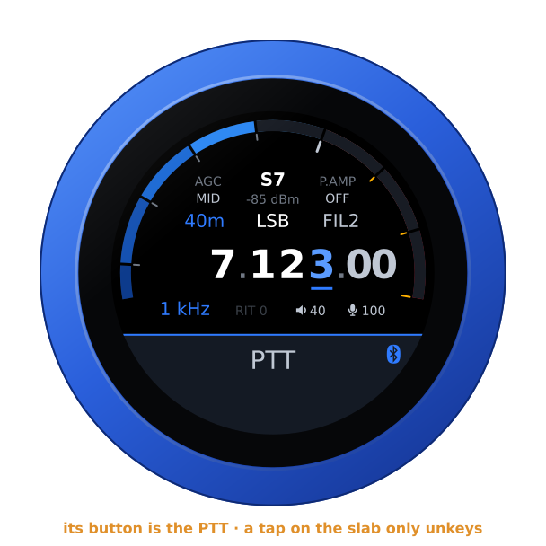
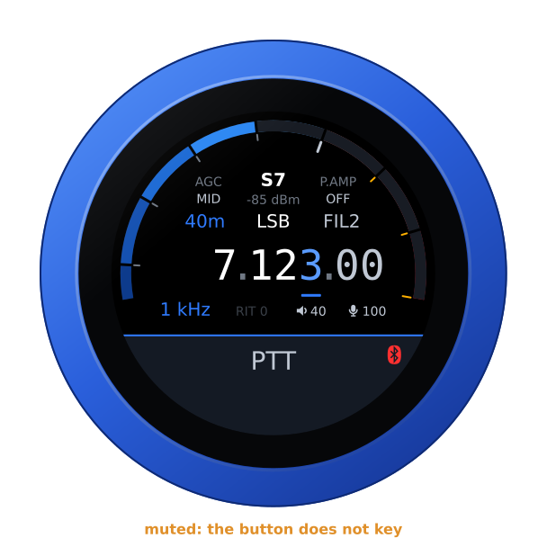
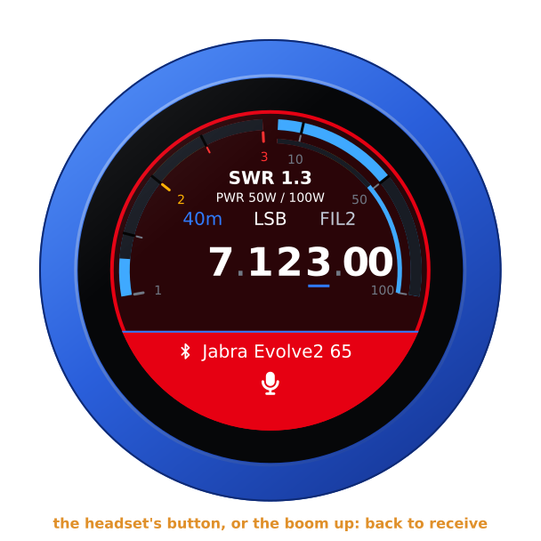
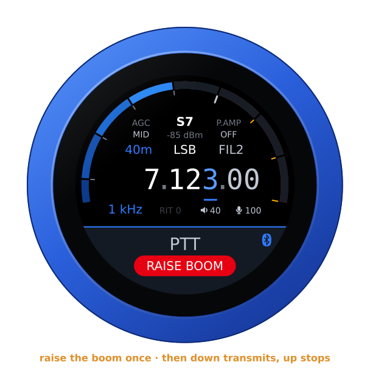

# A Bluetooth headset

The knob has a second chip beside its ESP32-S3: an ESP32 with classic
Bluetooth, which the S3 has not. With the companion firmware on it, the knob
is a Bluetooth headset's audio gateway — what a phone is to it. While a
headset is connected:

- the knob's audio plays in it, as well as on the jack — mono, as the
  hands-free profile carries it: 16 kHz with a wideband headset, 8 kHz with
  an older one;
- its microphone is the one you transmit with, and the knob's own is off;
- its call button is a PTT: a press transmits, the next one stops. The slab
  keys as it always does, too;
- its logo shows at the right end of the PTT slab, which keeps its caption;
  the logo turns red while the headset has its microphone muted, and then
  neither the button nor the slab keys.

The UberSDR firmware only receives: there the headset is for listening, and
its logo shows beside the spots, never in red, since nothing keys. So it is
with the IC-R8600 receiver on the Icom firmware: the slab says **RECEIVER**,
with the logo at its end, and nothing keys.

The Telephone firmware opens the headset's audio for its calls only, as a
mobile phone does. The audio opens when a call rings in, so the ring plays in
the headset as well as on the jack, or when you dial. It closes when the call
is over. While a headset is connected, the call itself is only in the headset:
the jack stays silent. The headset's button answers a call that rings, and
hangs up one that is up; the knob's slab then declines a call ringing in.

The knob keeps two mic gains: one for its own microphone, one for a headset's.
A headset's microphone comes levelled, while the knob's own is quiet, so one
setting never suited both. The face's mic readout, and its editor, are for the
microphone in use; the editor's title says **HEADSET MIC** while a headset is
connected. A headset coming or going swaps them. The configuration page has
both, under **Audio**. A call ringing in is the knob's to ring, with its buzz and its
face. There the headset's button only hangs up, its mute only mutes, and the
slab stays the call's, with the headset's logo at its end: see
[the Telephone guide](phone.md#a-bluetooth-headset).

The pictures are the knob's own screens, drawn from the firmware's texts and
layout (`tools/mkdocs.py`).

## The second chip

The second chip comes with the companion firmware on it, and the knob keeps
it up to date by itself: it finds a newer release with its own update check,
or on its SD card, and hands it to the chip. It is the one update the knob
installs without asking: it never transmits, and the chip checks it and
falls back by itself.

The update goes only while the knob is idle and no headset is connected —
after two quiet minutes, never during an over or a call — and takes about
half a minute. The chip does not call the headset meanwhile, but a headset
switched on connects at once all the same, and the update waits for the
next quiet moment. The chip checks the firmware's signature, keeps the one
before until the new one has started and talked to the knob, and goes back
to it by itself if the new one does not settle. One that crashed, hung or
would not start is not sent again; one that went back for a power cut, or
for a knob that never answered it, may go again, three times at most.

The knob fetches the firmware while it starts, before the radio connects, or
later, after two quiet minutes; an over or a call stops that download too,
and it goes again at the next quiet moment. On the USB cable, where the knob
has no way out, the configuration page fetches it and hands it over when it
is opened, as it does the knob's own updates. **Check automatically every …
hours** at 0 stops the knob looking for it on the network too; a copy on the
SD card still goes.

The configuration page shows the second chip's version under **Bluetooth
headset** — a release, or a development build, which the knob leaves alone —
and an update's progress.

### For developers

The companion firmware is `companion/` in the repository (ESP-IDF 5.5, target
`esp32`). The second chip's serial port is the knob's own USB-C, **plugged
in the other way round**: one way the cable reaches the ESP32-S3, the other
way the second chip's serial port (a CH340).

Once per knob, a cable writes what the knob's updates never do: a bootloader
that can go back to the firmware before, the partition table, an empty
otadata, and a first firmware. `tools/install-setup.sh` does it for a new
knob, after the ESP32-S3; on a knob in use, keeping its headset's pairing:

```sh
tools/install-setup.sh --second-chip                                # the latest release
tools/install-setup.sh --second-chip --chip-build companion/build   # a build of this tree's
```

After that, a development build goes on without a cable — the knob sends it
at a quiet moment —

```sh
cd companion && idf.py -B build build
curl -u admin:<password> -H "Expect:" --data-binary @build/vfo-knob-companion.bin \
     'http://<knob>/api/bt/update?force=1'
```

or by cable, only the firmware and an empty otadata, so that it is the one
that starts:

```sh
idf.py -B build -p /dev/ttyUSB0 app-flash
esptool.py -p /dev/ttyUSB0 erase_region 0xe000 0x2000
```

Never `idf.py flash`: that writes the bootloader and the partition table
again, which only the bench writes. Every build is signed with the knob's
key (`ota_signing_key.pem`): the chip takes an update only signed like the
firmware it runs. The knob's automatic updates leave a development build
alone. A test release is built the way `tools/release.sh` builds a release,
with an overlay — `-D COMPANION_DEFAULTS=<file>`, the file holding
`CONFIG_VFO_COMPANION_RELEASE=y`, `CONFIG_APP_PROJECT_VER_FROM_CONFIG=y` and
a version below any release, `CONFIG_APP_PROJECT_VER="v0.9.1"` say. A
release is published only after a knob has kept it and then taken an update
from it (`RADIO=companion tools/release.sh`).

Waveshare's own firmware, saved before the first of these with `esptool.py
-p /dev/ttyUSB0 read_flash 0 0x400000 waveshare-esp32.bin`, goes back with
`esptool.py -p /dev/ttyUSB0 write_flash 0 waveshare-esp32.bin`.

## Pairing

Open the knob's configuration page: hold a finger on the S-meter until the
knob clicks, then browse to the address on the card. **Bluetooth headset**
is there once the second chip runs the companion firmware.

1. Put the headset in pairing mode — on most, hold the call button with the
   headset off until its light flashes.
2. **Find headsets**: the knob looks for ten seconds, headsets first in the
   list.
3. **Connect** beside yours.

The knob remembers it, and calls it whenever it is switched on, as a phone
does: switch the headset on and it is there in a few seconds. **Disconnect**
lets it go until it calls again or you connect it; **Forget it** unpairs it.

## On the knob

On every firmware a connected headset shows only its logo, at the right end
of the slab, and the slab keeps its caption — **PTT**, **TX**, **----** —
as without a headset (the Telephone's slab is the call's:
[its guide](phone.md#a-bluetooth-headset)). The logo is in the face's own
colour; red while the headset has its microphone muted (not on a receiver,
where nothing keys); and white on the air, when the slab is red.

| A headset connected | Its microphone muted |
|---|---|
|  |  |

The headset hears what the jack plays, the knob's volume applied, and its
own volume buttons on top. Its mute is read from the microphone gain it
reports — 0 while muted, as the Jabras do; a headset that does not report it
never turns the logo red.

## Transmitting

The headset's call button keys, and the next press unkeys; a tap on the slab
does the same, as without a headset. While the headset has its microphone
muted, neither keys — an over would be a dead carrier — and the knob clicks
three times and says **HEADSET MUTED**. Unkeying is never refused.



If the headset goes out of reach, or its battery runs flat, while you
transmit, the knob unkeys: nobody could unkey from the headset any more.

## The boom arm as the PTT

On a headset that mutes its microphone when the boom goes up — the Jabras do
— the boom can be the PTT: tick **The boom arm is the PTT** under Bluetooth
headset on the configuration page. Lowering the boom transmits; raising it
stops.



Never by itself: when the headset connects, or the knob starts, with the boom
down, the slab says **RAISE BOOM** in red, under its caption, and nothing
transmits until the boom has been up once. The call button works as above all
the while. The option is the knob's, whichever firmware it runs.

## From a computer

```
GET  /api/bt                        the headset, its state, what a scan found;
                                    the second chip's firmware, and its update
POST /api/bt   do=scan              look for headsets, ten seconds
               do=connect&bda=…     pair if need be, and connect
               do=disconnect
               do=forget&bda=…
               do=boom&on=1         the boom arm as the PTT (on=0: not)
POST /api/bt/update                 a signed second-chip firmware, as the body:
                                    the knob sends it at a quiet moment
               ?force=1             a development build, or an older one, too
```

`/api/bt/update` needs a second chip that can go back to its firmware
before, which a cable sets up once ([For developers](#for-developers)). The
knob sends the firmware only after two minutes with no headset connected, no
over and no call, and it stops at once for any of them. The chip checks the
firmware's signature, and goes back to the one before by itself if the new
one does not settle. Without `force`, the knob sends only to a chip that
runs a release, and only a firmware with a release's version (`v1.18.0`, not
a development build's `v1.18.0-2-g…`) newer than the chip's; never one that
crashed, hung or would not start on it, nor one the chip restarted into three
times without keeping it. The page shows the update's progress under
**Second chip**.
`GET /api/bt` says, under `upd`, what the knob holds or sends, the last
result, the release it knows of (`offer`), and the firmwares it will not send
again (`blocked`).
