# The Icom firmware

`vfo-knob-icom` talks to an Icom radio itself, over the radio's own network
protocol — the one RS-BA1 and wfview use — with receive and transmit audio:
the knob and the radio are a complete station, with no computer in between.
It knows the **IC-705** (its memories, its preamp), the **IC-7610** (MAIN
and SUB, its antennas and its tuner), the **IC-9700** (2 m, 70 cm and 23 cm,
each band's power in its own watts) and the **IC-R8600** receiver (10 kHz to
3 GHz and its three antennas — and nothing to key). Its face wears Icom's
colours.

It also knows three radios it has not yet been tried on, built from wfview's
descriptions of them: the **IC-7300MK2** (HF, 6 m and 4 m), the **IC-7760**
(MAIN and SUB, 200 W) and the **IC-905** (2 m to 6 cm, and
3 cm with its CX-10G, each band's power in its own watts). Until someone has
used one with the knob, the knob does not switch their modulation input and
does not read their memories; see [Not yet tried](#not-yet-tried).

The pictures are the knob's own screens, drawn from the firmware's texts and
layout (`tools/mkdocs.py`); the orange marks are what your hand does.

## Before you start: the radio

The knob logs in to the radio as one of its network users, as RS-BA1, RS-R8600
and wfview do, and the radio must be on the same network as the knob. Out of
the box remote control is off on every one of them.

| Radio | On the radio | |
|---|---|---|
| **IC-705** | *MENU » SET » WLAN Set* | WLAN **ON**, **Connection Type: Station**, and your WiFi network |
| | *MENU » SET » WLAN Set » Remote Settings* | **Network Control: ON**, and a **Network User** with a name and a password |
| **IC-7610** | its **LAN** socket | a network cable to your router or switch |
| | *MENU » SET » Network* | **Network Control: ON**, and **Network User1** with a name and a password |
| **IC-9700** | its **LAN** socket | a network cable to your router or switch |
| | *MENU » SET » Network* | **Network Control: ON**, and **Network User1** with a name and a password |
| **IC-R8600** | its **LAN** socket | a network cable to your router or switch |
| | *MENU » SET » Network* | **Network Control: ON**, and **Network User1** with a name and a password |
| **IC-7300MK2, IC-7760, IC-905** | their **LAN** socket | a network cable to your router or switch |
| | the radio's network settings (as on the IC-7610; not yet checked here) | **Network Control: ON**, and a network user with a name and a password |

What most often stands in the way:

- **The user name is case-sensitive:** `ON6URE` and `on6ure` are two users.
- **A fixed address.** Give the radio the same IP address every time — a
  reservation in your router, or a fixed address in the radio's network
  settings — and enter that on the knob, not a name: a radio on WiFi that
  dozes answers its name only some of the time.
- **The ports.** The knob asks for the radio on its control port, `50001`;
  the radio then names its serial (CI-V) and audio ports, `50002` and `50003`.
  All three are UDP, on the radio's own network: leave them as they are, or
  change the knob's **Port** with the radio's.
- **One remote client at a time.** With RS-BA1, RS-R8600 or wfview connected,
  the radio has no room for the knob: close the other one first.
- **After a restart.** When the knob went away without saying goodbye — the
  power pulled — the radio keeps that session for a while. The knob waits for
  it to let go, and shows **NO LINK** until then: a minute or so.

## Tell the knob where the radio is

Open the knob's configuration page — hold a finger on the S-meter until the
knob clicks, and browse to the address on the card; user `admin`, password
`admin` until you change it. Under **Icom radios**:

| Field | |
|---|---|
| **Name, on the knob** | what the dial calls it, `IC-705` |
| **Host** | the radio's IP address, or `IC-705.local`. An address is steadier: a radio that dozes on WiFi answers its name only some of the time |
| **Port** | `50001` |
| **User name**, **Password** | the radio's network user |

Up to four radios can be listed; **In use** is the one the knob starts with.
Until the radio answers, the knob says so, with its own addresses:

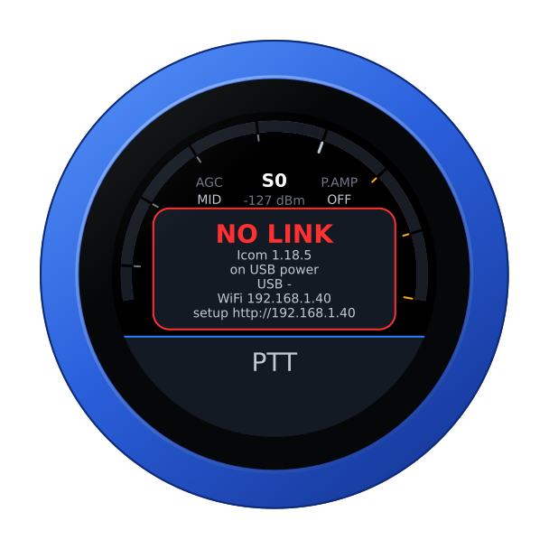

## The face

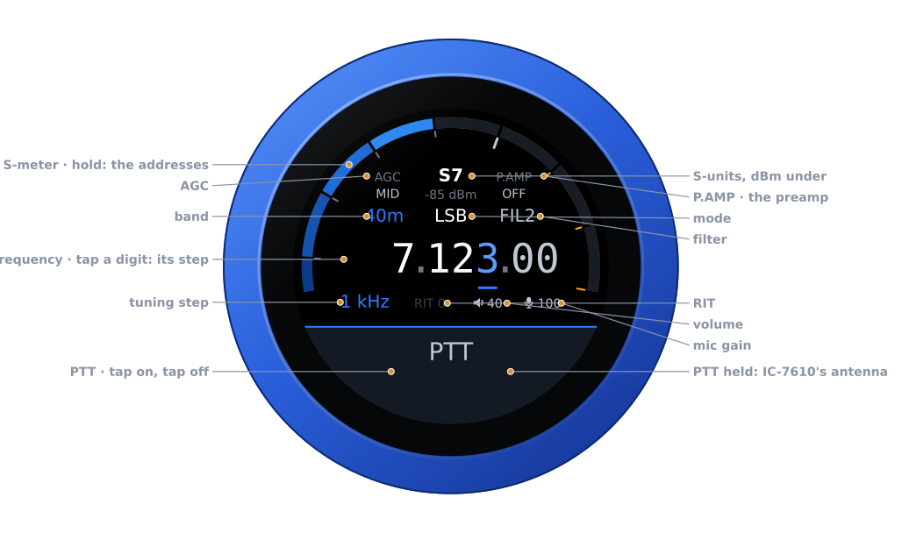

| Part | Tap | |
|---|---|---|
| **S-meter** | hold: the address card | S-units, peak held a second; dBm under the reading |
| **Battery** | — | the knob's own, over the reading, while it runs on it: full to empty by the quarter, green from half its charge up, yellow under that, red at a fifth and below. None on USB power, nor on the air |
| **AGC** | the AGC editor | FAST, MID, SLOW |
| **P.AMP** | the preamp editor | OFF, 1, 2 — or ON where the band has only one |
| **Band** | the band editor | the band's own frequency, on a tap on the panel — only the bands the radio has: on the IC-9700 2 m, 70 cm and 23 cm; on the IC-7300MK2 HF to 4 m; on the IC-905 2 m to 3 cm |
| **Mode** | the mode editor | USB, LSB, CW, CW-R, AM, FM, RTTY, DIGU, DIGL — on the IC-R8600 WFM in place of DIGU and DIGL |
| **Filter** | the filter editor | the radio's FIL1, FIL2, FIL3 |
| **Frequency** | a digit: the tuning step | the underlined digit is the step; from 1 GHz up the digits read MMMM.kkk.h, and from 10 GHz (the IC-905's 3 cm) the first of them reads 10: 10368.200.0 |
| **Step, RIT** | RIT: its editor | RIT in amber when set; none on the IC-R8600 |
| **Volume, mic gain** | their editors | the knob's own levels; the IC-R8600 has only the volume |
| **PTT** | key, and key off; on the IC-7610, hold: the antenna | see [Transmitting](#transmitting) and [the antennas](#main-sub-and-the-antennas-ic-7610); on the IC-705 and the IC-9700 a held press keys as it lifts; on the IC-R8600 **RECEIVER**, nothing to key — hold: the antenna |

Unplugged, the knob runs on its own battery and shows its charge at the top
of the arc, as a phone does — on every firmware's face. On USB power the
charge cannot be read, and none shows. The address card says which:
**battery 85 %**, or **on USB power**.

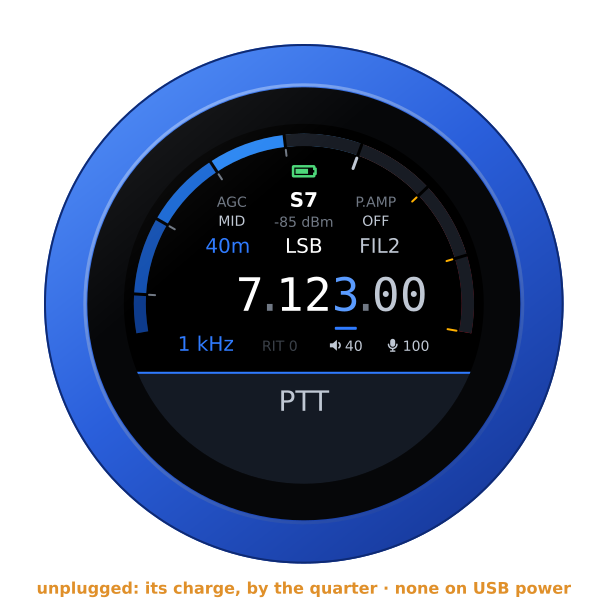

## Tuning

Turn the knob to tune: a slow turn moves a step at a time, a flick crosses a
band. Tap a digit to tune by that decade.

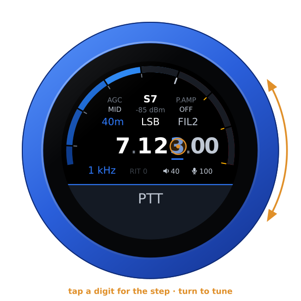

## Changing a setting

Tap a part of the face and its editor comes up; turn the knob to choose.

- **Band** and **mode** change on a tap *on the panel*; a tap anywhere else
  leaves them as they were.
- **Filter**, **AGC**, **preamp**, **RIT**, **volume** and **mic gain** apply as
  you turn; any tap closes them.

| Mode: tap the panel | Filter: applies as you turn |
|---|---|
| 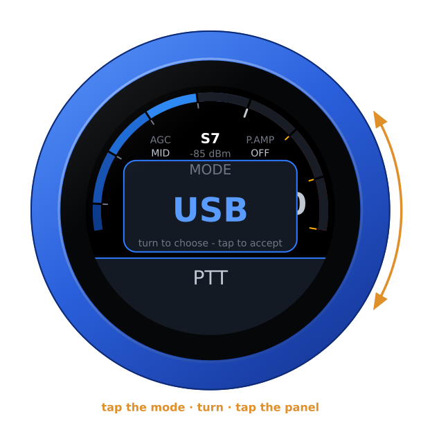 | 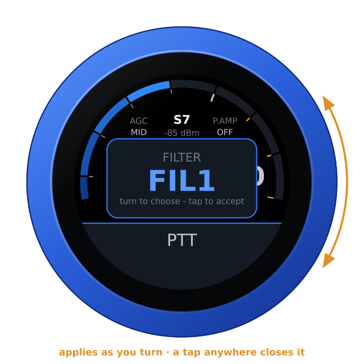 |

## Swipes

| Swipe | Opens |
|---|---|
| **From the left** | RF GAIN, then — a tap on it — POWER, in watts: the band's, on the IC-9700 (100 W on 2 m, 75 on 70 cm, 10 on 23 cm). Not on the IC-R8600. With a web SDR playing, BALANCE comes first |
| **From the right** | the IC-7610's TUNER: in the line, or out; the IC-R8600's SQUELCH |
| **Down** | RX — LOCAL or a web SDR — then, on the IC-7610, MAIN or SUB and the antenna; on the IC-R8600 the antenna; on the IC-705 and the IC-9700, V/M. The antenna is a press held on the slab away, too |
| **Up** | RADIO: another of the knob's radios |

### RF gain, power and the tuner

Both levels apply as the knob turns, and a tap anywhere closes them. The tuner
is only switched in or out: no tune cycle, nothing transmitted.

| RF GAIN | POWER | TUNER (IC-7610) |
|---|---|---|
| 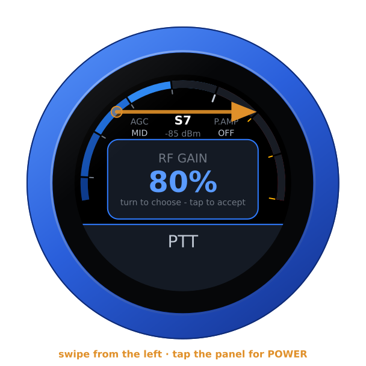 | 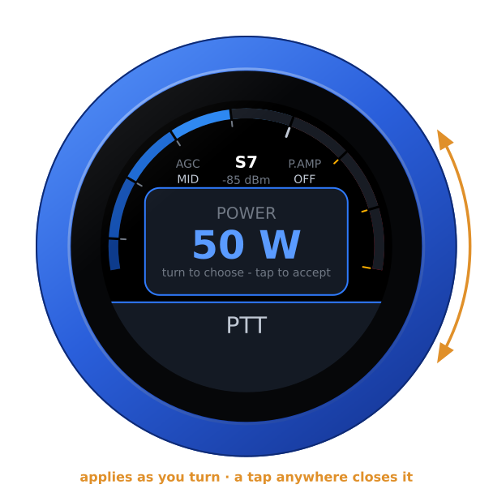 | 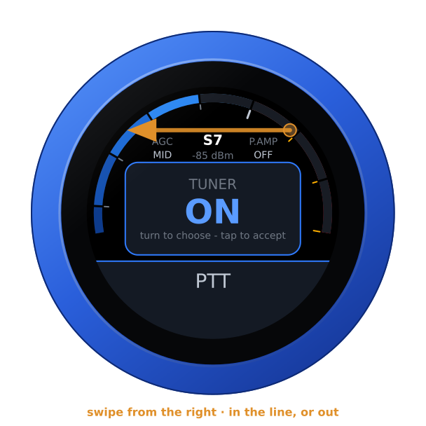 |

### MAIN, SUB and the antennas (IC-7610)

Swipe down, and after **RX** the IC-7610 offers its receiver and then its
antenna: ANT1, ANT2, and each with its RX input. Each takes a tap on the panel.
On SUB the knob does not key the radio: SUB only listens.

The antenna is also a press away: hold **PTT** half a second, until the knob
buzzes, and its editor comes up in place of keying — turn, and tap the panel; a
tap anywhere else leaves it as it was. A press held that long never keys. A tap
on PTT is still PTT, keyed 0.15 s after the finger lifts: the glass now and
then loses a held finger for up to about 0.13 s, and that must never be taken
for a tap — so two taps closer together than that are one press. On the air a
touch unkeys at once and no hold opens anything; the knob switches no antenna
relay under power. On a radio with no antenna to choose — the IC-705, the
IC-9700 — a tap, or a held press, keys as the finger lifts, as ever.

| VFO | ANTENNA | Held on PTT |
|---|---|---|
| 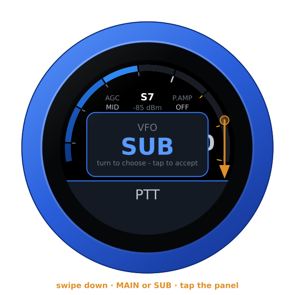 | 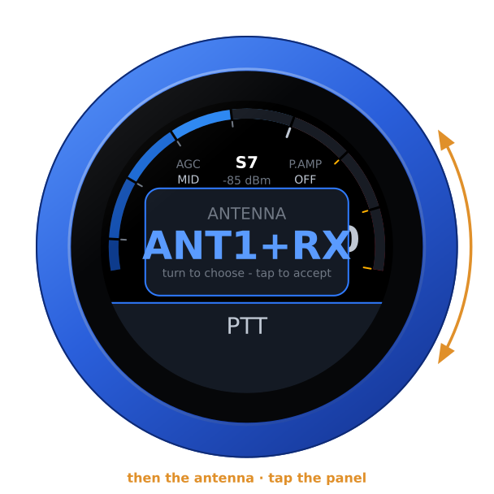 | 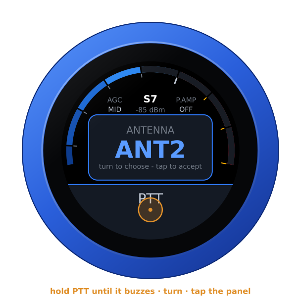 |

### Memory mode (IC-705, IC-9700)

Swipe down to **V/M** and choose **MEMORY**: the frequency readout becomes the
channel — its name, number, frequency, shift and tone — and the knob steps
through the programmed channels of one group. Tap the group, where the band
was, to choose another. **VFO** brings the VFO back, simplex.

On the IC-9700 the group is the band the radio is on — its 2 m, 70 cm or
23 cm channels — and its name stands where the group's number would: to reach
another band's channels, change band in VFO mode first.

| V/M | A channel |
|---|---|
| 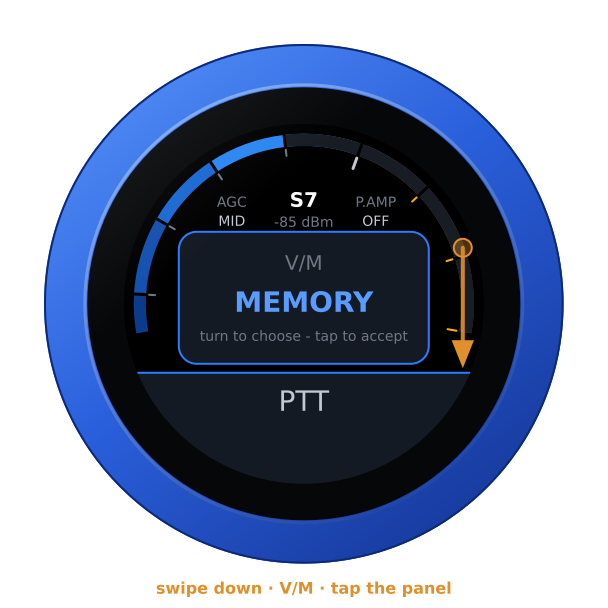 | 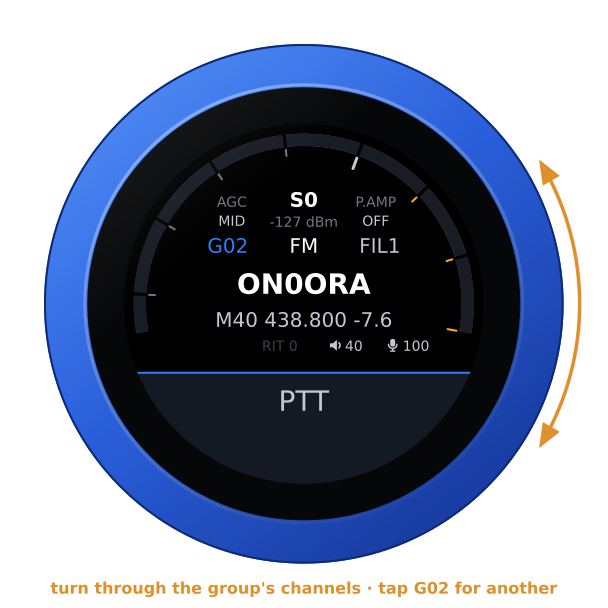 |

### The IC-R8600, a receiver

The knob tunes the IC-R8600 from 10 kHz to 3 GHz, in its USB, LSB, CW, CW-R,
AM, FM, WFM and RTTY, with its AGC, its preamp and its filters. From 1 GHz up
the digits move over — 1296.200.0, a MHz digit more and the 10 Hz one gone —
and the finest step is 100 Hz. Swipe down, after **RX**, for its antenna:
ANT1, ANT2 or ANT3 — or hold **RECEIVER** half a second, until the knob buzzes.
Swipe from the right for its **SQUELCH**, which works in
every mode, SSB and AM too: 0 % is OPEN, and it applies as the knob turns.

The slab says **RECEIVER**: nothing on the knob keys it — not the glass, not a
headset's button or its boom arm — and a Bluetooth headset just listens. RIT,
the microphone, RF gain and power, and memory mode are the transceivers'.

| The receiver | From 1 GHz | ANTENNA | SQUELCH |
|---|---|---|---|
| 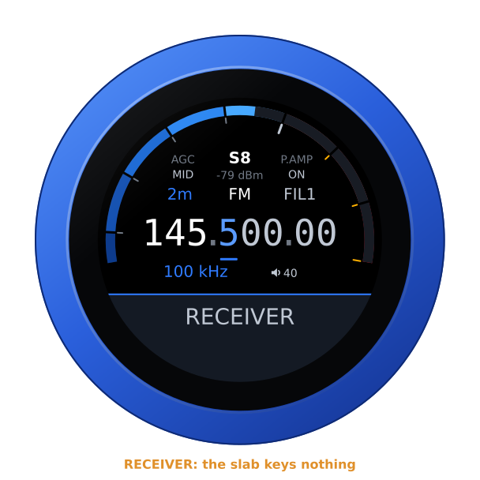 | 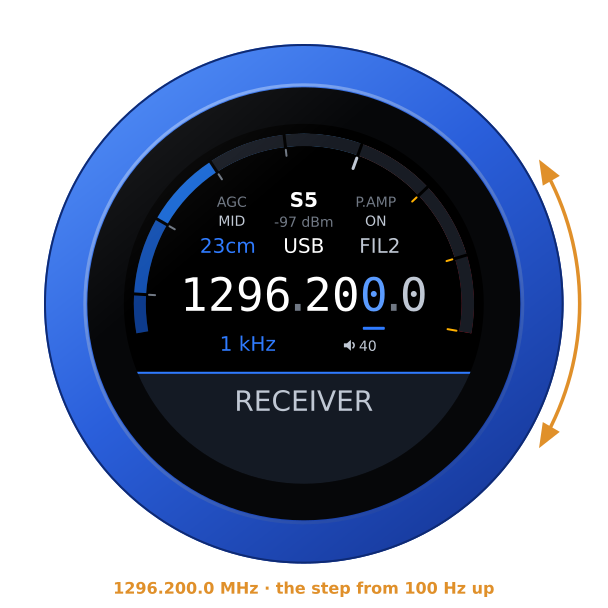 | 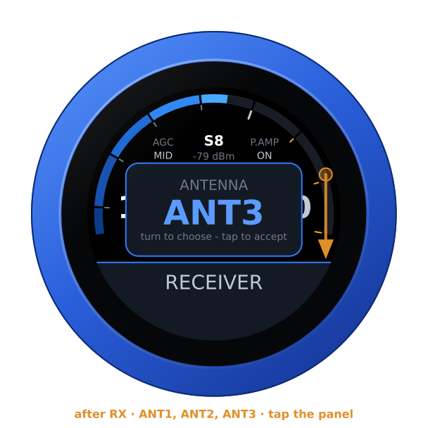 | 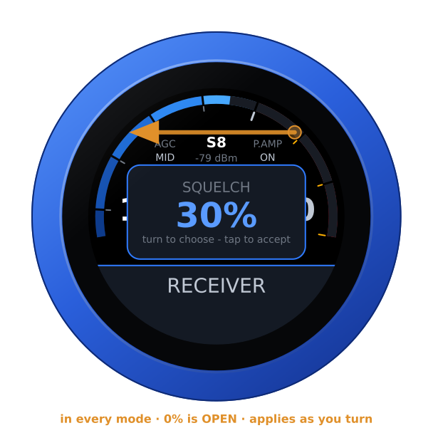 |

### Another radio

With more than one radio in the list, swipe up: turn to one, tap the panel, and
the knob restarts into it — with or without a link to the one it leaves. Under
the name, **LAN** says how it is reached.

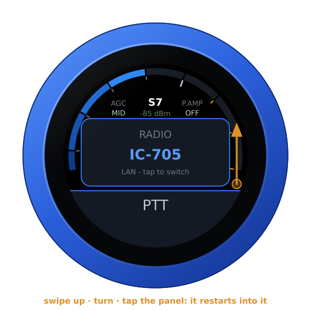

## A web SDR beside the radio

A KiwiSDR, a Web-888 or an UberSDR can play beside the radio, following its
frequency, mode and passband — in CW the station on the dial is heard at the
receiver's own CW tone, as on its own page (below). Add them under **Web SDRs**
on the configuration page — each with a **Test** — then swipe down and choose
one.

With one playing, the radio is in the left ear and the SDR in the right, both
brought to the same loudness. The SDR's S-meter is the thin blue line outside
the radio's, its reading the blue one under the radio's; **BALANCE**, first on
the swipe from the left, fades from one to the other. The SDR is silent while
you transmit.

A web SDR hears what it covers — a KiwiSDR or an UberSDR up to 30 MHz, a
Web-888 to about 62 MHz. Where it cannot reach the radio's frequency — 6 m on
a KiwiSDR, the IC-9700's bands or the IC-R8600 above 62 MHz on any of them —
it goes quiet rather than play the top of its range: its thin line goes, and
*can't reach* takes its reading's place, in amber. It stays logged in
meanwhile, nothing sent to it at every turn of the dial, and plays again the
moment the radio is back within its range — unless its owner's limit on idle
listening has ended the session meanwhile (*time up*: choose it again); the
radio page and the configuration page say what it covers (*out of range: it
covers 0-30 MHz*). It keeps one of the receiver's channels all the while:
staying up there, choose LOCAL.

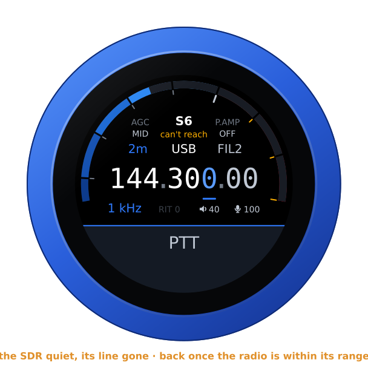

An UberSDR plays here through its Kiwi input: its own address on your
network with port **8073**, its KiwiSDR compatibility switched on
(`enable_kiwisdr` in its configuration). Its `https://` tunnel carries its
own page only, not this. Its bypass password, where you need one, goes in
**Password** — on its own network you need none — and the time-limit
password is a KiwiSDR's only. In CW the knob centres the SDR where the
receiver does: a KiwiSDR on its 500 Hz tone, or wherever its owner set it, an
UberSDR on the carrier, with its own tone.

A KiwiSDR behind the kiwisdr.com proxy or Cloudflare is reached only over
https: give it by its `https://` link, pasted whole
(`https://n0bqv.proxy.kiwisdr.com`, `https://kiwisdr.on3rvh.be`), and the
knob speaks to it over TLS, its certificate checked against the authorities
a browser trusts, for its name (not its dates). The first connection to one
takes a few seconds longer, the knob doing TLS in software; the next ones to
the same receiver are quick where its front lets the knob resume. An
`http://` link it answers with a redirect to https on its own host is
followed at once, and kept: the page shows the `https://` link from then on.
A redirect anywhere else is not followed (*moved*; the page's **Test** says
where to), and a receiver whose certificate does not check out is not spoken
to (*certificate*): both wait until it is chosen again or the list is saved.

| RX | Playing | BALANCE |
|---|---|---|
| 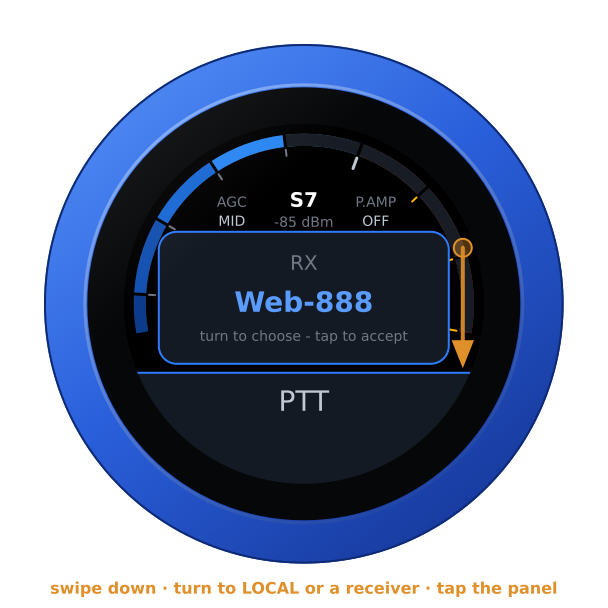 | 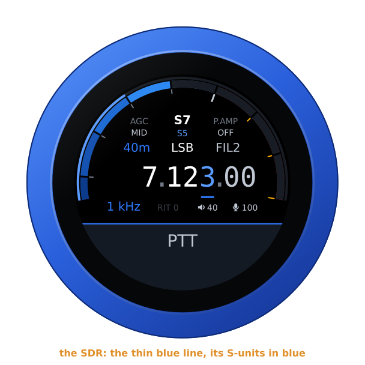 | 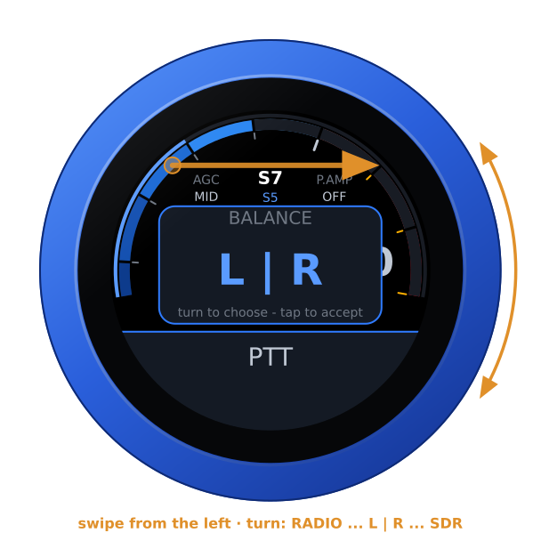 |

On the dial each receiver goes by the name you gave it on the page; without
one, by the antenna its status page names, once the knob has read that, else
by its address, with the port where another receiver shares it, so four
receivers on one address stay apart. **Test** puts the name an unnamed one
gives itself in its **Name** box, and **Save** keeps it. **Your name, for
their owners**, under the list, is what each receiver's owner sees the knob
as among those listening: your callsign, say; left empty, *VFO-Knob*.

Its owner's limits are kept. A receiver that turns the knob away because
its listening time for the day is used up says *day limit*, and the knob
leaves it alone, through restarts, until the receiver shows it has restarted
or, on a KiwiSDR, a day has passed. Choosing it again (swipe down, tap) is one
more try, and the knob takes two such refusals at most: a Kiwi bars an
address for good after five. One that ended a session nobody used says
*time up*, one whose owner sent the knob away *kicked*; both wait to be
chosen again, even after a crash, as does one that refuses this address.
A receiver with time limits that leaves the knob's login unanswered counts
as such a refusal, in case its answer was one; and with its settings memory
full (*memory full*) the knob logs in to one with time limits only when you
choose it. The knob logs in as the receivers' own apps do, so an owner's
limits on apps hold for it: a KiwiSDR whose status page lets no apps in says
*no apps* at once, and one whose channels for apps are all taken says
*busy*, *no apps* after the third time. A wrong password (*password?*) and an
address where no Kiwi answers (*not a kiwi*) wait until it is chosen again
or the list is saved; on its own the knob tries one receiver at most six
times in ten minutes. **Test** never logs in to a receiver at its day limit,
nor beside the knob's own login to one: the two never log in at once.

## Transmitting

**PTT** is a toggle: tap to key, tap again to unkey. It keys as the finger
lifts from a tap — on the IC-7610 0.15 s after, where a press held half a
second opens the antenna instead — and a swipe that starts on it never keys;
on the air a touch unkeys at once. The face turns red: SWR across the left
half, forward power in watts across the right, the microphone on the thin
inner ring.

The knob's audio reaches the radio over the network: for each over the knob
switches the radio's modulation input to it — WLAN on the IC-705, LAN on the
IC-7610 and the IC-9700 — and back to what it was after. Nothing to set on the
radio for that, on those four. On the IC-7300MK2, the IC-7760 and the IC-905
the knob does not switch it yet: set **DATA OFF MOD** (and **DATA MOD**, for the
data modes) to **LAN** on the radio, or the over goes out on the radio's own
microphone.

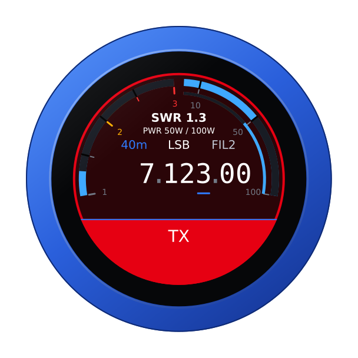

Nothing vibrates on the air — the motor sits beside the microphone and would be
heard — and the radio's own transmit time-out is the backstop: set it.

## Not yet tried

The IC-7300MK2, the IC-7760 and the IC-905 come from wfview's descriptions of
them, checked against its source, not from the radios themselves. Tuning,
modes, filters, AGC, preamps, the meters and PTT should work as on the radios
above. Until someone has used one with the knob:

- the knob does **not switch the modulation input**: set it to LAN on the radio
  (see [Transmitting](#transmitting)). It does read it, and its log says what
  the radio's DATA OFF MOD and DATA MOD are set to;
- the knob does **not read the memories**, so there is no memory mode;
- on the IC-7300MK2 the tuner, squelch and RX ANT input are not offered, and
  on the IC-7760 the antennas and the tuner: they switch relays;
- the IC-905 has no RIT, so its face has no RIT either; its 0.5 W on 3 cm
  shows as % rather than watts, and its SWR reads only from 1 W forward: on
  13 and 6 cm above about half power, on 3 cm not at all;
- on the IC-7760, if the radio will not say whether MAIN or SUB is selected,
  the knob does not key at all rather than key the wrong receiver.

The knob's log says what the radio refused, which is what is needed to finish
the job: if you have one of these radios, a session's log is very welcome.

## From a computer

With the radio connected, the knob's page opens on the radio's controls, in its
colours, and the same for other programs — a logbook reading the frequency, or
anything setting it with a URL:

```
GET /api/radio                        the state, as JSON
GET /api/radio/set?freq=14074000      Hz, or MHz with a point (14.074)
    ...&mode=usb&filter=2&agc=mid&rfgain=80&power=50&tuner=on&rit=-120
    ...&squelch=30                    the IC-R8600's, 0-100 %
```

With the IC-R8600 the page has a slider for its squelch as well.

Nothing there transmits, and no setting is taken while the radio is on the air.

## A Bluetooth headset

With the companion firmware on the knob's second chip, a Bluetooth headset can
be the knob's ear and microphone, and its call button the PTT: a press keys,
the next unkeys. The slab keeps PTT, with the headset's logo at its right
end — red while the headset has its microphone muted, when neither its button
nor the slab keys — and the knob's own microphone is off. Its battery shows
beside the logo, green, yellow or red, where the headset reports it
([its battery](headset.md#its-battery)). On the IC-R8600 the headset
just listens, as a speaker does. Pairing, the companion firmware and the boom
arm as the PTT: [the headset guide](headset.md).
A Bluetooth speaker plays the knob's audio with the jack, and you transmit
with the knob's own microphone: [the guide](headset.md#a-bluetooth-speaker).

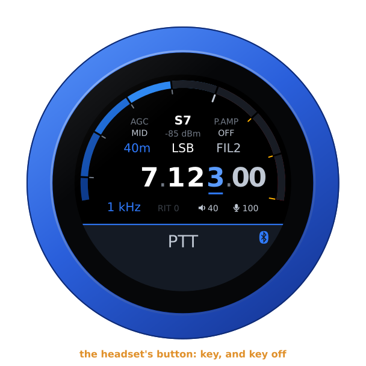

## Another firmware

Hold the S-meter for the address card, then hold it again for three seconds
until the knob buzzes, and turn: see [the setup guide](setup.md#back-to-the-setup-firmware-from-any-radios).
