# The Kiwi888 firmware

`vfo-knob-kiwi` makes the knob a dial for KiwiSDR and Web-888 web receivers:
no radio, no computer. A KiwiSDR and a Web-888 speak the same protocol, and
the knob talks it to them as their own apps do, and plays their audio on the
jack. Up to four receivers are on the knob at once, and another takes over
the moment you choose it, with no restart: four antennas a swipe apart. A
second one can play in the right ear beside the first, on the same
frequency: one antenna against another. It only receives, so there is no
PTT: the bottom of the face names the receiver you are listening to. The
face uses the receivers' own web page's look: black, its grey buttons, its
yellow highlight, its lime S-meter.

## Tell the knob where the receivers are

Open the knob's configuration page: hold a finger on the S-meter until the
knob clicks, then browse to the address on the card. The user is `admin` and
the password `admin` until you change it. Under **Receivers**, add each one:

| Field | |
|---|---|
| **In use** | the one the knob plays, in the left ear; not the one in the right ear (see below) |
| **Name, on the knob** | what the dial calls it, up to 15 characters; left empty, the antenna the receiver names (`EchoTracer`), else its address: whole where it fits, else the start of the host, or, on an address another receiver shares, its end with the port (`..83.21.23:8077`) |
| **Address** | the receiver's own, with its port: `host:8073` on most KiwiSDRs, `81.83.21.23:8077` for one of the four at Lombardsijde; or, for one behind the kiwisdr.com proxy or Cloudflare, its `https://` link, pasted whole (see below) |
| **Password** | the receiver's own, where it has one |
| **Time-limit password** | where its owner gave you one: it lifts the receiver's time limits for you |

Up to four. **Save** stores them, and the knob takes them at once. **Test**
logs in to one for a few seconds and says what it is, its antenna and
whereabouts, and how many of its channels are in use; never to one at its
day limit, nor to one playing in either ear. A receiver with no name yet gets the one
it gives itself in its **Name** box: its antenna, else the first part of its
own name. **Save** keeps it.

Many receivers are reached only over https now: one behind the kiwisdr.com
proxy (`https://n0bqv.proxy.kiwisdr.com`) or behind Cloudflare
(`https://kiwisdr.on3rvh.be`). Paste its link whole into **Address**: the
page keeps its `https://`, its name and its port, if it has one, and the
knob speaks to it over TLS, as a browser does, checking its certificate
against the authorities a browser trusts, for its name (not its dates). The
first connection to such a receiver takes a few seconds longer, the knob
doing TLS in software; the next ones to it — the session after its status, a
Test, the same receiver again after another — pick up where that one left
off and are quick, where the receiver's front allows that. Another receiver
chosen meanwhile is not held up for it: the knob lets go within about a
second, and the other ear plays on. An `http://` link that the receiver
answers with a redirect to https on its own host is followed at once, and
kept: from then on the page shows its `https://` link, and the knob goes
there straight. A redirect anywhere else is not followed: the face says
MOVED, and the page says where to (*moved to …*), for you to enter that
address if you trust it. A receiver whose certificate does not check out is
not spoken to at all: CERTIFICATE?.

**Add RF.Guru's receivers** fills in the four Web-888s at Lombardsijde, an
antenna each on one address: EchoTracer (`81.83.21.23:8077`), OctaLoop
(`:8076`), TerraBooster (`:8075`) and OctaLoop Mini (`:8074`). It logs in to
none of them; **Save** keeps them. It adds only those not in the list yet,
as far as four go.

**Your name, for their owners** is what each receiver's owner sees the knob
as, in its list of who listens: your callsign, say. Left empty, the knob is
*VFO-Knob*. Up to 31 characters, a letter like *ë* counting as two. One name
for every receiver; a new one is told at once to the receiver playing.

Under each receiver the page says how it is: *in use*, and how that goes;
*right ear*, for the one playing there; or what holds it back.

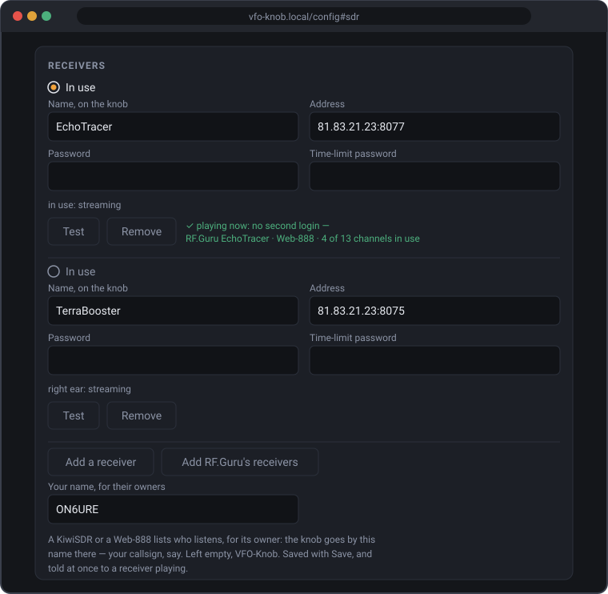

With no receiver yet, the knob says NO RECEIVER, with its own addresses so
the page is easy to find. Until a receiver answers, the knob says why:

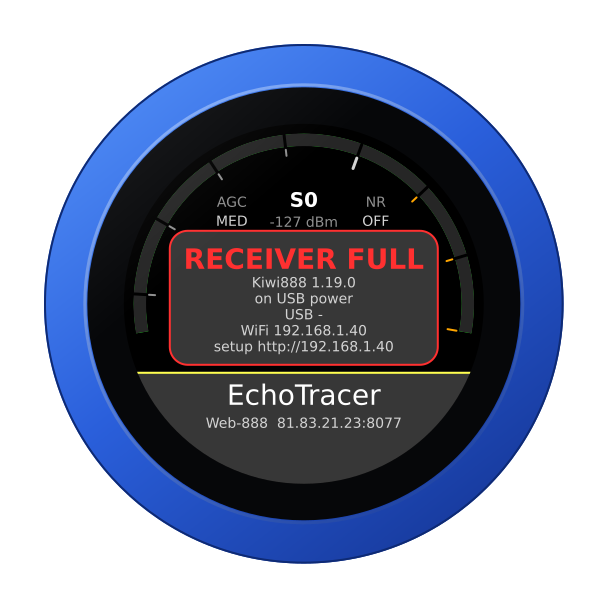

## The face

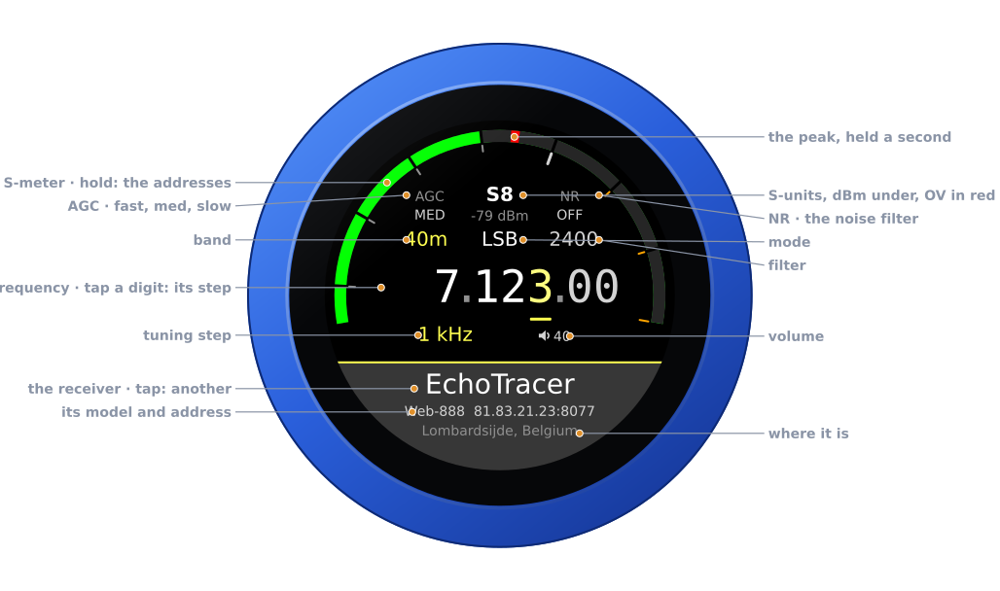

| Part | Tap | |
|---|---|---|
| **S-meter** | hold: the address card | S-units on the receivers' lime bar, the peak held a second as a red mark, as on their own page; the level in dBm under the reading, and **OV** after it, in red, while the receiver's ADC overloads. With a receiver in the right ear, its S-meter is the thin blue line outside, and its reading, in blue, takes the dBm's place |
| **Battery** | — | the knob's own, over the reading, while it runs on it: full to empty by the quarter, green from half its charge up, yellow under that, red at a fifth and below. None on USB power |
| **AGC** | the AGC | FAST, MED or SLOW: the decay of the receivers' own presets, a quarter, one and three seconds |
| **NR** | the noise filter | OFF, WDSP, LMS or SPEC: the receivers' own noise filters |
| **Band** | the band editor | 160 m to 10 m, and 6 m on a Web-888 |
| **Mode** | the mode editor | USB, LSB, CW, AM, SAM, SAL, SAU, NBFM: the receivers' own names |
| **Filter** | the filter editor | its width, by mode |
| **Frequency** | a digit: the tuning step | the underlined digit is the step |
| **Step, volume** | volume: its editor | the knob's own level |
| **The receiver** | the receivers | its name; under it its antenna, or its model and address (the model alone where the name is the address); under that where it is, or *connecting...* |

A swipe up brings the other receivers; a swipe down, the right ear's; a
swipe from the left, the balance between the two ears; a swipe from the
right, the squelch.

Turn the knob to tune: a slow turn moves a step at a time, a flick crosses a
band. Band and mode change on a tap *on the panel*. The filter, the AGC, the
noise filter, the squelch and the volume apply as you turn, and any tap
closes them.

| Tune | AGC | The mode |
|---|---|---|
| 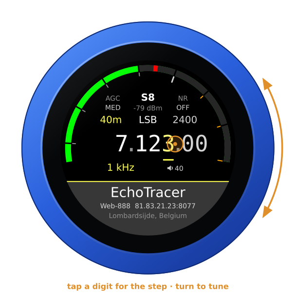 | 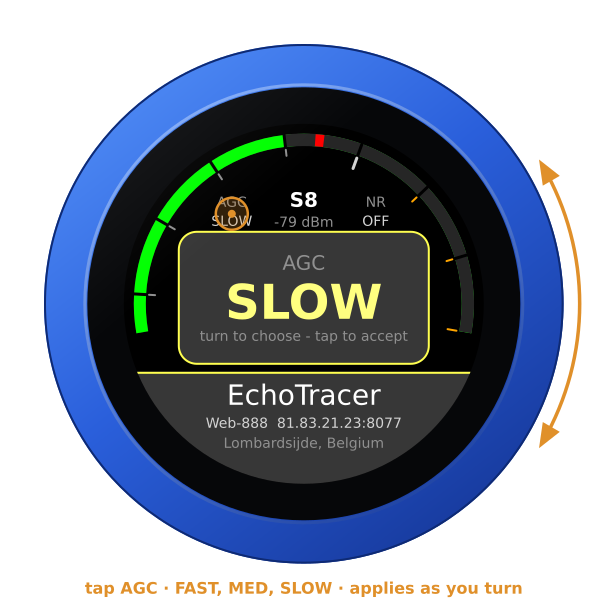 | 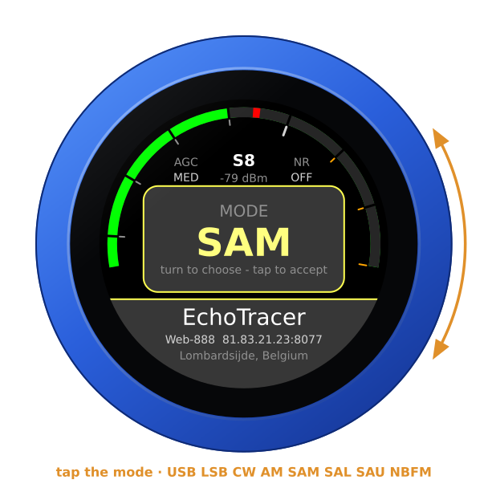 |

A band change puts a voice on its band's sideband: lower below 10 MHz, upper
above and on 60 m. Off the amateur bands the mode stays as it is.

The filter's widths follow the mode, as the receivers' page has them: 1.8 to
3.6 kHz for a sideband, from 300 Hz off the carrier; 60 Hz to 1 kHz in CW; 5
to 12 kHz in AM and SAM; 2.5 to 6 kHz in SAL and SAU, AM's lower and upper
sideband alone; 6 to 12 kHz in NBFM. In CW the station on the dial is heard
at the receiver's own CW tone, as on its own page: 500 Hz, unless its owner
set another, which the knob reads from the receiver and follows.

The S-meter is the receiver's own, in dBm: a Web-888 and a KiwiSDR each
count it from their own reference, and the knob reads both right. When a
strong signal overloads the receiver's ADC, its reading turns red with
**OV** after it, for a second after the last overload, as its own page warns.

| The filter | OV |
|---|---|
| 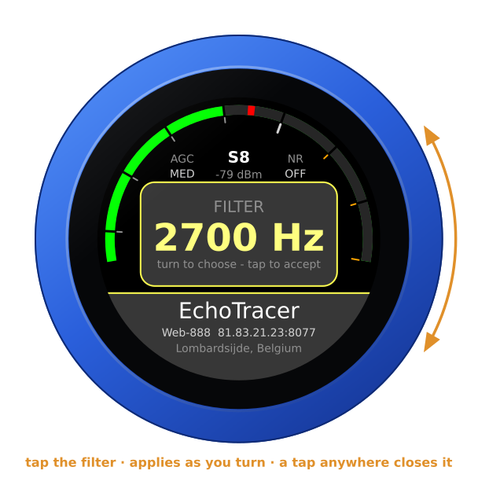 | 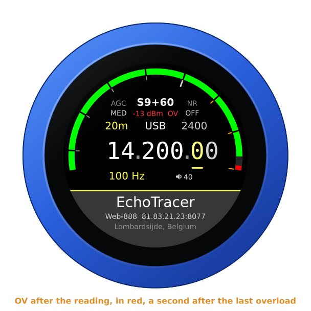 |

Unplugged, the knob runs on its own battery and shows its charge at the top
of the arc, as a phone does — on every firmware's face. On USB power the
charge cannot be read, and none shows. The address card says which:
**battery 85 %**, or **on USB power**.

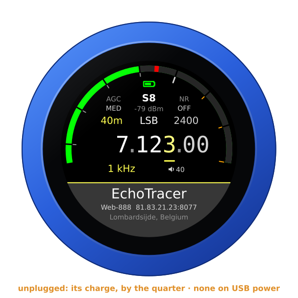

## Noise filter and squelch

Tap **NR**, right of the S-meter, and turn: **OFF**, **WDSP**, **LMS** or
**SPEC** (spectral), the receivers' own noise filters, with the settings
their page starts them with. The knob asks for the one you rest on for half
a second, so turning through them asks the receiver for nothing in between.

Swipe from the right for **SQUELCH**, 0 % **OPEN**. In NBFM it is the
receiver's own squelch scale; in the other modes it is how far over the
receiver's noise a signal must rise to open it, up to 40 dB at 100 %, with
half a second of tail, as its page has it. Closed, the knob plays silence
while the receiver goes on sending, so the sound is back the moment it
opens. The knob starts with both as you left them.

| The noise filter | The squelch |
|---|---|
| 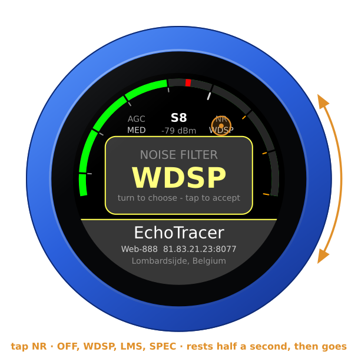 | 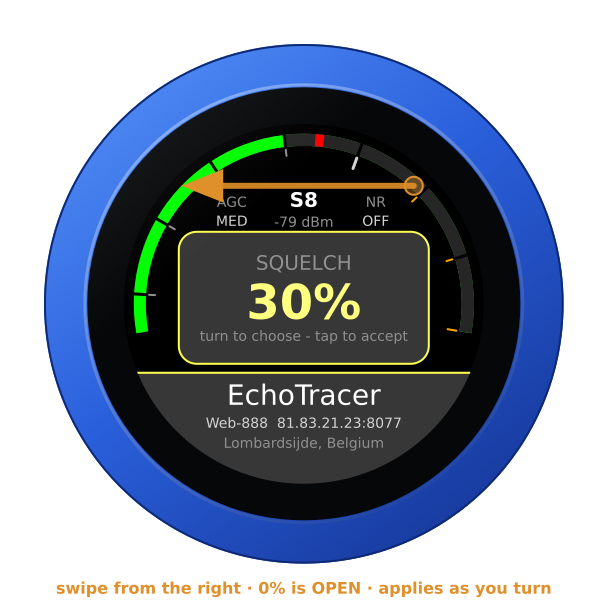 |

## Another receiver, at once

Swipe up, or tap the receiver's name at the bottom of the face: turn to
another and tap the panel. Its audio comes within a second or two, and the
dial stays where it was. Each goes by the name you gave it; without one, by
the antenna its status page names, once the knob has read that, and until
then by its address, with the port where another receiver shares it, so
four receivers on one address stay apart. The configuration page's **In
use** and the radio
page's buttons do the same. Tapping the one in use chooses it again — with a
single receiver too — which is how one held back by its owner's limits (see
below) is asked for once more. The one in the right ear is shown dimmed,
*in the right ear*, and a tap on it is refused with a triple click.

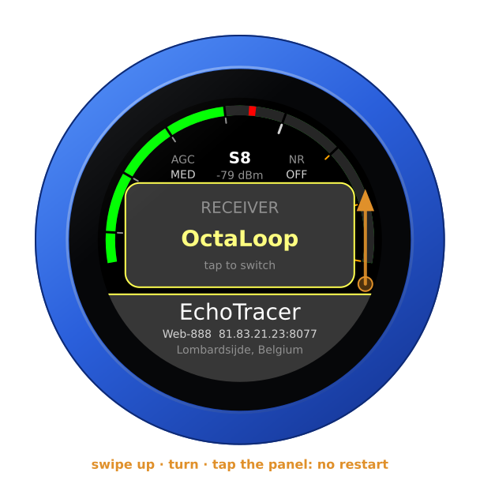

A receiver's answer to the knob's login is always waited for, up to ten
seconds, before another takes over: that answer may be a refusal it has
counted. Chosen in the middle of a login, the next receiver follows the
answer.

Each receiver tunes as far as it says it does: a KiwiSDR to 30 MHz, a
Web-888 to about 62 MHz. A dial beyond the new one's top comes down to it.

The knob starts on the receiver it last played, and on the dial, mode,
filter and AGC it last had.

## A second receiver, in the right ear

One antenna against another: a second receiver from the same list plays in
the right ear, the one in use in the left, on the same frequency, mode and
filter — the dial turns both. Swipe down for **RIGHT EAR**, turn to a
receiver, and tap the panel; **OFF** ends it. Both are brought to the same
loudness. The right ear's S-meter is the thin blue line outside the left
ear's, its peak held on it, and its reading takes the place of the dBm under
the S-units, in blue. **BALANCE**, a swipe from the left, fades from one ear
to the other: **LEFT** the left ear's receiver alone, in both ears, **L | R**
each in its own, **RIGHT** the right ear's alone.

The right ear takes the dial, the mode and the filter, and the left ear's
AGC, noise filter and squelch too, so one antenna is heard against the other
fairly: change one in the left ear and the right ear's receiver is told the
same, at the same pace — the noise filter once it has rested half a second.

| RIGHT EAR | Playing | BALANCE |
|---|---|---|
| 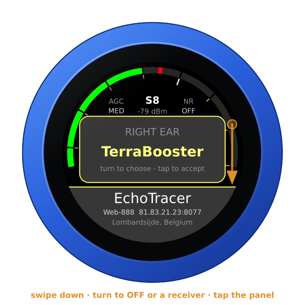 | 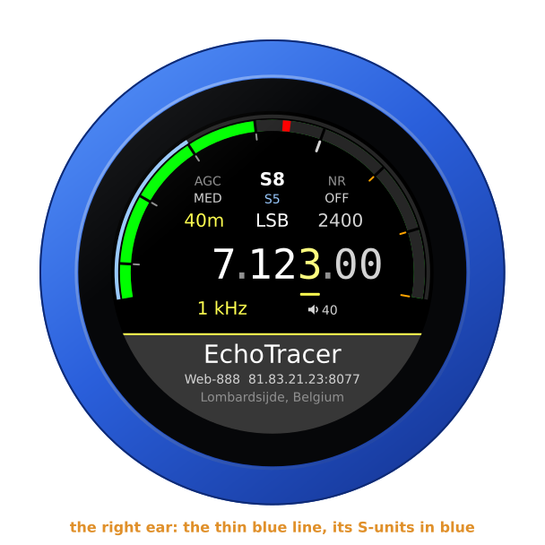 | 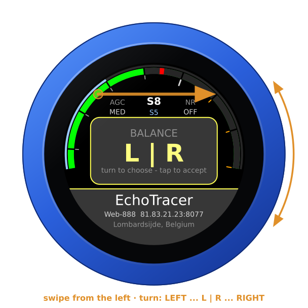 |

Each receiver hears only what it covers, and the dial is the left ear's: with
the left ear on 6 m on a Web-888, a KiwiSDR in the right ear cannot follow.
It goes quiet rather than play the top of its range: its thin line goes, and
*can't reach* takes its reading's place, in amber. It stays logged in
meanwhile, on the last frequency it could take — no new login, nothing sent
at every turn of the dial — and plays again the moment the dial is back
within its range, unless its owner's limit on idle listening has ended the
session meanwhile (*time up*: choose it again). The radio page and the
configuration page say what it covers: *out of range: it covers 0-30 MHz*.

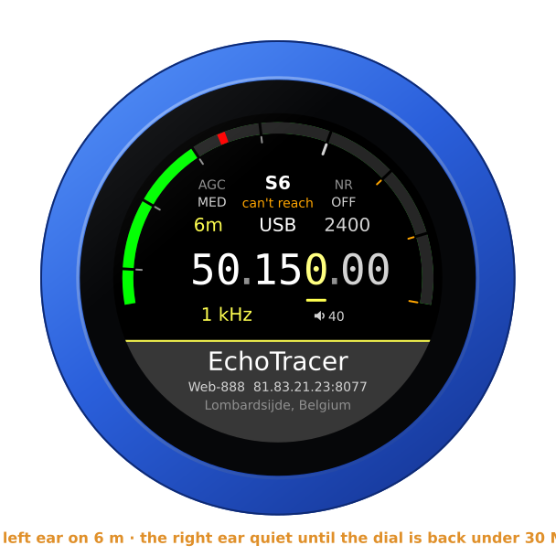

One receiver is never in both ears: each is a session of its own with the
receiver's owner, and two at once would be two channels. So each ear's
chooser shows the other's receiver dimmed — *in the left ear*, *in the right
ear* — and refuses it with a triple click; the pages and the API refuse it
too. Turn the right ear to **OFF**, or to another, and the left ear may take
its receiver, and the other way round. Should a list saved on the page give
the left ear the right ear's receiver — its own gone from the list — the
right ear lets go of it and waits, *left ear* under the S-units, until it is
free again.

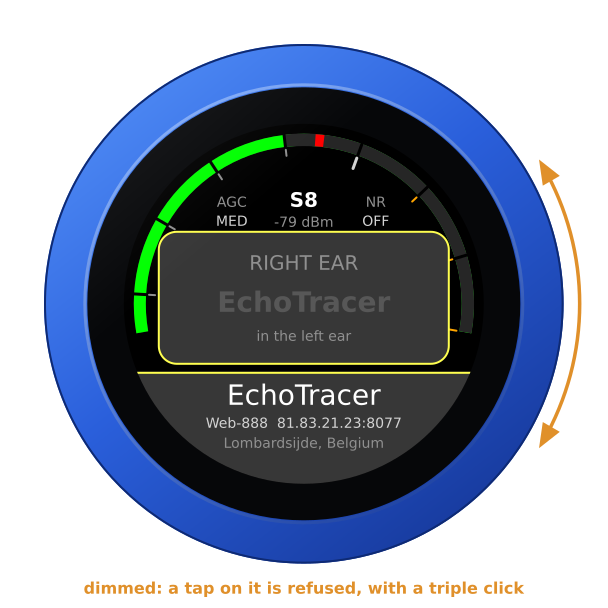

The right ear keeps its owners' limits as the left does: each receiver's
own, a session at a time. A day-limit mark is the receiver's, whichever ear
met it: refused at the right ear's login, it is held in the left as well,
and the two ears together never take more than two such refusals from it.
While its receiver connects, the right ear's place under the S-units shows
dots; when it cannot be had, a word in amber — *busy*, *day limit*, *time
up* and the rest, as the limits below have them — or *can't reach*, the
dial beyond its range. The right ear's choice and
the balance are kept through a restart.

## Its audio

A receiver sends its audio a sixth of a second at a time, and the knob keeps
a quarter of a second in hand, so the unevenness of the internet goes
unheard. The receiver's clock and the knob's never quite agree: the knob
follows the receiver's, playing a hair faster or slower — two thousandths at
most, far too little to hear — so that quarter second stays as it is for
hours. When the network holds the stream up longer than the quarter second
in hand, the sound stops; when it then hands the held-up audio over — all at once, or at least
twice as fast as it plays, as a connection catching up does — the knob
leaves out what is late by now, where the sound had stopped anyway, and
plays on from the live point: one break, rather than lagging behind for the
rest of the session or breaking the sound up. Audio handed over more slowly
than that is played as it comes, and cut back to the quarter second each
time it would fill the knob's buffer: a jump every few seconds until the
network has caught up.

Where the network keeps breaking the stream up — a short stall every few
seconds — the knob keeps more in hand. A second break within two minutes of
the first, and it holds as much as that stall held up, with a little to
spare, up to 0.7 s: that stall's audio is played, not left out, and the
stalls after it are ridden out, with no break. Once the stream has been calm
for three minutes, it eases back, a twelfth of a second every half minute,
to the quarter second, the audio playing a hair faster meanwhile: never a
cut. More delay only while the network is bad. A short stall every 8 s, for
two minutes, was 14 breaks; it is 2. The right ear does the same with its
own receiver's stream.

Every 30 seconds its log says how the audio came: what the knob holds and
what it is keeping it at (`ring 251 ms of 256`), the trim, the frames, any
the receiver let go or the network held up, the breaks, and any jump. The
right ear's line comes under `sdr:`.

## The receivers' limits

A KiwiSDR or a Web-888 has an owner, who sets how many listen at once, how
many of those may be apps such as the knob, and often how long anyone may
listen. The knob keeps to all of it.

**Day limit.** Many receivers allow each address so many minutes a day. Once
they are used up, the receiver turns the login away, and it counts each such
refusal: at the fifth it bars the address for good, every browser behind it
too. So the knob takes no chances. A receiver that says *day limit* is
marked, and the mark outlives a restart: the knob never logs in to it again
on its own — not at boot, not when the list is saved, not to retry. Choosing
it again yourself (the swipe up, a tap on its name, the page's **In use**,
the API) is one more try, and the knob takes two such refusals from a
receiver at most. A receiver with time limits that leaves the knob's login
unanswered — ten seconds of silence, or a connection that fails — counts as
one too, as its answer may have been such a refusal: the face says what it
saw, NO ANSWER or APPS FULL, and the receiver waits to be chosen. The mark
lifts when the receiver's own status shows its count was cleared: a Web-888
clears it only when it restarts, a KiwiSDR also once a day. When its owner
takes the time limits away, or a session plays for ten seconds — a
time-limit password lets it in — the knob lets the receiver go, but its
refusals stay counted, as the receiver keeps them until it restarts: should
it refuse again, the knob has no more tries than it had. **Test** never logs
in to a receiver with a mark, nor beside the knob's own login to one: while
the knob connects to a receiver, its Test answers from that, and the knob
waits for a Test's answer before its own login. A refusal a Test met holds
the receiver as any does, even one chosen a moment before: only choosing it
again, after, is a try.

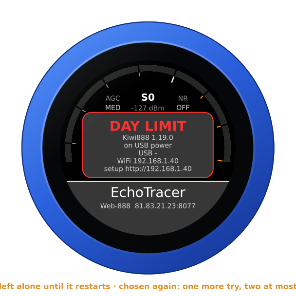

**Time up** and **kicked.** A receiver may end a session nobody used, and its
owner may send a listener away. Turning the knob or touching the glass counts
as listening: the knob tells the receiver so, a minute apart at most, as the
receiver's own page does, and tuning tells it by itself. A knob nobody
touches says nothing, and the owner's idle limit holds. When a session ends
so, the knob does not come back by itself: it asks LISTEN AGAIN, and a tap on
the panel starts a new session. In the right ear it asks nothing: *time up*
or *kicked* under the S-units, and choosing the receiver again — swipe down,
tap it — starts a new session.

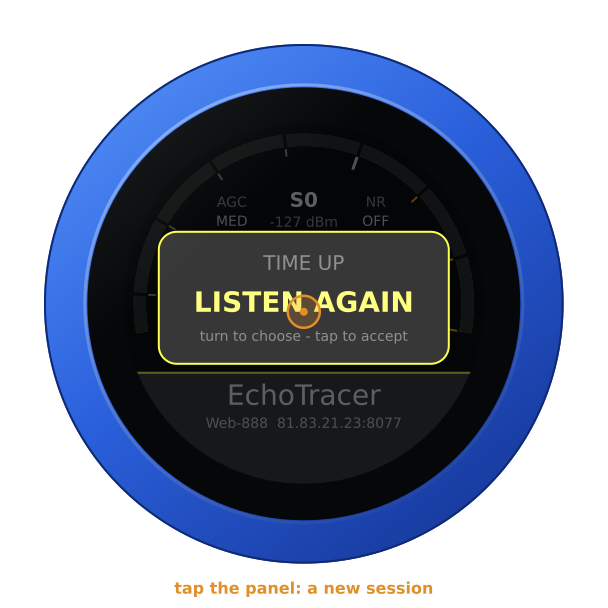

**Apps full.** A KiwiSDR keeps some of its channels for apps, and when those
are taken it takes a new one's connection and then says nothing at all. The knob says APPS
FULL after ten seconds of that silence and asks again two minutes later;
after the third time it says NO APPS and waits to be chosen again. A KiwiSDR
with time limits gets no second ask of the knob's own: its silence could be
a day limit's refusal whose answer was lost, so it counts as one, as above.
A KiwiSDR whose status says it lets no apps in at all is NO APPS without a
connection.

**The rest.** RECEIVER FULL is asked again after 30 s, then every minute.
REFUSED (the receiver will not talk to this address) waits until you choose
it again; PASSWORD?, NOT A KIWI, MOVED (a redirect elsewhere) and
CERTIFICATE? (an https receiver whose certificate does not check out) also
until the list is saved. NO ANSWER,
and a session that went quiet, are tried again after 2, 5, 10, 30 and then
60 s, back to 2 s once a session has played half a minute. On its own the
knob tries one receiver at most six times in ten minutes, then says TRY
LATER; tries that never reached it — the WiFi gone, say — do not count, and
choosing it yourself is always tried at once.

**Memory full.** The knob keeps its marks in its settings memory. When that
has filled up — a knob switched through many firmwares — a mark would not
outlive a restart, so the knob logs in on its own to no receiver with time
limits: the face says MEMORY FULL, and choosing the receiver yourself logs
in.

**After crashes.** A knob that crashes or browns out again and again, each
time soon after it started, would otherwise read a receiver's status and log
in at every start. From the second such start in a row it waits before it
contacts the receiver on its own — half a minute, then longer each time, ten
minutes at most — and says TRY LATER; choosing the receiver goes at once.
After any crash, what held a receiver back still holds it: one that timed
the knob out or kicked it asks LISTEN AGAIN, one that refused it waits to be
chosen. A power-on starts afresh.

The knob reads a receiver's status page once a boot, before its first
session — once between the two ears — and seldom after: owners drop an
address that polls it. While it connects, the face says *connecting...*
under the receiver's name, and shows no warning.

## From a computer

With a receiver playing, the knob's page opens on its controls: the band,
the mode, the filter and the AGC, a button for each receiver, and the right
ear's own buttons with the balance. The same works for other programs:

```
GET /api/radio                          the state, as JSON, the receiver's own say with it,
                                        the right ear's under "sdr": "right", with the
                                        "range" its receiver covers, Hz
GET /api/radio/set?freq=14074000        Hz, or MHz with a point (14.074)
    ...&mode=sam&agc=slow&lo=-4900&hi=4900
    ...&gain=1&squelch=30               the noise filter (0 off, 1 WDSP, 2 LMS, 3 SPEC),
                                        the squelch (0-100 %, 0 open)
GET /api/radio/set?receiver=1           another receiver, by its place from 0: at once,
                                        even while the one in use is down
GET /api/radio/set?sdr=2&balance=0      the right ear: off, or a receiver by its place
                                        from 0; the balance, -100 the left ear's alone,
                                        0 each in its own, 100 the right ear's alone
```

`lo` and `hi` are the passband around the dial, in Hz. `receiver=` and
`sdr=` are choices like the ones on the dial: of a receiver at its day
limit, one of its tries; of the other ear's receiver, refused (409); of a
place not in the list, said so (400), and nothing of the request done. The
page has the noise filter's buttons and a squelch slider, and **OV** after
the reading while the receiver's ADC overloads.

`GET /api/sdr` lists the receivers, each with `"tls": true` where it is
spoken to over https; `POST /api/sdr` saves the list as the configuration
page does, each address as the page takes it — `host:port`, or an `http://`
or `https://` link whole.

## A Bluetooth headset

With the companion firmware on the knob's second chip, a Bluetooth headset
plays the receiver; there is nothing to transmit, so its button and
microphone are left alone. A headset's audio is one channel: with a second
receiver in the right ear it hears the two together, and **BALANCE** turns
it to either. Only its logo shows, at the right end of the slab — and its
battery beside it, green, yellow or red, where the headset reports it
([its battery](headset.md#its-battery)). A receiver's name too long to stay
centred clear of them moves aside, and only one too long for the room left
ends in dots. Pairing and the companion firmware: [the headset
guide](headset.md).

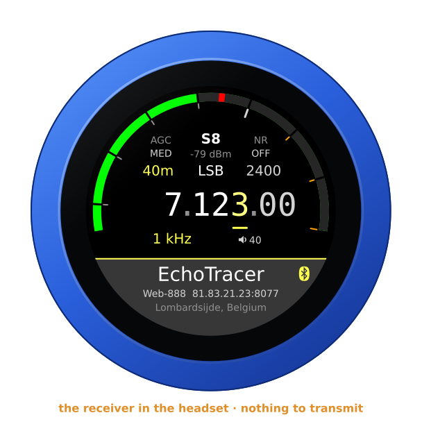

A Bluetooth speaker plays the receivers the same way, a fifth of a second or
so behind the jack — the two ears together in both its channels, as a
headset hears them — with a speaker beside the name, and its battery beside
that where it reports one. Until its own **Level** is set it is sent a
quarter of the level, 12 dB less: a quarter of full level where its own
volume is the knob's **VOLUME**, a quarter of the jack's where it keeps its
own — it is a loudspeaker, not earphones: [A Bluetooth
speaker](headset.md#a-bluetooth-speaker). Each speaker, and each headset,
has its own **Level** on the configuration page, 24 dB down to 12 dB up,
kept for it: [its level](headset.md#its-level).

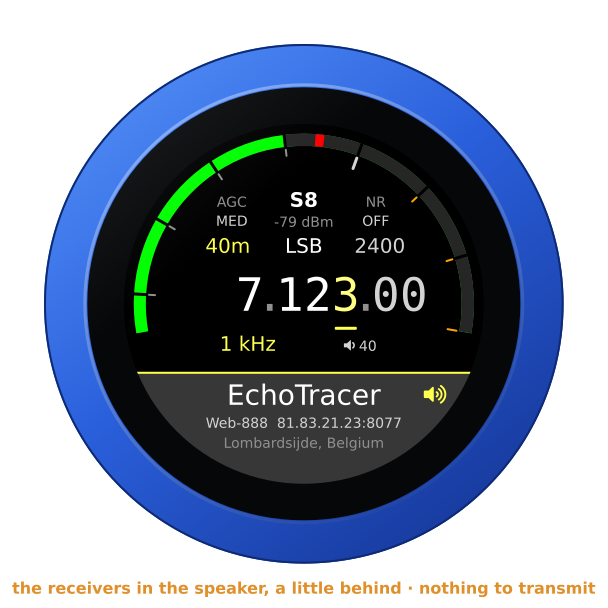

## Another firmware

Hold the S-meter for the address card, then hold it again for three seconds
until the knob buzzes, and turn: see [the setup guide](setup.md#back-to-the-setup-firmware-from-any-radios).
