# The FlexRadio firmware

`vfo-knob-multiflex` talks to a FLEX-6000 or FLEX-8000 itself, over the
radio's own API — no SmartSDR, no AetherSDR, no computer. The knob is one of
the radio's MultiFlex stations, beside SmartSDR, AetherSDR or a Maestro, in the
Maestro's colours: on the LAN, or through **SmartLink** for a radio away from
home.

The pictures are the knob's own screens, drawn from the firmware's texts and
layout (`tools/mkdocs.py`); the orange marks are what your hand does.

## Before you start: the radio

**MultiFlex** must be enabled on the radio. On the LAN the knob needs no login;
through SmartLink it logs in to your SmartLink account.

## Tell the knob where the radio is

Open the knob's configuration page — hold a finger on the S-meter until the
knob clicks, and browse to the address on the card; user `admin`, password
`admin` until you change it.

- **On the LAN:** under **FlexRadio**, the radio's IP address (it announces
  itself by broadcast, which the knob does not look for yet) and port `4992`.
  Up to four radios, with a name each for the dial.
- **Through SmartLink:** under **SmartLink**, your account's email address and
  password, and **Log in to SmartLink**. The password goes to FlexRadio's login
  service and is not kept: the knob keeps the login it is given, until you log
  out there. Your radios are listed, each with **Use now**; with **Offer these
  radios on the knob** they come after the LAN ones on the dial.

Until the radio answers, the knob says so, with its own addresses:

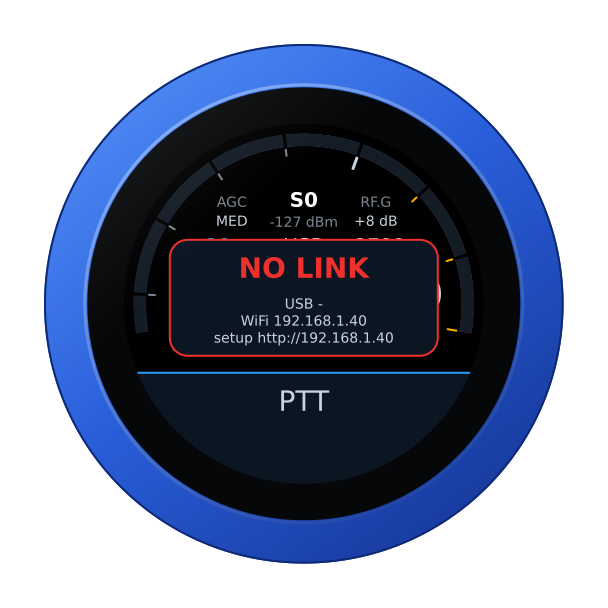

## Your own station, or the dial for one

At the start, with other stations already on the radio, the knob asks what to
be — turn, and tap the panel:

- **STATION OWN** — a station of its own: its own slice, which the radio gives
  back where it was after a restart; its own audio both ways, as Opus over WiFi,
  so the knob's speaker and microphone are the station; its own transmit
  settings.
- **DIAL FOR** *station* — the dial and PTT for a station already there, like a
  FlexControl on its computer. The knob tunes that station's active slice and
  follows when its operator clicks another; PTT keys that station, with that
  station's microphone. The knob plays no audio.

The last choice is offered first, and taken after 30 s without an answer; with
nobody else on the radio the knob does not ask. Through SmartLink the knob is
always its own station.

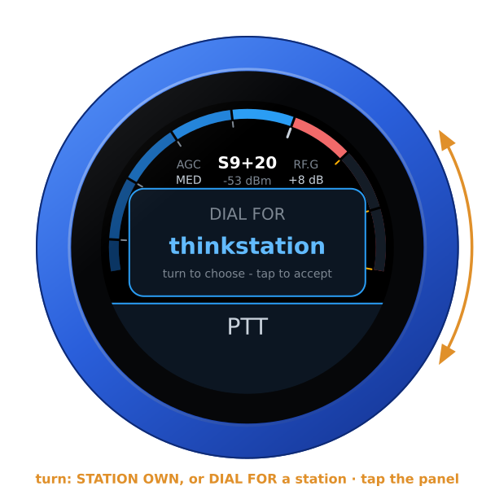

## The face

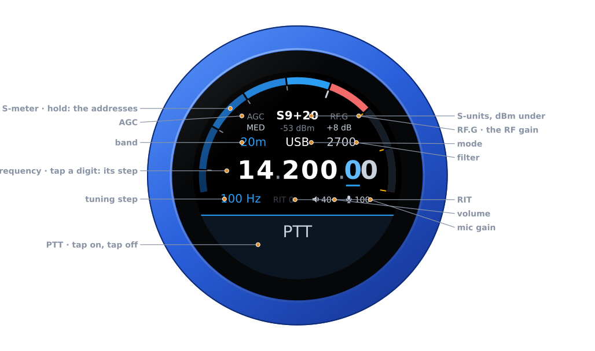

| Part | Tap | |
|---|---|---|
| **S-meter** | hold: the address card | S-units, peak held a second; dBm under the reading |
| **AGC** | the AGC editor | FAST, MED, SLOW, OFF |
| **RF.G** | the RF gain editor | the panadapter's RF gain, −8 to +32 dB |
| **Band** | the band editor | the band's own frequency, on a tap on the panel |
| **Mode** | the mode editor | USB, LSB, CW, AM, SAM, FM, NFM, DIGU, DIGL, RTTY |
| **Filter** | the filter editor | its width, on the side of the carrier the mode uses |
| **Frequency** | a digit: the tuning step | the underlined digit is the step |
| **Step, RIT** | RIT: its editor | RIT in amber when set |
| **Volume, mic gain** | their editors | the knob's own levels |
| **PTT** | key, and key off | see [Transmitting](#transmitting) |

Turn the knob to tune: a slow turn moves a step at a time, a flick crosses a
band. Band and mode change on a tap *on the panel*; filter, AGC, RF gain, RIT,
volume and mic gain apply as you turn, and any tap closes them.

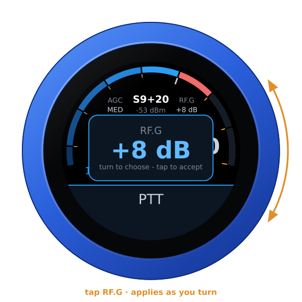

## Swipes

| Swipe | Opens |
|---|---|
| **From the right** | the menu: **TUNE**, a carrier at the tune power, for an external tuner or to check SWR — PTT stops it, and it stops by itself after 30 s; **ATU**, one cycle of the radio's tuner; **MEM**, the tuner's memories, lit when on — a tap switches them and the menu stays. It opens on MEM: TUNE and ATU are a turn away |
| **Down** | RX: LOCAL or a web SDR, when the knob has some |
| **From the left** | BALANCE, while a web SDR plays |
| **Up** | RADIO: another radio — on the LAN or through SmartLink |

| The menu | Another radio |
|---|---|
| 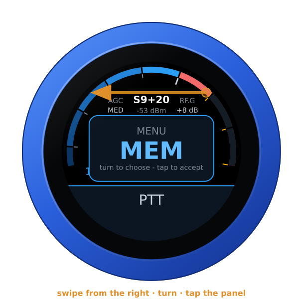 | 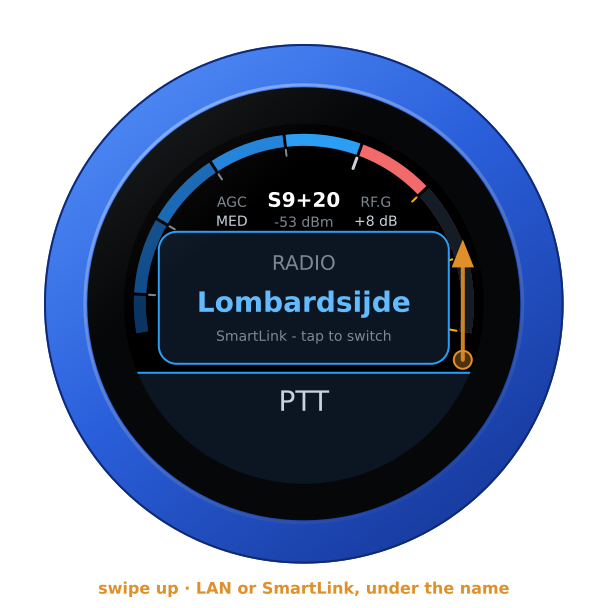 |

The same radio can be in the list twice, once on the LAN and once through
SmartLink: **LAN** or **SmartLink** under the name says which. Chosen, the
knob restarts into it.

## SmartLink

Through SmartLink the knob asks FlexRadio's server to introduce it to the
radio, then reaches the radio over TLS. The radio's certificate is its own,
self-signed: the knob pins it the first time, as AetherSDR does, and refuses a
different one until you log in again. After that it is the same station as on
the LAN, audio and PTT included. A radio reachable only by hole punching —
neither a forwarded port nor UPnP — is listed but not yet connected to.

## A web SDR beside the radio

A KiwiSDR, a Web-888 or an UberSDR can play beside the radio, following its
frequency, mode and passband: add them under **Web SDRs** on the configuration
page, each with a **Test**, then swipe down and choose one. The radio is in
the left ear and the SDR in the right, both brought to the same loudness; the
SDR's S-meter is the thin blue line outside the radio's, its reading the blue
one under the radio's. The SDR is silent while you transmit.

| RX | Playing | BALANCE |
|---|---|---|
| 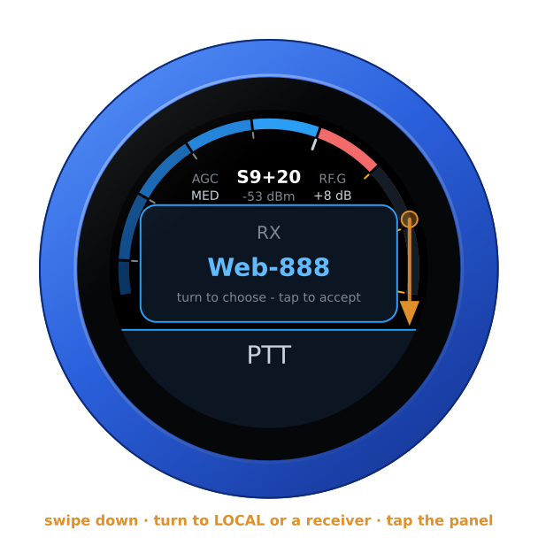 | 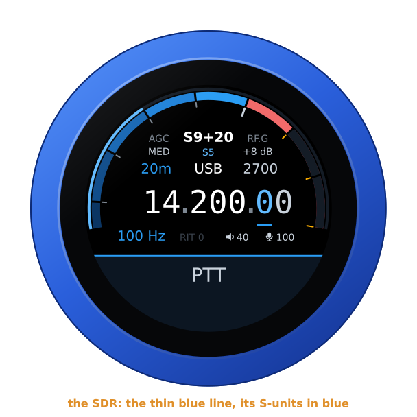 | 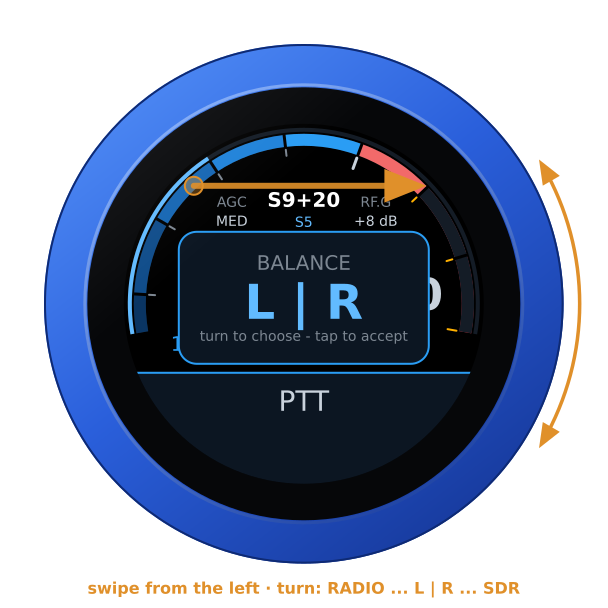 |

## Transmitting

**PTT** is a toggle: tap to key, tap again to unkey. It keys as the finger
lifts from a tap — a swipe that starts on it never keys — and on the air a
touch unkeys at once. The knob says why when the radio will not transmit:
out of band, or another station on the air. The face turns red: SWR across
the left half, forward power across the right, the microphone on the thin
inner ring.

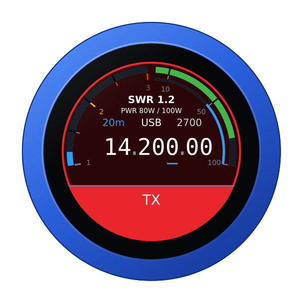

As a station of its own the knob is safe from losing power mid-over: the radio
stops a station's transmission when it leaves. As the dial for another station
it is not — that station is still there — so the radio's transmit time-out is
the backstop.

## From a computer

With the radio connected, the knob's page opens on the radio's controls, and
the same for other programs:

```
GET /api/radio                        the state, as JSON
GET /api/radio/set?freq=14074000      Hz, or MHz with a point (14.074)
POST /api/radios/switch  to=1         another radio: the knob restarts into it
```

## A Bluetooth headset

With the companion firmware on the knob's second chip, a Bluetooth headset can
be the knob's ear and microphone, and its call button the PTT: a press keys,
the next unkeys. The slab keeps PTT, with the headset's logo at its right
end — red while the headset has its microphone muted, when neither its button
nor the slab keys — and the knob's own microphone is off. Pairing, the companion
firmware and the boom arm as the PTT: [the headset guide](headset.md).

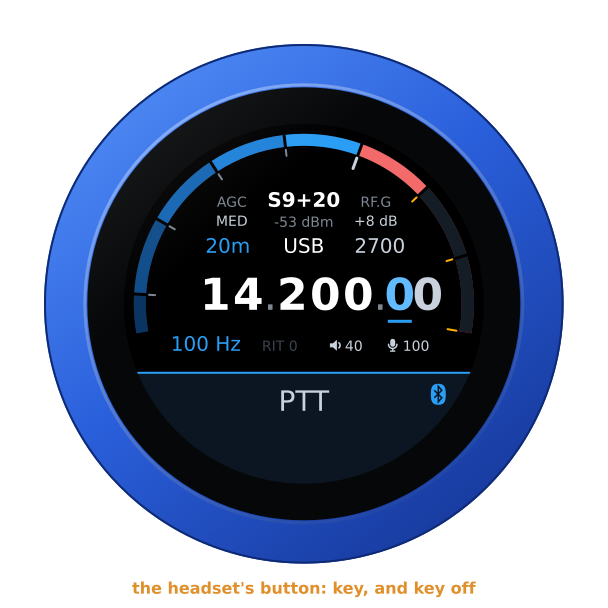

## Another firmware

Hold the S-meter for the address card, then hold it again for three seconds
until the knob buzzes, and turn: see [the setup guide](setup.md#back-to-the-setup-firmware-from-any-radios).
