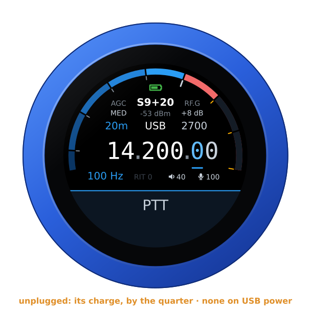
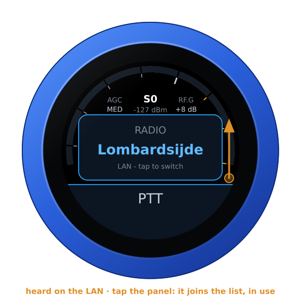
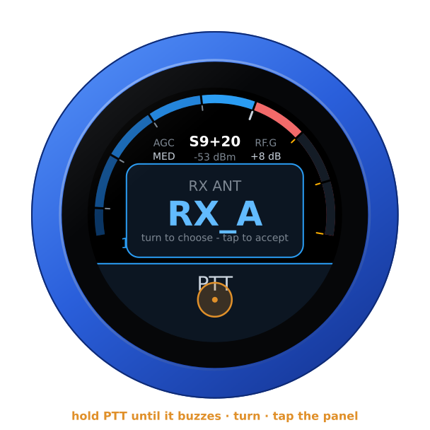
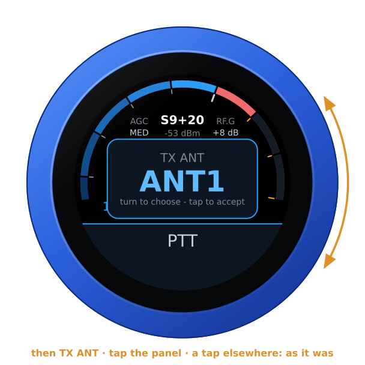
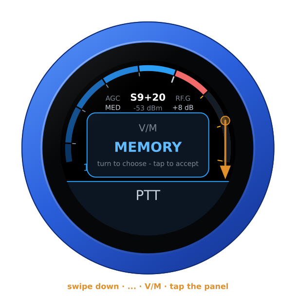
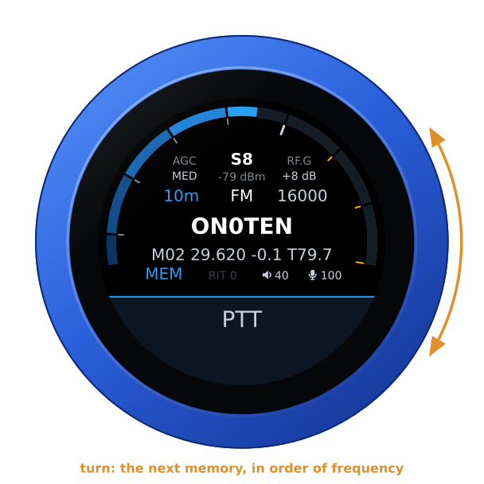
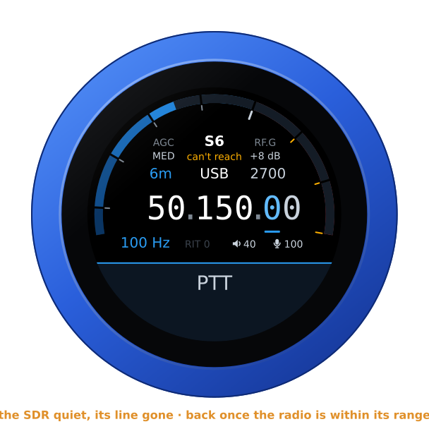

# The FlexRadio firmware

`vfo-knob-multiflex` talks to a FLEX-6000 or FLEX-8000 itself, over the
radio's own API — no SmartSDR, no AetherSDR, no computer. The knob is one of
the radio's MultiFlex stations, beside SmartSDR, AetherSDR or a Maestro, in the
Maestro's colours: on the LAN, or through **SmartLink** for a radio away from
home.

The pictures are the knob's own screens, drawn from the firmware's texts and
layout (`tools/mkdocs.py`); the orange marks are what your hand does.

## Before you start: the radio

**MultiFlex** must be enabled on the radio. On the LAN the knob needs no login;
through SmartLink it logs in to your SmartLink account.

## Tell the knob where the radio is

Open the knob's configuration page — hold a finger on the S-meter until the
knob clicks, and browse to the address on the card; user `admin`, password
`admin` until you change it.

- **On the LAN:** a FlexRadio announces itself on its network, and the knob
  listens. Under **FlexRadio**, **On this network** lists every one it hears —
  its name, model, address, and who is on it — and **Add** puts one in the
  list above, its name and address filled in; **Save** keeps it. Or type the
  radio's IP address and port `4992` yourself: a radio on another subnet, or
  reached over a VPN, is not heard. Up to four radios, with a name each for the
  dial.
- **A new knob,** with no address yet: swipe up on the dial. After **NO
  ADDRESS** come the radios it hears on the LAN; tap the panel on one and it
  joins the list, in use, and the knob restarts into it.
- **Through SmartLink:** under **SmartLink**, your account's email address and
  password, and **Log in to SmartLink**. The password goes to FlexRadio's login
  service and is not kept: the knob keeps the login it is given, until you log
  out there. Your radios are listed, each with **Use now**; with **Offer these
  radios on the knob** they come after the LAN ones on the dial.

Until the radio answers, the knob says so, with its own addresses:


## Your own station, or the dial for one

At the start, with other stations already on the radio, the knob asks what to
be — turn, and tap the panel:

- **STATION OWN** — a station of its own: its own slice, which the radio gives
  back where it was after a restart; its own audio both ways, as Opus over WiFi,
  so the knob's jack and microphone are the station; its own transmit
  settings.
- **DIAL FOR** *station* — the dial and PTT for a station already there, like a
  FlexControl on its computer. The knob tunes that station's active slice and
  follows when its operator clicks another; PTT keys that station, with that
  station's microphone. The knob plays no audio.

The last choice is offered first, and taken after 30 s without an answer; with
nobody else on the radio the knob does not ask. Through SmartLink the knob is
always its own station.


## The face


| Part | Tap | |
|---|---|---|
| **S-meter** | hold: the address card | S-units, peak held a second; dBm under the reading |
| **Battery** | — | the knob's own, over the reading, while it runs on it: full to empty by the quarter, green from half its charge up, yellow under that, red at a fifth and below. None on USB power, nor on the air |
| **AGC** | the AGC editor | FAST, MED, SLOW, OFF |
| **RF.G** | the RF gain editor | the panadapter's RF gain, −8 to +32 dB |
| **Band** | the band editor | the band's own frequency, on a tap on the panel |
| **Mode** | the mode editor | USB, LSB, CW, AM, SAM, FM, NFM, DIGU, DIGL, RTTY |
| **Filter** | the filter editor | its width, on the side of the carrier the mode uses |
| **Frequency** | a digit: the tuning step | the underlined digit is the step |
| **Step, RIT** | RIT: its editor | RIT in amber when set |
| **Volume, mic gain** | their editors | the knob's own levels |
| **PTT** | key, and key off; hold: the antennas | see [Transmitting](#transmitting) and [The antennas](#the-antennas) |

Turn the knob to tune: a slow turn moves a step at a time, a flick crosses a
band. Band and mode change on a tap *on the panel*; filter, AGC, RF gain, RIT,
volume and mic gain apply as you turn, and any tap closes them.


Unplugged, the knob runs on its own battery and shows its charge at the top
of the arc, as a phone does — on every firmware's face. On USB power the
charge cannot be read, and none shows. The address card says which:
**battery 85 %**, or **on USB power**.



## Swipes

| Swipe | Opens |
|---|---|
| **From the right** | the menu: **TUNE**, a carrier at the tune power, for an external tuner or to check SWR — PTT stops it, and it stops by itself after 30 s; **ATU**, one cycle of the radio's tuner; **MEM**, the tuner's memories, lit when on — a tap switches them and the menu stays. It opens on MEM: TUNE and ATU are a turn away |
| **Down** | RX: LOCAL or a web SDR, when the knob has some; then the antennas, RX ANT and TX ANT; and last, with memories on the radio, V/M |
| **From the left** | BALANCE, while a web SDR plays |
| **Up** | RADIO: another radio — on the LAN or through SmartLink |

| The menu | Another radio |
|---|---|
|  |  |

The same radio can be in the list twice, once on the LAN and once through
SmartLink: **LAN** or **SmartLink** under the name says which. Chosen, the
knob restarts into it. A radio heard on the LAN and not yet in the list comes
after the knob's own, marked **LAN**: chosen, it joins them.



## The antennas

Hold **PTT** half a second, until the knob buzzes: in place of keying, the
slice's antennas come up — its receive antenna first, **RX ANT**, from the
slice's list: ANT1, ANT2, RX_A, RX_B, XVTA, XVTB on a FLEX-6600. Turn, and tap
the panel; then the transmit antenna, **TX ANT** (ANT1, ANT2, XVTA, XVTB), and
a tap on its panel again. A tap anywhere else leaves them as they were. The
swipe down has them too, after RX.

A tap on PTT is still PTT, and a press held half a second never keys, whether
the antennas come up or not. The glass now and then loses a held finger for up
to about 0.13 s; so that this is never taken for a tap, a tap keys 0.15 s after
the finger lifts, and two taps closer together than that are one press. On the
air a touch unkeys at once and no hold opens anything; and the knob switches no
antenna under power — one chosen meanwhile waits for receive.

| RX ANT | TX ANT |
|---|---|
|  |  |

## Memories

The radio's memories — the ones SmartSDR keeps — are on the dial as an Icom's
memory channels are. Swipe down to **V/M**, last of the swipe, and choose
**MEMORY**: the memory's name takes the frequency's place, and under it its
number, frequency, shift and tone. Turn, and the knob steps through all of
them, one a detent, in order of frequency, putting the slice on each with the
radio's own *memory apply* — its frequency, mode and filter — and then setting
the memory's shift and tone itself: *memory apply* leaves the transmitter's
offset where the last memory left it, which would send a repeater's over, or a
simplex one after it, on the wrong frequency. It starts on the memory the slice
is on, else the one it showed last, else the nearest; on a radio with none yet,
on the first one saved. **VFO** brings the dial back, simplex. Nothing moves
the slice while the radio is on the air.

The radio's memories have no groups: the band stands where an Icom's group
would. Tuned elsewhere — the slice moved from SmartSDR, say — the knob leaves
memory mode by itself, unless the slice landed on another memory; and with the
connection lost, it starts again on the VFO.

| V/M | A memory |
|---|---|
|  |  |

## SmartLink

Through SmartLink the knob asks FlexRadio's server to introduce it to the
radio, then reaches the radio over TLS. The radio's certificate is its own,
self-signed: the knob pins it the first time, as AetherSDR does, and refuses a
different one until you log in again. After that it is the same station as on
the LAN, audio and PTT included. A radio reachable only by hole punching —
neither a forwarded port nor UPnP — is listed but not yet connected to.

## A web SDR beside the radio

A KiwiSDR, a Web-888 or an UberSDR can play beside the radio, following its
frequency, mode and passband — in CW the station on the dial is heard at the
receiver's own CW tone, as on its own page (below): add them under **Web SDRs**
on the configuration page, each with a **Test**, then swipe down and choose one. The radio is in
the left ear and the SDR in the right, both brought to the same loudness; the
SDR's S-meter is the thin blue line outside the radio's, its reading the blue
one under the radio's. The SDR is silent while you transmit.

A web SDR hears what it covers — a KiwiSDR or an UberSDR up to 30 MHz, a
Web-888 to about 62 MHz. Where it cannot reach the radio's frequency — 6 m on
a KiwiSDR — it goes quiet rather than play the top of its range: its thin
line goes, and *can't reach* takes its reading's place, in amber. It stays
logged in meanwhile, nothing sent to it at every turn of the dial, and plays
again the moment the radio is back within its range — unless its owner's
limit on idle listening has ended the session meanwhile (*time up*: choose it
again); the radio page and the configuration page say what it covers (*out
of range: it covers 0-30 MHz*). It keeps one of the receiver's channels all
the while: staying up there, choose LOCAL.



An UberSDR plays here through its Kiwi input: its own address on your
network with port **8073**, its KiwiSDR compatibility switched on
(`enable_kiwisdr` in its configuration). Its `https://` tunnel carries its
own page only, not this. Its bypass password, where you need one, goes in
**Password** — on its own network you need none — and the time-limit
password is a KiwiSDR's only. In CW the knob centres the SDR where the
receiver does: a KiwiSDR on its 500 Hz tone, or wherever its owner set it, an
UberSDR on the carrier, with its own tone.

A KiwiSDR behind the kiwisdr.com proxy or Cloudflare is reached only over
https: give it by its `https://` link, pasted whole
(`https://n0bqv.proxy.kiwisdr.com`, `https://kiwisdr.on3rvh.be`), and the
knob speaks to it over TLS, its certificate checked against the authorities
a browser trusts, for its name (not its dates). The first connection to one
takes a few seconds longer, the knob doing TLS in software; the next ones to
the same receiver are quick where its front lets the knob resume. An
`http://` link it answers with a redirect to https on its own host is
followed at once, and kept: the page shows the `https://` link from then on.
A redirect anywhere else is not followed (*moved*; the page's **Test** says
where to), and a receiver whose certificate does not check out is not spoken
to (*certificate*): both wait until it is chosen again or the list is saved.

| RX | Playing | BALANCE |
|---|---|---|
|  |  |  |

On the dial each receiver goes by the name you gave it on the page; without
one, by the antenna its status page names, once the knob has read that, else
by its address, with the port where another receiver shares it, so four
receivers on one address stay apart. **Test** puts the name an unnamed one
gives itself in its **Name** box, and **Save** keeps it. **Your name, for
their owners**, under the list, is what each receiver's owner sees the knob
as among those listening: your callsign, say; left empty, *VFO-Knob*.

Its owner's limits are kept. A receiver that turns the knob away because
its listening time for the day is used up says *day limit*, and the knob
leaves it alone, through restarts, until the receiver shows it has restarted
or, on a KiwiSDR, a day has passed. Choosing it again (swipe down, tap) is one
more try, and the knob takes two such refusals at most: a Kiwi bars an
address for good after five. One that ended a session nobody used says
*time up*, one whose owner sent the knob away *kicked*; both wait to be
chosen again, even after a crash, as does one that refuses this address.
A receiver with time limits that leaves the knob's login unanswered counts
as such a refusal, in case its answer was one; and with its settings memory
full (*memory full*) the knob logs in to one with time limits only when you
choose it. The knob logs in as the receivers' own apps do, so an owner's
limits on apps hold for it: a KiwiSDR whose status page lets no apps in says
*no apps* at once, and one whose channels for apps are all taken says
*busy*, *no apps* after the third time. A wrong password (*password?*) and an
address where no Kiwi answers (*not a kiwi*) wait until it is chosen again
or the list is saved; on its own the knob tries one receiver at most six
times in ten minutes. **Test** never logs in to a receiver at its day limit,
nor beside the knob's own login to one: the two never log in at once.

## Transmitting

**PTT** is a toggle: tap to key, tap again to unkey. It keys 0.15 s after the
finger lifts from a tap — a swipe that starts on it never keys, and a press
held half a second opens [the antennas](#the-antennas) instead — and on the
air a touch unkeys at once. The knob says why when the radio will not transmit:
out of band, or another station on the air. The face turns red: SWR across
the left half, forward power across the right, the microphone on the thin
inner ring.


As a station of its own the knob is safe from losing power mid-over: the radio
stops a station's transmission when it leaves. As the dial for another station
it is not — that station is still there — so the radio's transmit time-out is
the backstop.

## From a computer

With the radio connected, the knob's page opens on the radio's controls, and
the same for other programs:

```
GET /api/radio                        the state, as JSON
GET /api/radio/set?freq=14074000      Hz, or MHz with a point (14.074)
    ...&ant=3&txant=2                 the antennas, by place in the slice's lists, from 1
POST /api/radios/switch  to=1         another radio: the knob restarts into it
GET /api/flexfound                    the FlexRadios heard on the LAN, as JSON
```

## A Bluetooth headset

With the companion firmware on the knob's second chip, a Bluetooth headset can
be the knob's ear and microphone, and its call button the PTT: a press keys,
the next unkeys. The slab keeps PTT, with the headset's logo at its right
end — red while the headset has its microphone muted, when neither its button
nor the slab keys — and the knob's own microphone is off. Its battery shows
beside the logo, green, yellow or red, where the headset reports it
([its battery](headset.md#its-battery)). Pairing, the companion
firmware and the boom arm as the PTT: [the headset guide](headset.md).
A Bluetooth speaker plays the knob's audio with the jack, and you transmit
with the knob's own microphone: [the guide](headset.md#a-bluetooth-speaker).


## Another firmware

Hold the S-meter for the address card, then hold it again for three seconds
until the knob buzzes, and turn: see [the setup guide](setup.md#back-to-the-setup-firmware-from-any-radios).
