# The Telephone firmware

`vfo-knob-phone` turns the knob into a telephone on one SIP account, with no radio
involved. The knob's microphone and the jack (or a Bluetooth headset) are the
handset. The firmware has its own small SIP client:
- it registers over UDP and finds its own way out through your router (no STUN, no port forwarding);
- audio is G.722, HD voice up to 7 kHz, wherever the other side has it, and
  otherwise G.711 (A-law or µ-law), both ways. The knob's own audio runs at
  G.722's 16 kHz, so an HD call goes through untouched;
- keys go out as RFC 4733 DTMF.

The face is SVXConnect's, with your favourite contacts where the talkgroups were.

The knob has no speaker of its own. A call plays on the 3.5 mm jack, for
headphones or a powered speaker, and in a Bluetooth speaker with it, or only
in a Bluetooth headset.

The pictures are the knob's own screens, drawn from the firmware's texts and
layout (`tools/mkdocs.py`); the orange marks are what your hand does. Their
numbers are Ofcom's, kept for drama: no one answers them.

## First run

Open the knob's configuration page: hold a finger on the meter arc until the
knob clicks, then browse to the address on the card. The user is `admin` and the
password is `admin` until you change it.

1. Set the WiFi.
2. Under **Telephone**, enter the account your provider gave you: the SIP user,
   its password, the SIP server, and the port (5060 unless told otherwise).
3. Enter the account's own number. It is shown on the knob's face.
4. Press **Save the account**.

The knob registers straight away. The page then shows *registered* and the
address your router gives the knob outside, and the face reads **connected**.

Until it is registered, the slab says **NO SERVICE** and a panel says why:
- **NO ACCOUNT**: no account is saved yet;
- **NOT REGISTERED**: the provider refused the account, so check the user and
  password;
- **NO LINK**: the knob is still trying.

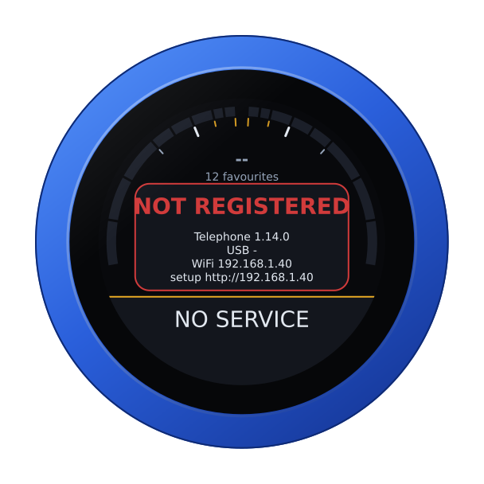

## The face

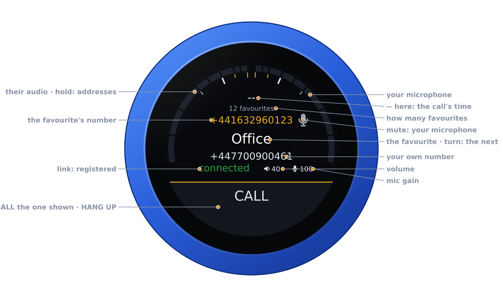

| Part | Tap | |
|---|---|---|
| **The arc** | hold: the address card | two meters in dBFS: the other end's audio on the left half, your microphone (what they hear) on the right. Each fills up from its own end towards the top, with a peak that holds for a second, then falls |
| **Battery** | — | the knob's own, between the meters' tops, while it runs on it: full to empty by the quarter, green from half its charge up, yellow under that, red at a fifth and below; under the keypad, none. None on USB power |
| **Under the arc** | — | the call's time and its state (*in call*, or *HD call* when it runs in G.722; *incoming call*; the seconds it has rung); at rest, the calls you missed (in red), or else how many favourites there are |
| **The number's row** | — | the favourite's number at rest; in a call, the other end's number |
| **Mute** | on, off | your microphone off: the other end hears silence, and you still hear them |
| **The middle** | — | the favourite on the dial at rest; in a call, the other end's name (from your favourites, or the caller's own), or its number when it has none. No favourite shows while a call is on |
| **Your number** | — | the account's number, where SVXConnect shows the reflector |
| **Link** | — | **connected** while registered, **connecting** while trying, otherwise **disconnected** |
| **Volume, mic gain** | their editors | the knob's own levels |
| **The slab** | see [Calling](#calling) | **CALL**, a green **ANSWER**, a red **HANG UP**, **ENDED**, or **NO SERVICE** while not registered |

During a call the middle says who it is with: their name, from your
favourites or as their own phone gives it, or their number when there is no
name. The arc shows both voices: theirs on the left half, yours on the right.

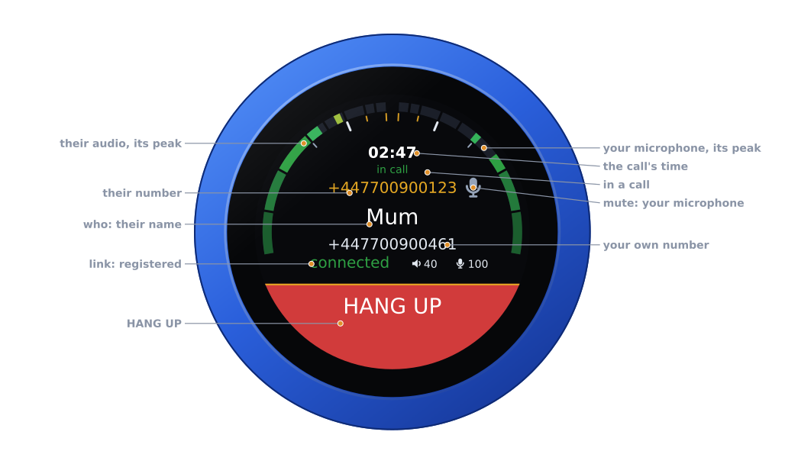

Unplugged, the knob runs on its own battery and shows its charge at the top
of the arc, between the meters' tops, as a phone does; the keypad covers it.
On USB power the charge cannot be read, and none shows. The address card says
which: **battery 85 %**, or **on USB power**.

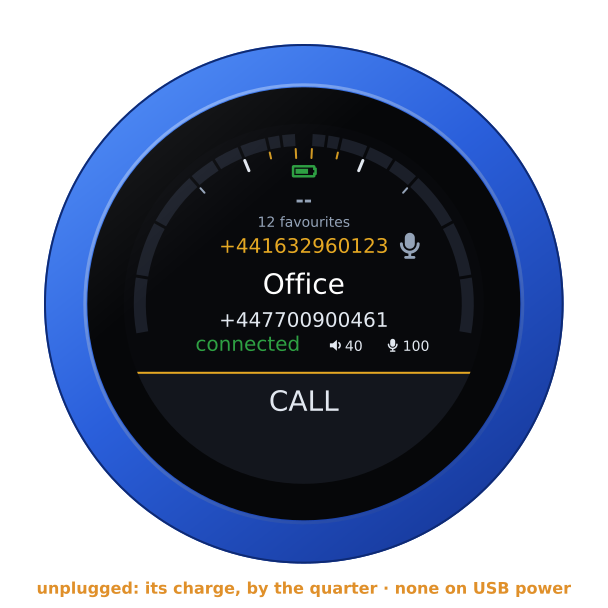

## Calling

**A favourite:** turn the knob to it, then tap **CALL**.

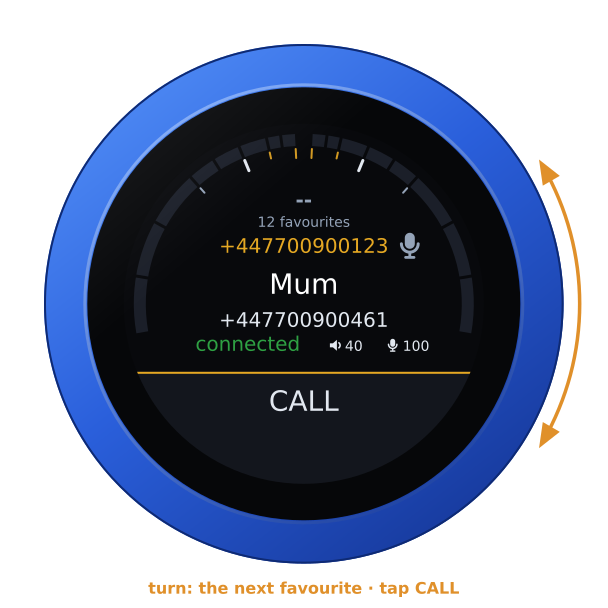

**A number by hand:** swipe down from the top for the keypad, type the number,
then tap **CALL**.
- Tap the backspace, right of the number, to delete its last digit.
- A long press on **0** as the first digit gives **+**, for an international
  number.
- A number longer than eight characters is shown in smaller type, so it fits.
- Tap the **×** at the top, or swipe up, to close the keypad. In a call, the
  call goes on.

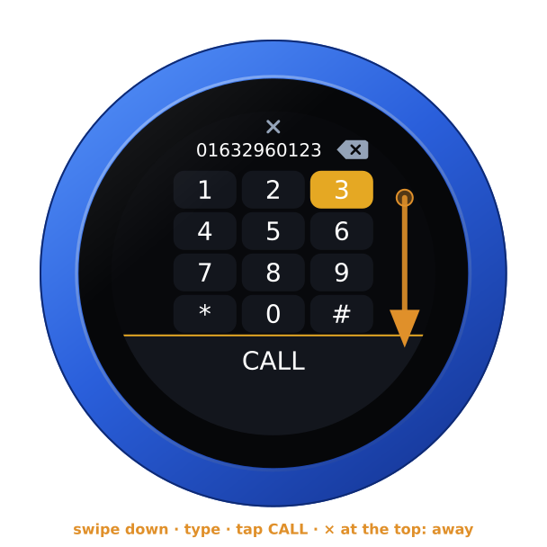

**While it rings at the other end,** the knob says **CALLING**, then
**RINGING**, with the seconds so far. Tap **HANG UP** to give up.

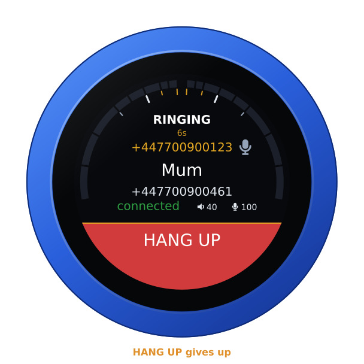

**An incoming call:** the knob vibrates at full strength in the ring's own
rhythm (two long pulses, then a rest), and its rim turns green. A screen that
had dimmed or gone dark lights up, and stays lit until the call is over. It
rings on the jack, and in a headset or a speaker when one is connected. The
slab splits in two: tap **ANSWER** on the right, which breathes green, to take
the call, or **DECLINE** on the left.

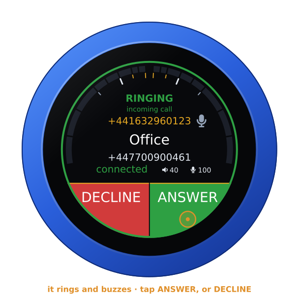

With a headset connected, the headset's own button answers, and the slab is
one red **DECLINE**, with *answer on the headset* under it.

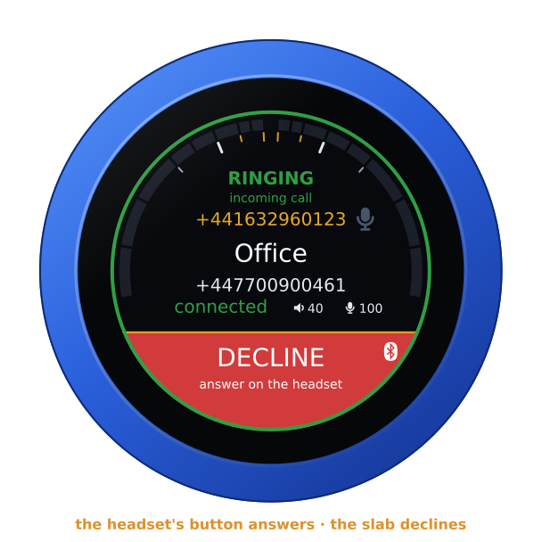

**During a call:** turn the dial for the volume. **VOLUME** comes up as you
turn and goes by itself two seconds after the last click; a tap meanwhile
goes where you aim it, as **HANG UP**. The dial does the same while a call
rings in, for how loud it rings, and while you are calling out. Swipe down
for the keypad. Its keys go out as DTMF, for menus and voicemail. Tap
**HANG UP** to end the call.

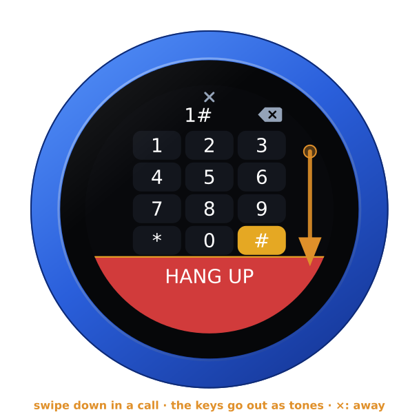

**Mute:** tap the microphone right of the number: the knob's own microphone,
struck through in red while it is off. The other end hears silence until you
tap it again, and you still hear them. A headset has its own mute, on the
headset: while one is in use the knob's microphone is greyed, or struck
through in red when the headset has itself muted.

**Without a headset,** the call plays on the jack, and the knob's own microphone
starts each call muted (struck through in red). It hears the room, and the
speaker on the jack with it. Tap the microphone to talk through it. Connect a
headset during the call, and the call moves into it, its microphone live; if
the headset goes, the call comes back to the jack and the knob's microphone,
muted until you tap it.

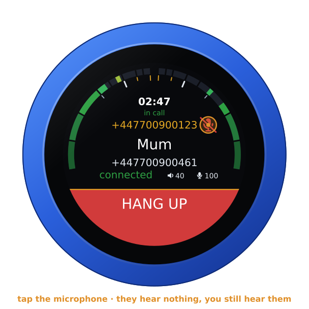

**When a call ends,** the knob says why: *busy*, *declined*, *missed* (a call
that rang out unanswered), *no answer*, *not available*, *no such number*,
*refused*, *network trouble* or *failed*. A call hung up from either end just
shows **CALL ENDED**.

A call ringing in that nobody answers stops after two minutes, as *missed*,
if your provider has not ended it sooner (most send it to voicemail first).
If the knob loses its WiFi during a call, the call ends; one ringing in at
that moment counts as missed.

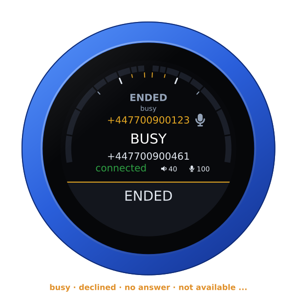

With the knob's own microphone unmuted, the speaker on the jack and the
microphone are in one room. While the other end is talking, the knob holds its
microphone so they do not hear themselves back. With a headset, both directions
run at once.

## Call history

Swipe from the left for the last 20 calls, newest first: in, out, missed (in
red) and declined, with how long each lasted and how long ago it was.
- Turn the knob to step through them.
- Tap the panel to call that number back.
- Tap anywhere else to close it.

The history is kept across restarts. The times come from the network's clock.

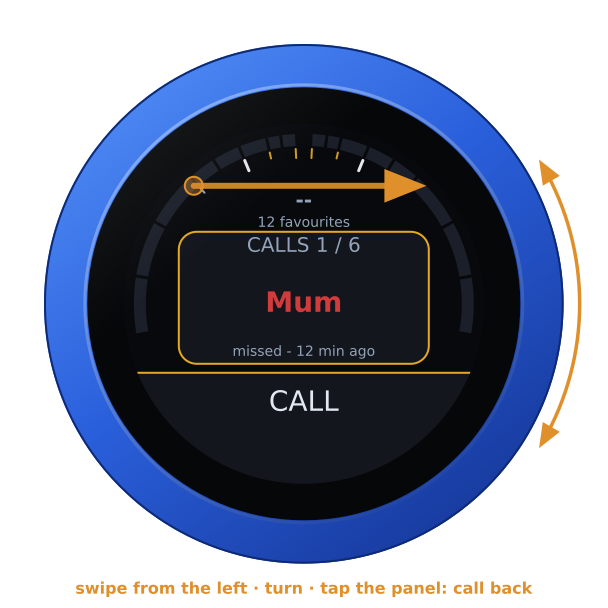

A call you missed shows under the arc, in red, until you open the history.

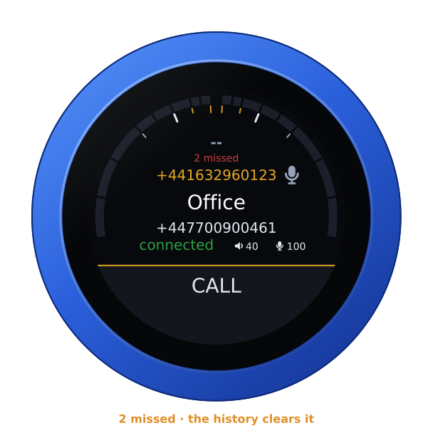

## A Bluetooth headset

With a headset paired ([A Bluetooth headset](headset.md)), it is the knob's ear
and microphone during calls. Its logo shows at the slab's right end — white on
the red slab of a call, red between calls while the headset has its
microphone muted — with its battery beside it where the headset reports it
([its battery](headset.md#its-battery)), and the slab stays the call's:
- **The call is only in the headset,** its microphone live: the jack stays
  silent while a headset is connected. If the headset goes during a call, the
  call comes back to the jack, with the knob's microphone muted.
- **Its audio opens for calls only,** as with a mobile phone. It opens when a
  call rings in, and the ring plays in it as well as on the jack, or when you
  dial, so the ringback plays in it. It closes when the call is over. Between
  calls the headset rests.
- **Answering is at once,** the headset's audio already open. A call answered
  in its first two seconds waits the moment the headset needs (three seconds
  at most), so the caller's first word is not lost.
- **The headset's button** answers a call that rings, and hangs up a call
  that is up or being made. The slab then declines a call ringing in, and
  places calls.
- **The headset's mute** only mutes. It never keys anything.

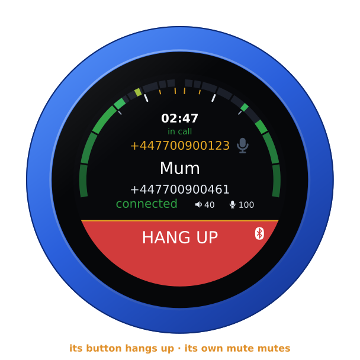

A Bluetooth speaker ([A Bluetooth speaker](headset.md#a-bluetooth-speaker))
plays a call as the jack does, and with it — a fifth of a second or so
behind. Its audio opens for calls only, as a headset's. The slab answers a
call ringing in at once, split in **DECLINE** and **ANSWER** as without a
headset, the speaker under **ANSWER**, and white on the red slab of a call.
You talk into the knob's own microphone, muted at the start of each call: tap
the microphone to talk. While the other end talks the knob holds its
microphone back, as it does without a speaker, and longer by the speaker's
lag, so that the other end does not hear itself. The speaker's buttons
answer nothing; a speaker that takes its volume from what plays to it has the
call's **VOLUME** for its own, its volume buttons turning the knob's
([its volume](headset.md#a-bluetooth-speaker)).

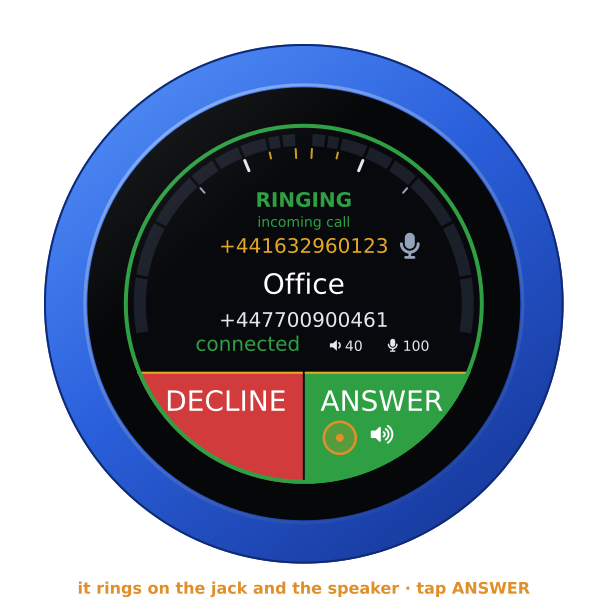

## Favourites

The **Favourites** list on the page holds up to 40 names and numbers. Between
calls the dial steps through them in that order, and the slab calls the one
shown.

The list can also come from Google Contacts (see below). Each sync replaces it.

## For other programs

Behind the page's login (HTTP basic auth, `admin` and your password):

| Request | |
|---|---|
| `GET /api/phone` | what the telephone is doing, as JSON: `registered`, `call` (`idle`; `calling` out; `ringing` in; `talking`; `ended`, with `call_why`), the other end's `peer` and `peer_number`, the call's `seconds`, `muted`, and `public_ip` |
| `GET /api/phone/dial?number=+3212345678` | call a number (POST with the same field works too) |
| `GET /api/phone/answer` | answer the call that rings |
| `GET /api/phone/hangup` | hang up, give up calling, or decline |
| `GET /api/phone/dtmf?digits=123#` | keys, in a call |
| `GET /api/phone/history` | the last 20 calls, newest first: each one's `kind` (`in`, `out`, `missed`, `declined`), `number`, `name`, `when` (seconds since 1970; 0 if the clock was not set yet), `seconds` it lasted, and whether it is `new` (missed, not yet looked at) |
| `GET /api/phone/favourites` | the favourites, as JSON |

For example:

```sh
curl -u admin:admin http://vfo-knob.local/api/phone
curl -u admin:admin "http://vfo-knob.local/api/phone/dial?number=%2B3212345678"
```

## Google Contacts

The knob can take your **starred** contacts from Google as its favourites. Each
of their numbers becomes one entry; a contact with several numbers gets one entry
per number, with its kind after the name (*Mobile*, *Work*). The knob syncs again
by itself every six hours, and whenever you press **Sync now**. It needs only
WiFi, not the SIP account, and it never syncs during a call.

Google wants an app of your own for this: a free Google Cloud project that only
your account uses. It takes five minutes, once. [GOOGLE.md](../GOOGLE.md) covers
it in full: every step, every message the page can show, and what to do about
each.

1. At [console.cloud.google.com](https://console.cloud.google.com/), create a
   project, for example *VFO-Knob*.
2. Under **APIs & Services → Library**, find the **Google People API** and press
   **Enable**.
3. Under **Google Auth Platform** (formerly the *OAuth consent screen*), press
   **Get started**:
   - give the app a name and your email address;
   - choose **External** as the audience;
   - finish.

   Then, under **Audience**, press **Publish app**. An app left in *Testing*
   signs you out of the knob after seven days.
4. Under **Clients**, press **Create client** and choose **Web application**.
   Under **Authorized redirect URIs**, add exactly
   `https://vfoknob.com/google.html`.
   Press **Create**, then copy the **Client ID** and the **Client secret**.
   Google shows the secret only this once.
5. On the knob's page, under **Google Contacts**:
   - paste both values;
   - press **Save the client**;
   - press **Sign in with Google**.

Signing in, Google first warns that it *hasn't verified this app*. The app is your
own, so choose **Advanced**, then **Go to VFO-Knob**, then **Continue**, and allow
it to see your contacts. Google then returns you to the knob's page, which shows
the sync. The favourites follow a few seconds later.

How it works:
- Google only returns a sign-in to an `https` page, never to a knob on your
  network. So it returns to a small static page, `google.html`, which hands the
  sign-in to the knob it started from. That page forwards only to a LAN address
  or a local name, and the knob accepts only the sign-in it began itself.
- The knob keeps Google's token. It only ever reads contacts.
- **Sign out** deletes the token. The favourites stay as they are.
- To use your own copy of that page, put it at another `https` address, enter
  that address both under the client's redirect URIs and in the page's
  **Sign-in returns through** field.
