# The setup firmware

Every knob ships with the **setup firmware** (`vfo-knob-setup`). It does two
things, with nothing but a phone: it puts the knob on your WiFi, and it
installs the firmware for your radio. Later, any radio's firmware can hand the
knob back to it, to install another.

The pictures below are the knob's own screens, drawn from the firmware's texts
and layout (`tools/mkdocs.py`); the orange marks are what your hand does.

## 1. Power on

The RF.Guru splash, then the setup firmware says it is starting.

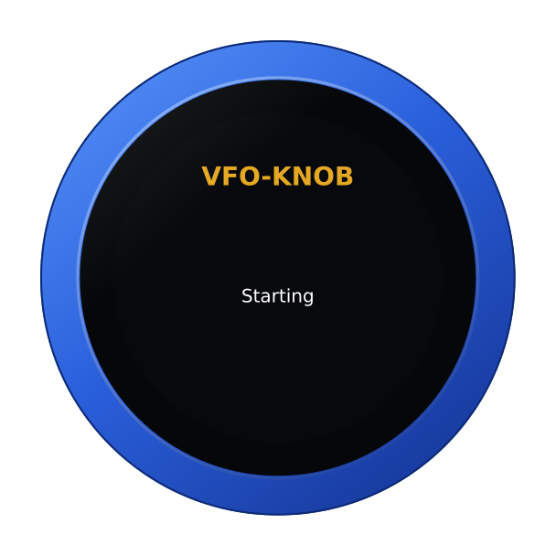

If the knob already knows a WiFi network, it spends up to 25 seconds joining
it, and goes straight to [the firmware list](#4-choose-your-radios-firmware).
Otherwise it opens a hotspot of its own.

## 2. Join the knob's hotspot with your phone

The knob comes up as an open WiFi network, **VFOKnob**, and says so.

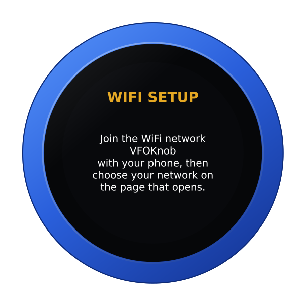

Join **VFOKnob** on your phone. The phone opens the knob's WiFi page by itself,
the way a hotel's sign-in page opens; if it does not, browse to
`http://192.168.4.1`.

## 3. Choose your network

The page lists the networks the knob can hear, strongest first. Tap yours,
enter its password — **Show** shows it as you type, so a phone's keyboard
cannot quietly change it — and tap **Connect**.

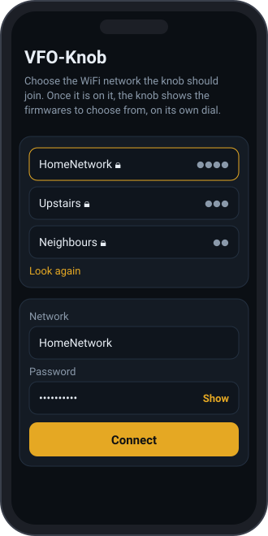

The knob tries the network and says how it goes, on its face and on the page:

| On the knob | On the phone |
|---|---|
| 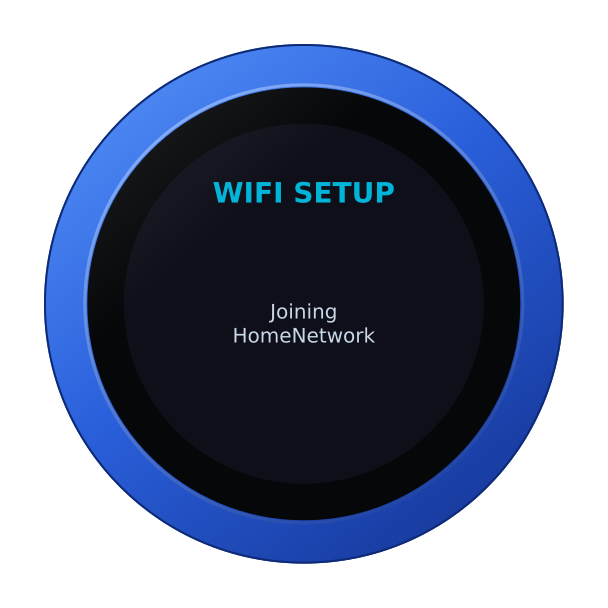  | 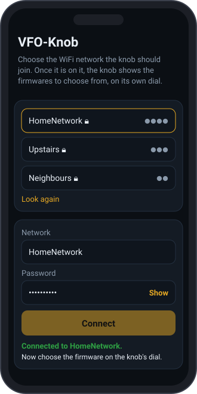 |

If it cannot join, both say why — **wrong password?**, **network not found** —
and the page lets you try again. Once it is on, the hotspot goes away after a
few seconds; the phone can be put away.

## 4. Choose your radio's firmware

The knob looks up the firmwares published for it, with their versions, and
shows them on the dial, one a detent. Turn to your radio's and tap the panel.

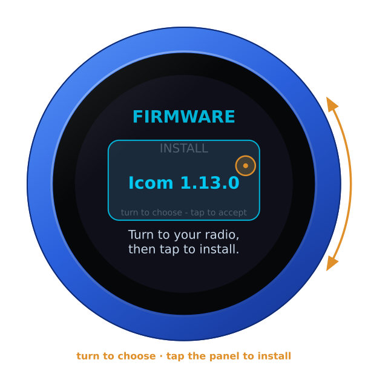

| Firmware | For |
|---|---|
| **AetherSDR** | AetherSDR on a computer, over the USB cable or WiFi (TCI) |
| **Icom** | the IC-705 and the IC-7610, over the radio's own LAN |
| **FlexRadio** | a FLEX-6000/8000 as a MultiFlex station, on the LAN or through SmartLink |
| **SvxLink** | an SvxLink reflector: the knob is the station |

The list comes from the update server each time, so a knob set up long after
it was made still offers every firmware there is by then. The last entry is
**WIFI — Set up again**: it brings the hotspot back, for another network.

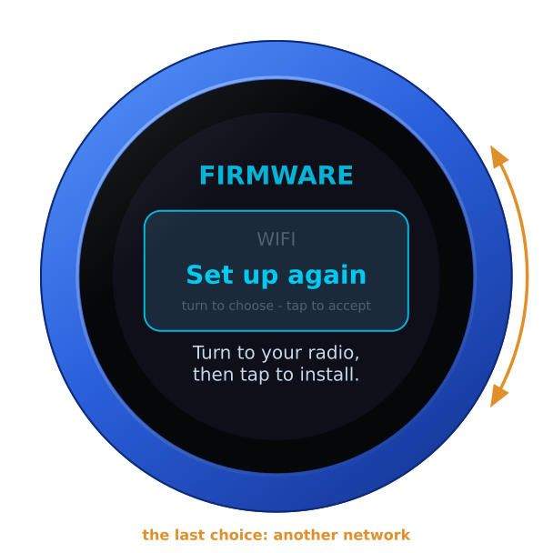

## 5. It installs, and restarts into it

The knob downloads the image, checks its signature, installs it and restarts
into it. It keeps the WiFi settings: the new firmware joins the same network.

| Installing | Done |
|---|---|
| 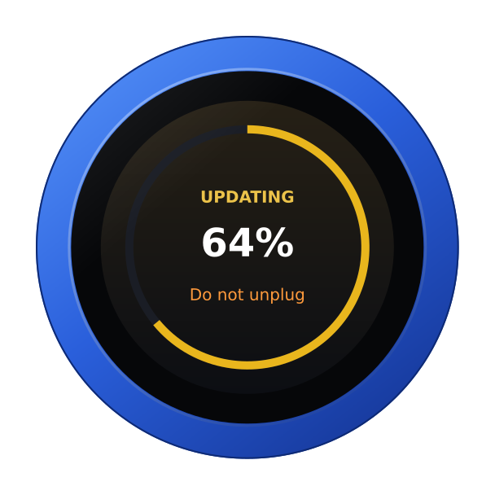 | 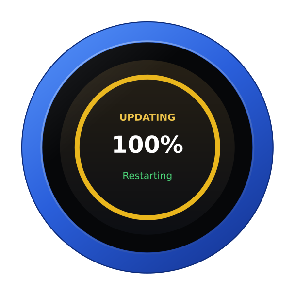 |

Then tell the knob where its radio is, on its configuration page: see the
guide for that firmware.

## Back to the setup firmware, from any radio's

To install another radio's firmware, go back to the list from the knob itself.

1. Hold a finger on the S-meter, at the top of the face, until the knob
   clicks: the address card comes up. Let go.

   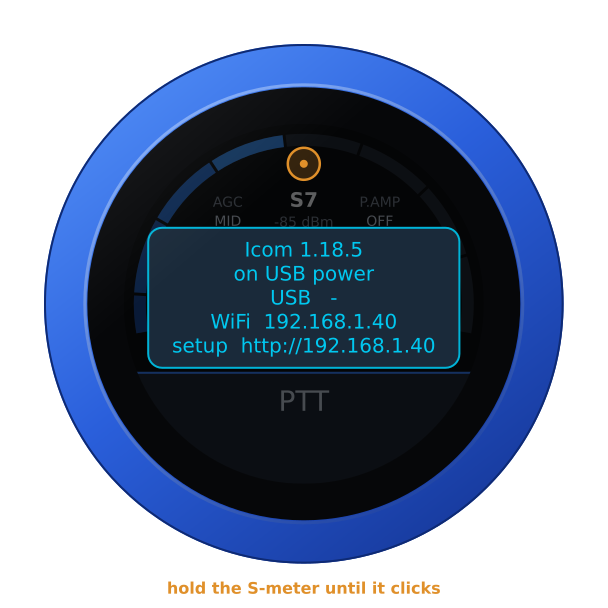

2. Hold the S-meter (or the card) again, for three seconds, until the knob
   buzzes. It asks **FIRMWARE?** — turn the knob for yes. A tap, or ten
   seconds of nothing, says no.

   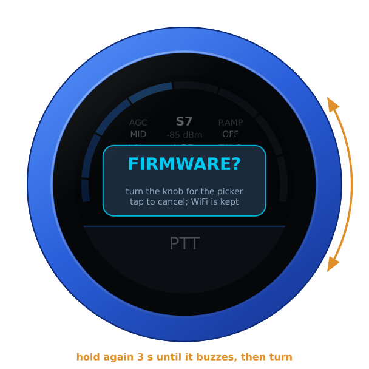

3. The knob restarts, installs the setup firmware over WiFi and shows the
   list again, the WiFi settings kept.

   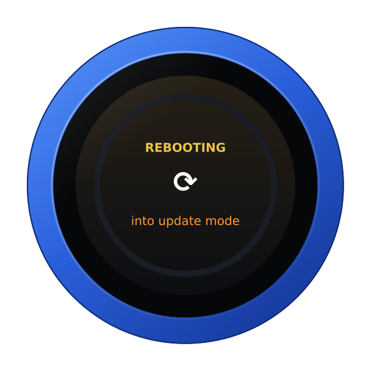

With something wrong — **NO LINK**, say, on a knob with another radio's
firmware — the warning panel shows the addresses in the card's place: hold
that until the knob buzzes. It needs WiFi: on the USB cable the knob says
**Needs WiFi** and carries on as it was.

Each firmware keeps its own settings, so going back to one later finds its
radio, its login and its choices as they were.

## If something is not right

| The knob says | What to do |
|---|---|
| **Could not join** *network*: **wrong password?** | Check the password on the phone's page and connect again. |
| **Could not join** *network*: **network not found** | The network is out of reach, or a 5 GHz-only one: the knob uses 2.4 GHz. |
| **None found. Is the network online? Trying again.** | The knob is on the network but cannot reach the update server; it keeps trying. |
| **WiFi would not start.** | Power the knob off and on again. |
| **Needs WiFi** (from a radio's firmware) | The way back to the list is over WiFi: set up WiFi on that firmware's page, or use **Set up again**. |
