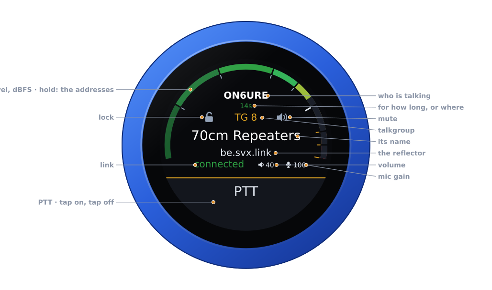
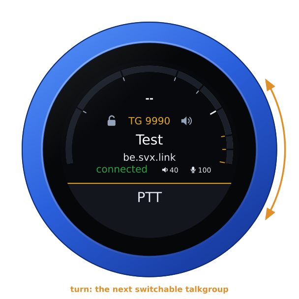
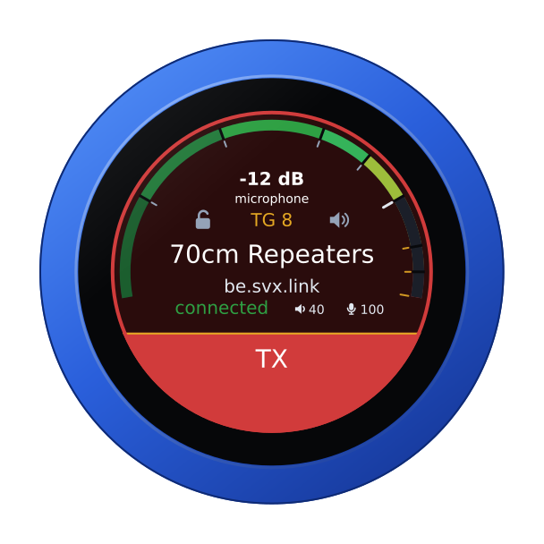

# The SvxLink firmware

`vfo-knob-svxconnect` turns the knob into a node on an
[SvxLink](https://www.svxlink.org/) reflector — no radio at all: the knob's
microphone and speaker are the station. It speaks the reflector's protocol 3.0,
with the reflector's own TLS and a client certificate, and Opus audio both
ways. It is a port of [SVXConnect-CLI](https://github.com/Guru-RF/SVXConnect-CLI)'s
reflector client, in [SVXConnect](https://svxconnect.app/)'s colours.

The pictures are the knob's own screens, drawn from the firmware's texts and
layout (`tools/mkdocs.py`); the orange marks are what your hand does.

## First run

Open the knob's configuration page — hold a finger on the S-meter until the
knob clicks, and browse to the address on the card; user `admin`, password
`admin` until you change it.

1. Set the WiFi, and the **reflector**: its name, not its host — `be.svx.link`
   is found through its SRV record.
2. Under **Station**, give your callsign and an email address; the location and
   position are for the reflector's map.
3. Press **Request certificate**. The knob makes its key (a few seconds), sends
   the reflector a certificate request, and keeps asking every 30 s until the
   sysop has signed it — then it logs in by itself. The certificate renews by
   itself; the key never changes, because the reflector knows the callsign by it.

## The face

The radio face, read differently:

| Part | Tap | |
|---|---|---|
| **The arc** | hold: the address card | the received audio in dBFS, and in transmit the microphone |
| **Who is talking** | — | with where they are when the reflector publishes it, or who spoke last and how long ago |
| **Lock** | on, off | no switching, by the dial or by a busier talkgroup |
| **Talkgroup** | — | `TG n`, its name from the reflector's portal where the frequency is, the reflector under it |
| **Mute** | on, off | the speaker off; the talkgroup still selected, who is talking still shown |
| **Link** | — | **connected**, **connecting** or **disconnected** |
| **Volume, mic gain** | their editors | the knob's own levels |
| **PTT** | key, and key off | see [Transmitting](#transmitting) |

## Talkgroups

Turn the knob: the next switchable talkgroup, one a detent.

Talkgroups follow SVXConnect's rules, set on the configuration page:
*switchable* ones are on the dial, *monitored* ones are followed when there is
traffic, a `+` after a number raises its priority (`9990, 8++, 1745+`), the
knob stays on a talkgroup for a while after an over, and drops back to
monitoring after a quiet spell. With no lists set it steps through every
talkgroup the reflector's portal names.

## Transmitting

**PTT** is a toggle, as on the radios: tap to key, tap again to unkey. It keys
as the finger lifts from a tap, and on the air a touch unkeys at once. The
reflector's own announcement of your callsign confirms the key; on a busy
talkgroup it refuses you the floor, and the knob says so with the refusal
click. On the air the arc is the microphone.

## On an enhanced reflector

Where the reflector has a portal, the knob reads its talkgroup names (kept in
flash, refreshed daily) and follows its live feed for where each talker is.
The feed is a second connection to the same host; it can be switched off on
the configuration page.

## Another firmware

Hold the arc for the address card, then hold it again for three seconds until
the knob buzzes, and turn: see [the setup guide](setup.md#back-to-the-setup-firmware-from-any-radios).
