# The UberSDR firmware

`vfo-knob-ubersdr` makes the knob a dial for an [UberSDR](https://ubersdr.org/)
web receiver: no radio, no computer. The knob talks to the receiver over its
own protocol, the one its web page uses, through UberSDR's tunnel or on your
own network, and plays its audio on the jack. It only receives, so there is
no PTT: the bottom of the face shows the DX cluster's spots on the band and
the voices the receiver hears there. The receiver's noise filters are where a
radio's gain is, its SNR where the AGC is, and its SSTV pictures are a swipe
away. A KiwiSDR or a
Web-888 can play beside it. The face uses UberSDR's own dark theme.

The pictures are the knob's own screens, drawn from the firmware's texts and
layout (`tools/mkdocs.py`); the orange marks are what your hand does.

## Tell the knob where the receiver is

Open the knob's configuration page: hold a finger on the S-meter until the
knob clicks, then browse to the address on the card. The user is `admin` and
the password `admin` until you change it. Under **UberSDR**:

| Field | |
|---|---|
| **Name, on the knob** | what the dial calls it, `ON6URE-TEL` |
| **Address** | as its page has it: `https://<name>.tunnel.ubersdr.org` through UberSDR's tunnel, over TLS, or `http://<address>:8080` on your own network, in the clear. A link pasted whole is taken apart: its `https://` or `http://` and name here, its port below |
| **Port** | `443` through the tunnel; on a LAN the receiver's own, `8080` unless its owner changed it |
| **Password** | optional: the receiver's bypass password, where its owner gave you one |

Up to four receivers can be listed; **In use** is the one the knob starts
with. Changes apply on the knob's next boot. When the one in use cannot be
reached, the knob goes on to the next in the list by itself
([another receiver](#another-receiver)).

`https://` is TLS and `http://` in the clear, whatever the port; an address
without either is TLS on port 443 and in the clear on any other. An IP
address typed alone, a `.local` name or a one-word one is taken for a
receiver on your network, which no certificate could name: the page puts
`http://` in front, and 8080 in the port if it said 443.

Without a password the knob listens as a guest, under the receiver's own
rules: a time limit per session (an hour on many), and a busy receiver may
turn it away. The password lifts both. On the receiver's own network none is
needed: UberSDR, as it comes, lets private addresses (`10.x`, `172.16-31.x`,
`192.168.x`) past its limits, and the knob listens there without the tunnel
and without its time limit. A guest's time left shows on the slab
([a guest's time](#a-guests-time)). Until the receiver answers, the knob
says why, with its own addresses:

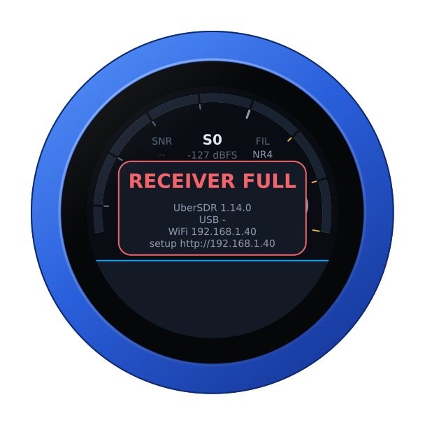

With more than one receiver listed, the receiver it is about is named under
the warning, as the dial names it ([another receiver](#another-receiver)).

## The face


| Part | Tap | |
|---|---|---|
| **S-meter** | hold: the address card | S-units in UberSDR's colours, red through yellow to green, peak held a second; the level in dBFS under the reading |
| **Battery** | — | the knob's own, over the reading, while it runs on it: full to empty by the quarter, green from half its charge up, yellow under that, red at a fifth and below; over an SSTV picture, none. None on USB power |
| **SNR** | — | the signal above the noise in the passband, in dB: red at 0, green from 15, as UberSDR colours it |
| **FIL** | the noise filter | OFF, NR2, RN2, NR4, whichever the receiver runs |
| **Band** | the band editor | 160 m to 10 m, each band's own frequency |
| **Mode** | the mode editor | USB, LSB, CWU, CWL, AM, SAM, FM, NFM, UberSDR's own names |
| **Filter** | the filter editor | its width, by mode: 1.8 to 5 kHz for a sideband, 100 Hz to 1 kHz in CW, 4 to 12 kHz in AM, 10 to 16 kHz in FM |
| **Frequency** | a digit: the tuning step | the underlined digit is the step |
| **Step, volume** | volume: its editor | the knob's own level |
| **The spot or voice** | all of them, on the dial | the one nearest the dial: green while it is heard, white when you are on it, grey beside it; under it where and what it is, and how many there are on the band |
| **Time left** | — | a guest's, at the slab's left end: whole minutes, or from a hundred on in hours, **1 h 40**; in the last five the seconds too, in amber, red in the last one; only where the receiver limits a guest ([a guest's time](#a-guests-time)) |

Turn the knob to tune: a slow turn moves a step at a time, a flick crosses a
band. Band and mode change on a tap *on the panel*. The filter, the noise
filter and the volume apply as you turn, and any tap closes them.

| Tune | The noise filter | The mode |
|---|---|---|
| 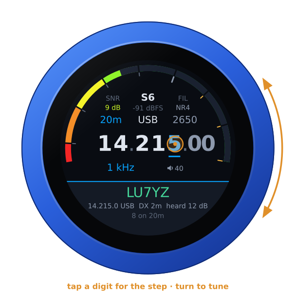 | 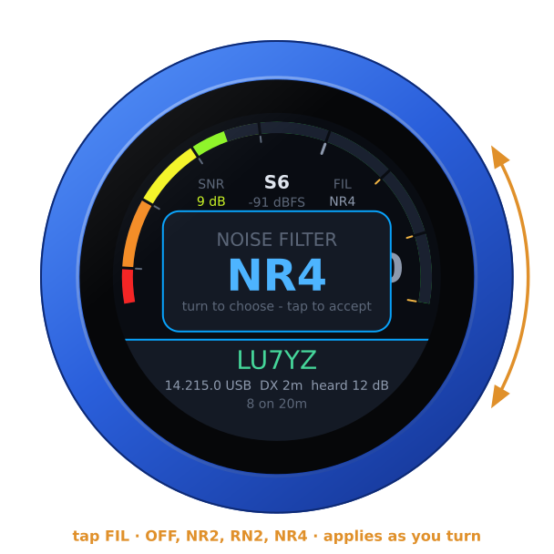 | 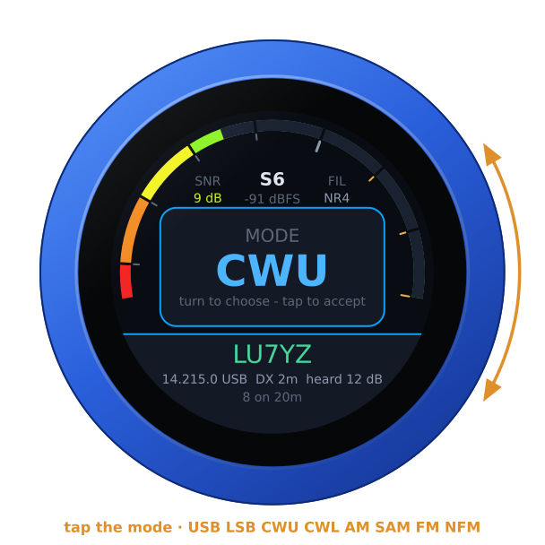 |

The noise filters run on the receiver, before its audio is sent: **NR2**
spectral subtraction, **RN2** RNNoise, **NR4** libspecbleach. The knob offers
only the ones the receiver runs. The knob asks for a filter once the dial
has rested on it for half a second, and at most once a second, which is as
often as UberSDR takes them. If all the receiver's filters are in use, the
knob says **FILTERS FULL** and goes back to what is running.

Unplugged, the knob runs on its own battery and shows its charge at the top
of the arc, as a phone does; an SSTV picture covers it. On USB power the
charge cannot be read, and none shows. The address card says which:
**battery 85 %**, or **on USB power**.

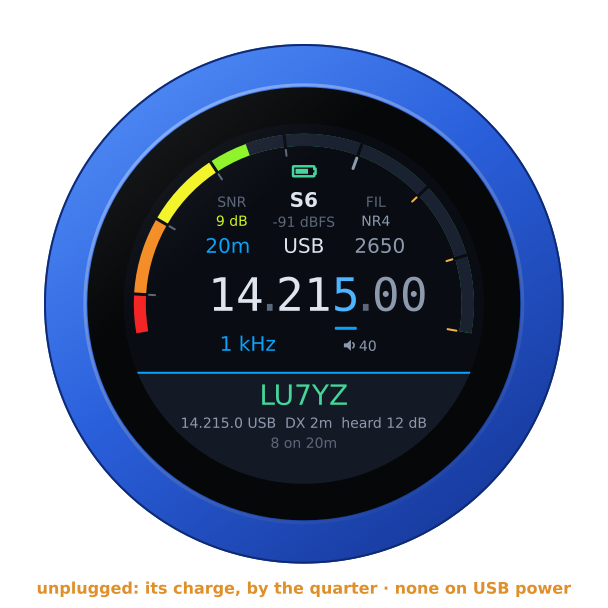

## Spots and voices

The receiver's DX cluster, and the voices its own detector hears, are the
knob's too. The bottom of the face shows the one nearest the dial on the
band you are on. In a voice mode that means the cluster's voice spots and
every voice heard now, whether anyone has spotted it or not: a voice nobody
has named goes by its frequency. In CW it means the cluster's CW spots and
the CW skimmer's. A voice on a spotted frequency is that spot, heard: it
turns green, with the voice's SNR.

Tap it and they are all on the dial in frequency order, opened on the
nearest. Turn, and the receiver goes to each spot in its mode as you reach
it, so you hear them as you go. A tap closes the list where you are, or,
before you turned, goes to the nearest.

| On the dial | A voice nobody has spotted |
|---|---|
| 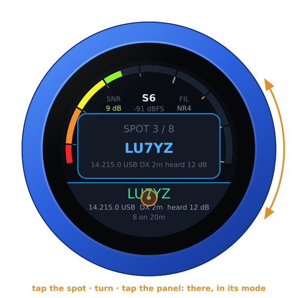 | 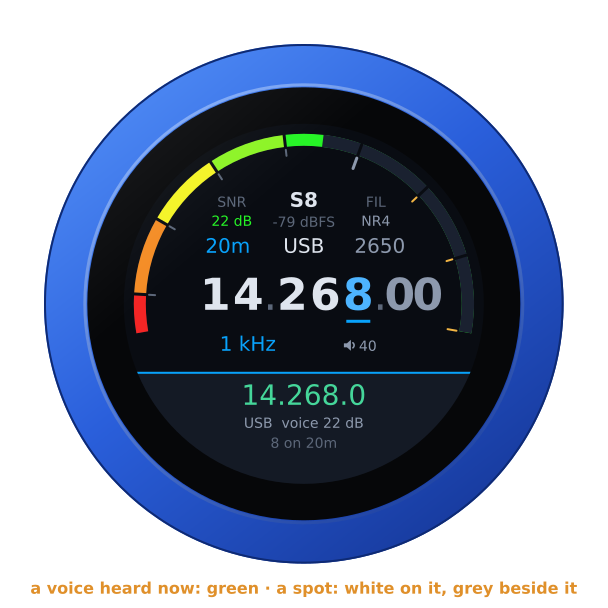 |

The voices are asked for every ten seconds, and at once on another band. A
cluster spot's mode is its comment's, where the comment names one, and
otherwise the band plan's (IARU Region 1): CW at the bottom of a band, the
digital modes above it, voice above those, on the lower sideband below
10 MHz. Spots for digital modes are left out: there is no voice to hear.
Spots age out after half an hour, the skimmer's after ten minutes.

## SSTV pictures

Where the receiver keeps an SSTV gallery (its **sstv** addon, which decodes
the SSTV channels by itself), swipe from the right: the panel says how many
pictures it has. Tap it and the newest fills the face, with its mode above
and where and when under it. The knob steps through the rest, newest first:
the next ones are fetched ahead while you look, so a turn is usually
instant, and otherwise the last picture stays, dimmed, until the next is
there. Any tap goes back to the dial. The receiver's gallery loses its
oldest pictures as new ones come: if the one you are on goes, the viewer
steps back to the last there is, and with none left the dial is back. So it
is when the knob goes on to another receiver
([another receiver](#another-receiver)): its gallery is that one's.

| SSTV | A picture |
|---|---|
| 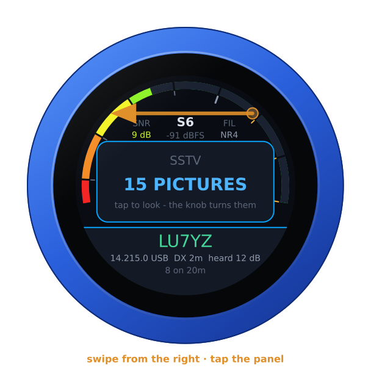 | 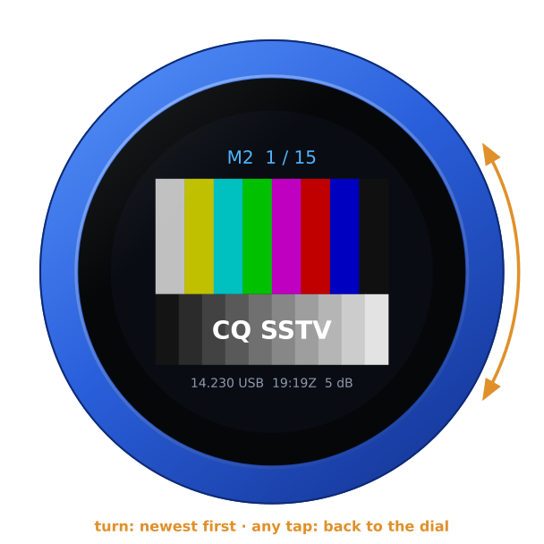 |

## A KiwiSDR beside it

A KiwiSDR or a Web-888 can play beside the UberSDR, following its frequency,
mode and passband — in CW the station on the dial is heard at its CW tone,
as on its own page: 500 Hz, unless its owner set another. Add them under
**Web SDRs** on the configuration page, each with a **Test**, then swipe down
and choose one. The UberSDR is in the left ear and the KiwiSDR in the right,
both brought to the same loudness. The KiwiSDR's S-meter is the thin violet
line outside the UberSDR's, and its reading replaces the dBFS, in violet.
**BALANCE**, a swipe from the left, fades from one to the other.

A KiwiSDR behind the kiwisdr.com proxy or Cloudflare is reached only over
https: give it by its `https://` link, pasted whole
(`https://n0bqv.proxy.kiwisdr.com`, `https://kiwisdr.on3rvh.be`), and the
knob speaks to it over TLS, its certificate checked against the authorities
a browser trusts, for its name (not its dates). The first connection to one
takes a few seconds longer, the knob doing TLS in software; the next ones to
the same receiver are quick where its front lets the knob resume. An
`http://` link it answers with a redirect to https on its own host is
followed at once, and kept: the page shows the `https://` link from then on.
A redirect anywhere else is not followed (*moved*; the page's **Test** says
where to), and a receiver whose certificate does not check out is not spoken
to (*certificate*): both wait until it is chosen again or the list is saved.

A KiwiSDR hears up to 30 MHz, a Web-888 to about 62 MHz. Where it cannot
reach the UberSDR's frequency — 6 m, on an UberSDR that covers it — it goes
quiet rather than play the top of its range: its thin line goes, and *can't
reach* takes its reading's place, in amber. It stays logged in meanwhile,
nothing sent to it at every turn of the dial, and plays again the moment the
dial is back within its range — unless its owner's limit on idle listening
has ended the session meanwhile (*time up*: choose it again); the radio page
and the configuration page say what it covers (*out of range: it covers 0-30
MHz*).

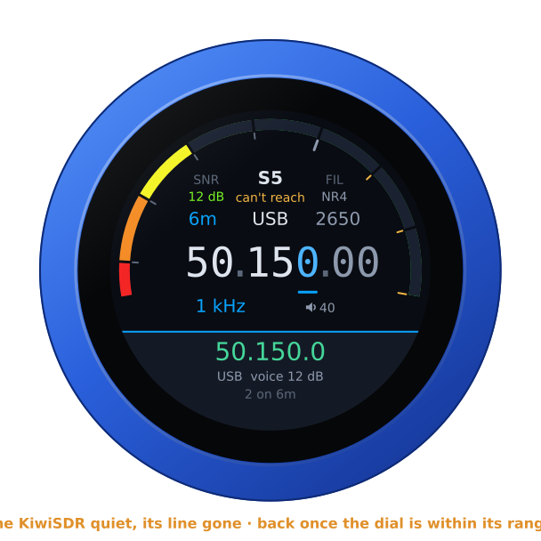

| RX | Playing | BALANCE |
|---|---|---|
| 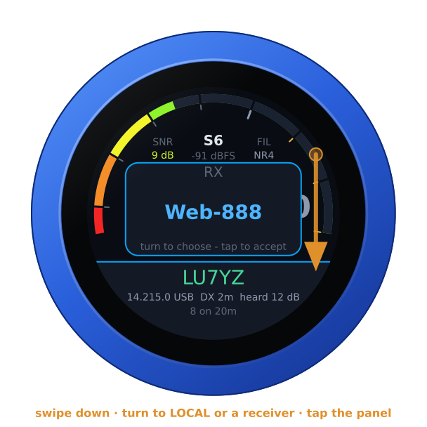 | 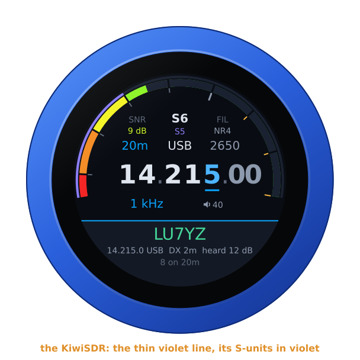 | 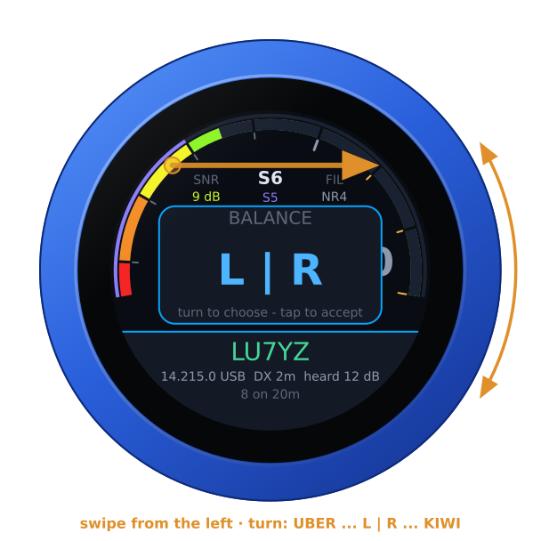 |

On the dial each receiver goes by the name you gave it on the page; without
one, by the antenna its status page names, once the knob has read that, else
by its address, with the port where another receiver shares it, so four
receivers on one address stay apart. **Test** puts the name an unnamed one
gives itself in its **Name** box, and **Save** keeps it. **Your name, for
their owners**, under the list, is what each receiver's owner sees the knob
as among those listening: your callsign, say; left empty, *VFO-Knob*.

Its owner's limits are kept. A KiwiSDR or a Web-888 that turns the knob
away because its listening time for the day is used up says *day limit*, and
the knob leaves it alone, through restarts, until the receiver shows it has
restarted or, on a KiwiSDR, a day has passed. Choosing it again (swipe down,
tap) is one more try, and the knob takes two such refusals at most: a Kiwi
bars an address for good after five. One that ended a session nobody used
says *time up*, one whose owner sent the knob away *kicked*; both wait to be
chosen again, even after a crash, as does one that refuses this address.
A receiver with time limits that leaves the knob's login unanswered counts
as such a refusal, in case its answer was one; and with its settings memory
full (*memory full*) the knob logs in to one with time limits only when you
choose it. The knob logs in as the receivers' own apps do, so an owner's
limits on apps hold for it: a KiwiSDR whose status page lets no apps in says
*no apps* at once, and one whose channels for apps are all taken says
*busy*, *no apps* after the third time. A wrong password (*password?*) and an
address where no Kiwi answers (*not a kiwi*) wait until it is chosen again
or the list is saved; on its own the knob tries one receiver at most six
times in ten minutes. **Test** never logs in to a receiver at its day limit,
nor beside the knob's own login to one: the two never log in at once.

## A guest's time

A receiver's owner may limit a guest's session: an hour, often. The time
left is at the left end of the slab, level with the spot: **52 min**, or from
a hundred minutes on in hours, **1 h 40**; in the last five minutes the
seconds too, in amber, **4:59**; red in the last minute. A call too long to
stay centred clear of it moves aside, and only one too long for the room left
ends in dots. With the receiver's password, or on its own network, there is
no limit, and nothing shows there.

| The time left | The last five minutes | Idle |
|---|---|---|
| 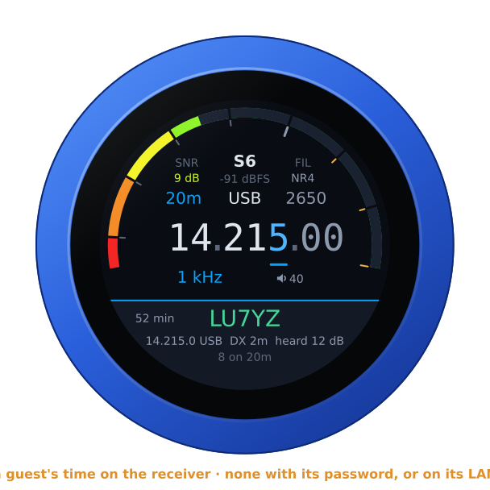 | 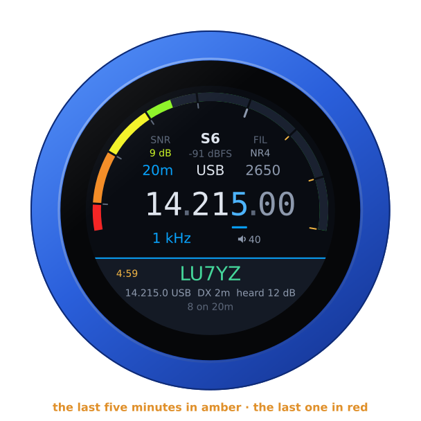 | 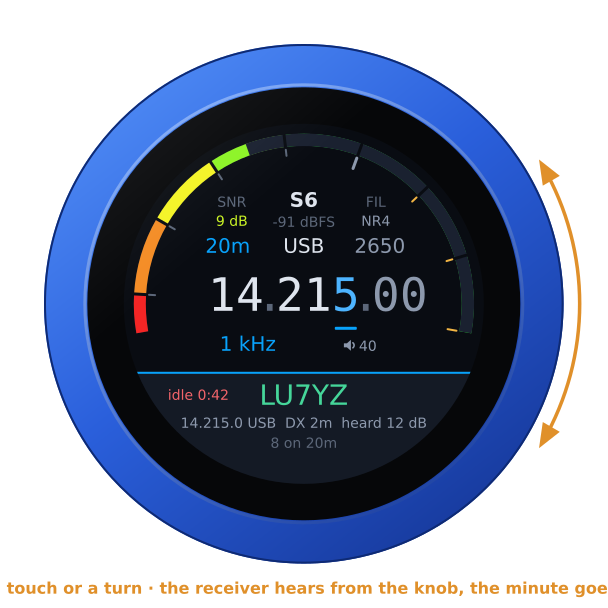 |

The knob counts it as the receiver does. A session's time runs from the
moment it first played, by the clock. Tuning does not move it, nor does a
dropped connection: the knob comes back to the same session, whose time has
gone on meanwhile. Where the receiver also keeps an allowance for the day,
for each address, and that runs out first, the knob counts that instead; it
only runs while the knob listens.

A receiver may also end a session left idle: nothing done for so many
minutes. Touching the glass or turning the knob counts as listening, as a
click does on UberSDR's own page. In the last minute before an idle limit
would end the session, the knob counts that minute instead, in red:
**idle 0:42**. Use the knob, and the count is the session's again.

At 0:00 the receiver ends the session, within seconds — up to half a
minute where it is the day's allowance that ran out, which the receiver
looks at less often; the count waits at 0:00 meanwhile. The knob does not
start another by itself, as UberSDR's own page does not: it asks. Tap
the panel for a new session, with its whole time again. A session that goes
on a minute past the count, a receiver restarted meanwhile, say, is no longer
counted.

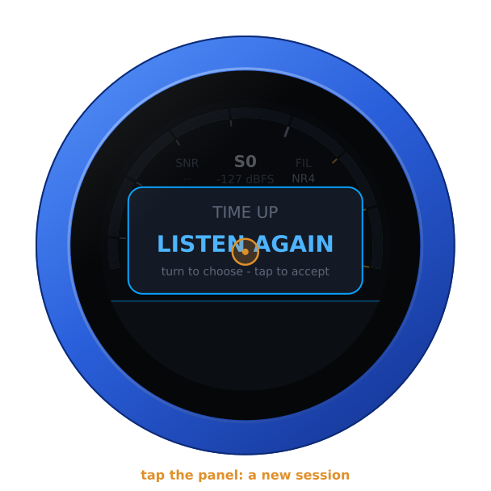

## Another receiver

With more than one receiver in the list, swipe up: turn to one, tap the
panel, and the knob restarts into it.

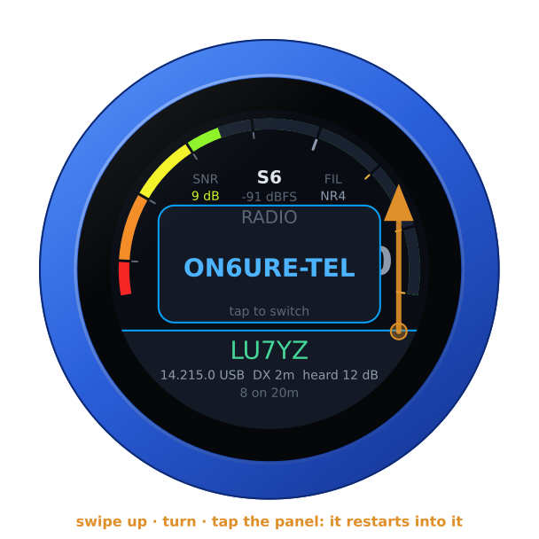

The knob also goes on to the next by itself, with no restart, when the one
in use cannot be reached: its name is not found, nothing answers, the
connection is refused, its TLS fails, or only its tunnel or a proxy
answers, the receiver behind it gone. Take a knob home from a station whose
UberSDR it played on that station's own network: at home that receiver's
name is not found, and the knob goes on to the next one, its tunnel, say.

The one in use gets a fair chance first: a second try four seconds after the
first, so that a moment without WiFi or DNS does not lose it. Then the
others, once each, in the list's order — after the last, the first. The
first that answers plays, and is **In use** from then on: the knob starts
with it next time, and the noise filter you had goes with it where that
receiver runs it too. The list keeps its order. Meanwhile the face names the
receiver it is on, with its state: **NOT FOUND** or **NO ANSWER**, then
**CONNECTING** with the next one's name.

| Not found | The next |
|---|---|
| 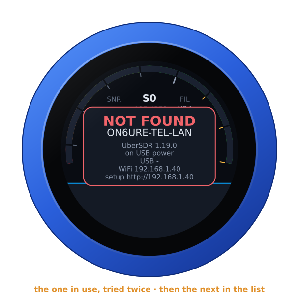 | 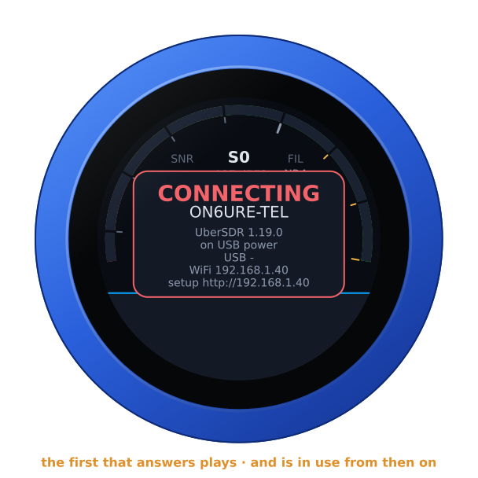 |

The receiver **In use** that answers but turns the knob away keeps its turn:
**RECEIVER FULL**, **BUSY**, **DAY LIMIT**, a password refused, **TIME UP**
are the receiver's word, not a receiver gone, and the knob waits on it as it
would with that receiver alone. One the knob went on to that answers so — a
stand-in you never chose — is passed by for the next, its refusal shown a
moment first, and is not **In use** until it lets the knob in and plays. One
lost in the middle of a session is the same as one not reached at the start:
two tries, then the next. When none answers, the knob tries them all again,
round after round, waiting a little longer between rounds each time, up to
a minute. Nor does it hand over while the knob's own WiFi is down: no other
receiver would answer then either. With a single receiver the knob keeps
trying it, as ever.

## From a computer

With the receiver connected, the knob's page opens on its controls, with
the spots and voices on the band, each one a button that tunes there, the
newest pictures of its SSTV gallery, and a guest's time left. The same works
for other programs:

```
GET /api/radio                          the state, as JSON, with the spots and voices
GET /api/radio/set?freq=14074000        Hz, or MHz with a point (14.074)
    ...&mode=usb&lo=50&hi=2700&gain=3
```

`gain` is the noise filter by its place in the list: 0 off, then the
receiver's. In the JSON, under `uber`, `time_left_s` is a guest's time left
in seconds, as the slab counts it (-1 where no limit applies), and
`time_left_by` whose limit it is: `session`, `day` or `idle`. With no
link, `why` says why, as the face does (`NOT FOUND`); with more than one
receiver listed, `uber`'s `rx` and `rx_name` are the one the knob is on, by
its place in the list and its name: the one in use, or the next it tries.
The radio page says it at the top, where it says **connected** once the
receiver plays.

## A Bluetooth headset

With the companion firmware on the knob's second chip, a Bluetooth headset
plays the receiver. Only its logo shows, at the right end of the slab, so the
spots keep their place — and its battery beside it, green, yellow or red,
where the headset reports it ([its battery](headset.md#its-battery)). A call
too long to stay centred clear of them moves aside, and only one too long
for the room left ends in dots. Pairing and the companion firmware:
[the headset guide](headset.md).

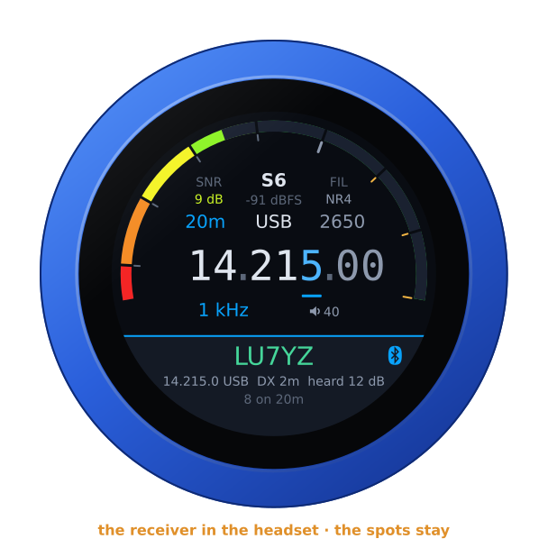

A Bluetooth speaker plays the receiver the same way, a fifth of a second or
so behind the jack, with a speaker beside the spot:
[A Bluetooth speaker](headset.md#a-bluetooth-speaker).

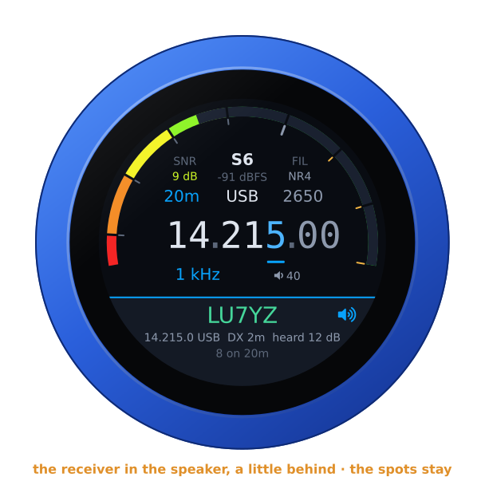

## Another firmware

Hold the S-meter for the address card, then hold it again for three seconds
until the knob buzzes, and turn: see [the setup guide](setup.md#back-to-the-setup-firmware-from-any-radios).
